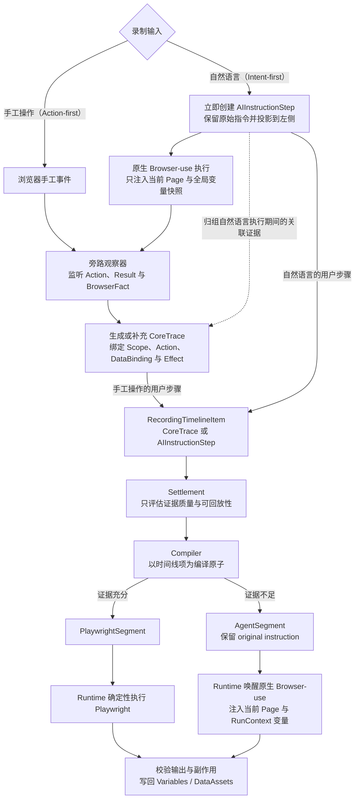

# ADR-007：RPA 录制采用 Action-first / Intent-first 双通道与双模式编译

## Context

新版 RPA Agent 绿地重建后，CoreTrace、Page/Frame Scope、DataBinding、BrowserEffect 和创建态变量边界比旧 ScienceClaw 更清晰。但真实本地 Live UI 验收暴露出三个直接影响产品可用性的问题：

1. 手工操作已经发生，左侧步骤仍长时间不显示，用户无法判断是否录制成功；
2. 自然语言指令为了满足录制协议被迫调用扩展工具、限制单步 Action 数并接受额外 `done` 门禁，导致能力和效率弱于原生 Browser-use；
3. 只有已严格结算的 CoreTrace 才能进入 Compiler，证据稍有缺失就阻止 Skill 生成，而不是降级为运行时 AI。

这些问题不是 CoreTrace 数据模型本身造成的，而是把“执行、录制观察、证据结算、用户时间线和脚本编译”绑在了同一条同步控制链上。录制层为了获得可编译证据，开始反向要求 Browser-use 配合；UI 又把步骤是否存在绑定到 Settlement 是否完成；Compiler 则缺少确定性与 AI 两种合法目标之间的选择边界。

旧 ScienceClaw 也存在明显缺点：`RPAAcceptedTrace`、`signals`、`runtime_results`、诊断、Browser-use History 和编译提示职责混合，Compiler 依赖大量启发式规则。但旧版本仍有三项经过产品使用验证的价值：

- Recorder / Configure / Test 的主要交互符合用户习惯，手工操作反馈直接；
- Browser-use 保留完整 planner/agent loop，并复用当前录制 Page；
- Trace-first 设计已经提出“能确定性回放就生成 Playwright，否则保留 Runtime AI”的正确方向。

因此本决策不整体回退旧 ScienceClaw，也不继续为当前新链路追加局部门禁。选择保留新版 CoreTrace 和运行上下文边界，同时恢复旧版交互热路径与 Browser-use 原生能力，并把编译目标显式定义为 Playwright 或 AI Instruction。

## Why This Design

### 手工操作与自然语言操作的事实起点不同

手工录制是 **Action-first**。用户真实点击、输入或选择时，浏览器事件就是确定事实，可以立即形成 CoreTrace 并展示。导航、下载、新 Page 等副作用可能稍后补充，但不影响“用户执行了这个动作”的成立。

自然语言录制是 **Intent-first**。用户提交指令时，唯一必然存在的事实是原始意图。Browser-use 后续可能执行零个、一个或多个 Action；可能只从页面状态得出结果；旁路观察也可能只捕获部分动作。因此自然语言步骤不能由“监听到了多少 Action”决定是否存在。

### 执行成功与确定性可编译是两个状态

Browser-use 完成用户指令，只证明运行态任务成功；它不自动证明旁路已获得稳定 Locator、完整 Page/Frame Scope、输出来源和副作用因果关系。反过来，录制证据不足也不能让 Browser-use 的成功变成失败或迫使它继续推理。

### 不确定性应该由 AI 运行时承担，而不是由录制热路径消灭

确定性证据足够时，Playwright 能以更低成本、更高稳定性回放。证据不足时，继续要求录制期模型补工具调用、补 Locator 或补 `done` 只会放大复杂度。正确降级是保存原始意图，并在 Skill 运行到该步骤时唤醒 Browser-use。

## Decision

### 1. 录制时间线只包含两类用户项

```text
RecordingTimelineItem
├── CoreTrace
└── AIInstructionStep
```

- 手工操作成功后直接生成 CoreTrace；CoreTrace 同时是该条左侧用户步骤的事实来源。
- 自然语言提交后立即创建 AIInstructionStep，保存原始指令并显示在左侧。
- 不为所有操作再增加通用 SOPStep 包装层，避免 `SOPStep -> CoreTrace -> CompiledStep` 对手工路径造成无收益的层级。
- 不恢复旧版 `steps + traces + recorded_actions` 多套事实源。`RecordingTimelineItem` 是唯一有序创作时间线，CoreTrace 是唯一浏览器动作事实类型。

AIInstructionStep 的最小职责是：

```text
step_id
sequence
instruction
execution_status
observation_trace_refs[]
compile_mode: pending | playwright | agent
expected_outputs[]
```

AIInstructionStep 表达用户意图和内部观察分组，不表达浏览器动作事实。旁路观察到的实际动作仍使用 CoreTrace，并通过 `observation_trace_refs` 与该 AI 步骤关联；这些子动作默认不拆成左侧主步骤。

### 2. CoreTrace 数据模型继续保留

CoreTrace 继续使用新版已经确认的职责：

```text
scope
action
data_bindings
effects
wait_until
```

CoreTrace 不保存 UI 状态、聊天文案、Browser-use History、录制时变量值或 Compiler 决策。手工主步骤和 AI 观察子动作使用同一种 CoreTrace 事实模型。

捕获期间允许内部短生命周期 Draft 持续补充异步 BrowserEffect；指令结束或录制停止后冻结为 CoreTrace。Draft 不进入公共 API、Compiler 或最终 Skill。

### 3. Browser-use 是原生执行主体

RPA Agent 对 Browser-use 的运行态影响限制为：

- 绑定当前录制会话的 BrowserContext/Page；
- 提供当前页面语义、Page Alias 和必要任务上下文；
- 提供当前会话或本次运行中已产生的全局变量信息；
- 声明允许使用的 Secret、DataAsset 和预期结构化输出。

RPA Agent 不得：

- 注册要求 Browser-use 配合录制的专用动作；
- 修改原生 Action Schema、`done` 语义、失败重试或 planner loop；
- 用 Candidate 或 CoreTrace 是否存在阻止 `done`；
- 降低 `max_actions_per_step` 等原生能力；
- 因录制证据不足要求 Browser-use 继续运行。

旁路观察可以订阅 Browser-use Action 生命周期、Playwright 事件和 CDP 事实，但监听器必须透明：不得修改动作参数、返回值、错误或控制流。

### 4. Settlement 只评估证据，不控制执行

Settlement 的职责调整为：

- 判断 CoreTrace 的 Scope、Target、Locator、Binding 和 Effect 证据是否完整；
- 判断一条 AIInstructionStep 的观察证据是否覆盖原始意图；
- 输出稳定的可回放性结论和原因；
- 标记需要用户确认的手工降级步骤。

Settlement 不再承担：

- Browser-use 是否可以结束；
- 左侧步骤是否可以存在；
- 失败后是否重新驱动 Agent；
- 把录制执行失败伪装为确定性 CoreTrace。

建议的评估状态为：

```text
deterministic_ready
insufficient_evidence
needs_confirmation
```

### 5. Compiler 以时间线项为原子选择执行模式

Compiler 对每条 RecordingTimelineItem 产生一个 CompiledStep：

```text
CompiledStep
├── PlaywrightSegment
└── AgentSegment
```

手工 CoreTrace 在证据完整时编译为 Playwright。证据不足时，如果事件事实能够形成明确的最小语义指令，可以生成 AgentSegment；否则必须在 Configure 页面要求用户确认或补充指令，不能静默猜测。

AIInstructionStep 的默认规则为：

- 关联 CoreTrace 完整覆盖原始指令，且 Scope、Locator、Binding、Effect 和输出来源均可验证：编译为一个包含多个 Playwright 语句的 PlaywrightSegment；
- 任一关键证据无法证明：保留原始 instruction，编译为 AgentSegment。

V1 不生成“部分 Playwright 前缀 + 完整原始 AI 指令”。否则运行时可能重复点击、导航或提交。只有未来 Compiler 能证明残余意图边界时，才允许拆分混合 Segment。

### 6. 确定性编译采用有限硬条件

只有同时满足以下条件，时间线项才能编译为 Playwright：

1. Page 和 Frame Scope 可解析；
2. 每个必要目标至少存在一个可验证 Locator；
3. 输入来源、输出去向和变量 Binding 明确；
4. Navigation、Download、Popup、Dialog 等必要副作用已正确关联；
5. 操作结果不依赖运行时语义判断；
6. 关联 CoreTrace 完整覆盖原始指令；
7. 不需要从 Browser-use final text、站点关键词或录制样例值发明动作。

不能通过扩大关键词、站点模板、经验 Selector 或 LLM 分数来掩盖证据缺口。

### 7. 全局变量通过创建态与运行态上下文提供

自然语言步骤必须能使用前序步骤产生的数据。

```text
录制期 Browser-use  ← SessionVariableStore 当前快照
回放期 Browser-use  ← RunContext VariableStore 当前快照
```

AI AgentContext 至少包含：

```text
current_page
page_aliases
variables
skill_inputs
allowed_secrets
data_assets
expected_outputs
expected_effects
```

约束如下：

- `variables` 只包含当前会话或本次 Skill 运行中、截至当前步骤已经产生的非敏感值；
- 普通标量和小型 JSON 对象可以提供完整值；大型 DataAsset 提供引用和摘要，按需读取；
- Secret 与普通变量分离，只提供明确允许的名称和值；
- AI 步骤必须返回声明的结构化输出，输出写回 SessionVariableStore 或 RunContext，供后续手工、Playwright 或 AI 步骤使用；
- 不跨用户、录制会话、Skill 或运行实例共享所谓“全局变量”。

确定性 CoreTrace 仍优先使用显式 DataBinding。全局变量快照只扩展 Agent 的语义上下文，不改变 CoreTrace 的数据流事实。

### 8. 副作用继续由统一旁路观察器捕获

人工通道和 Browser-use 通道共享同一套 BrowserContext/Page 监听器。监听器必须在动作执行前安装，并捕获：

- Navigation；
- Download；
- Popup / New Page；
- Dialog；
- Page Activated / Closed；
- File Chooser 等需要明确建模的浏览器副作用。

能够可靠归因时，副作用附着到触发动作的 CoreTrace `effects`，而不是伪造成第二条动作 Trace。UI 可以嵌套展示：

```text
点击“导出”
└── 下载 report.xlsx
```

副作用存在但无法可靠关联时，BrowserFact 不得被丢弃。Settlement 将对应时间线项标记为 `insufficient_evidence`，自然语言步骤降级为 AgentSegment；手工步骤进入用户确认。

### 9. UI 以旧 ScienceClaw 交互为主

保留旧版 Recorder、Configure、Test 的主要布局和操作逻辑。内部模型只通过 ViewModel 投影，不把 CoreTrace、Settlement 等技术概念作为页面主文案。

录制页状态：

```text
executing | succeeded | failed
```

配置和编译状态：

```text
pending | playwright | agent | needs_confirmation
```

- 手工动作捕获后立即显示 CoreTrace 步骤，不等待完整副作用结算；
- 自然语言提交后立即显示原始 instruction，不等待 Browser-use 完成或监听到 Action；
- Browser-use 内部动作只在展开区域展示；
- “Browser-use 已完成但证据不足”显示为“已完成 · 运行时使用 AI”，不是失败或长期待结算。

## Data Flow

### 总览



这张图刻意不使用统一 `SOPStep`：手工操作的时间线项就是 `CoreTrace`，自然语言的时间线项才是 `AIInstructionStep`。Browser-use 执行期间观察到的 `CoreTrace[]` 是该 AI 指令的关联证据，不替代原始意图，也不反向决定 Browser-use 是否可以完成。

### 手工录制

```text
用户手工操作
  → 浏览器事件捕获
  → 立即生成/投影 CoreTrace Draft
  → 左侧显示手工步骤
  → BrowserFact Observer 补充副作用
  → 冻结 CoreTrace
  → Settlement 评估可回放性
  → PlaywrightSegment
     或 needs_confirmation → AgentSegment
```

### 自然语言录制

```text
用户提交自然语言
  → 立即创建 AIInstructionStep
  → 左侧显示原始指令
  → 原生 Browser-use 执行
       ← 当前 Page
       ← SessionVariableStore 当前快照
  → 旁路观察 Action / Result / BrowserFact
  → 生成并关联 CoreTrace[]
  → Settlement 评估证据覆盖度
  → Compiler
       ├── 证据充分 → PlaywrightSegment
       └── 证据不足 → AgentSegment(original instruction)
```

### Skill 运行

```text
CompiledStep 顺序执行
  ├── PlaywrightSegment
  │     → 解析显式 Binding
  │     → 执行确定性 Playwright
  │     → 写回 RunContext Variables / DataAssets
  └── AgentSegment
        → 绑定当前 Page
        → 提供 RunContext 全局变量快照
        → 原生 Browser-use 执行
        → 校验 expected_outputs / expected_effects
        → 写回 RunContext
```

## Problems Addressed

| 既有问题 | 新方案如何解决 |
| --- | --- |
| 旧 ScienceClaw Trace 混合动作、输出、History、signals 和编译提示 | CoreTrace 只保存浏览器动作事实；AIInstructionStep 只保存意图和观察分组 |
| 旧 Compiler 依赖大型启发式和站点经验 | 使用有限硬条件决定 Playwright，否则明确降级 Agent |
| 新 RPA Agent 手工步骤显示滞后 | 手工 CoreTrace 和 AIInstructionStep 在动作/提交发生时立即投影，不等待 Settlement |
| 新 RPA Agent 削弱 Browser-use | 移除录制专用工具、`done` 门禁和 Action 数量限制，恢复原生 loop |
| 证据不足导致整个 Skill 无法编译 | AIInstructionStep 合法编译为 AgentSegment |
| Browser-use 完成但没有动作 Trace | 原始 instruction 已先保存，不依赖 Action 捕获决定步骤存在 |
| 下载、Popup 等副作用容易缺失或误建步骤 | 统一旁路 BrowserFact 监听并附着为 CoreTrace Effect |
| 后续 AI 无法使用前序数据 | 录制期和回放期分别提供 SessionVariableStore / RunContext 全局变量快照 |
| UI 被内部 Candidate/Settlement 概念污染 | 保留旧版交互，技术对象只通过用户可读 ViewModel 投影 |

## Design Principles

1. **Browser-use 是执行主体。** RPA Agent 是 Page/变量上下文提供者和旁路观察者，不能反向控制 Browser-use 运行态。
2. **能证明才确定性编译。** 证据不足时保留原始意图并降级为 AI，不发明 Locator、动作或输出来源。
3. **手工 Action-first，自然语言 Intent-first。** 两条通道共享 CoreTrace，但步骤出现的依据不同。
4. **CoreTrace 是动作事实，不是 UI 步骤包装器。** 自然语言意图使用 AIInstructionStep，不为手工路径增加通用 SOPStep。
5. **执行成功、捕获完整、可确定性编译是三个独立状态。** 任一状态不得替代另外两个。
6. **副作用属于动作事实。** Download、Popup、Navigation 等由旁路监听并附着为 Effect。
7. **变量在当前创建/运行上下文内全局可见。** Secret 和大型 DataAsset 仍按最小暴露原则处理。
8. **编译以用户时间线项为原子。** V1 不做无法证明边界的部分确定性 + 完整 AI 混合执行。
9. **UI 优先表达用户意图和结果。** Candidate、Settlement、BrowserFact 不成为页面主认知模型。
10. **不为兼容旧实现扩张新模型。** 旧 ScienceClaw 只复用交互、底层机制和验证经验，不恢复旧多事实源。

## Decision Boundary

### Applies To

- Recorder 的手工和自然语言录制时间线；
- Browser-use 与当前 Page、变量上下文和旁路观察的集成；
- CoreTrace、AIInstructionStep、Settlement 和 Compiler 的职责；
- Download、Popup、Navigation 等副作用捕获；
- 生成 Skill 的 PlaywrightSegment / AgentSegment 选择；
- Recorder、Configure、Test 的用户状态投影。

### Does Not Apply To

- Browser-use 上游源码修改；
- 通用工作流 DAG、分支循环编辑器或完整调试器；
- 阶段二数据处理的完整设计；
- 旧 Session、旧 Trace 和旧 Skill 的迁移；
- 跨用户、跨 Skill 的全局变量共享；
- V1 的 Playwright 前缀与残余 AI 自动拆分优化。

## Rejected Options

### 为所有操作增加通用 SOPStep

拒绝。手工 CoreTrace 已经能够直接成为用户步骤，再包装一层只增加 ID、排序和状态同步成本。只有自然语言需要独立的 Intent 容器。

### 要求 Browser-use 调用录制专用工具

拒绝。它改变 Action 空间、完成语义和模型行为，把录制完整性问题转嫁给执行 Agent，并已在真实场景中造成多轮重试和能力退化。

### 直接把 Browser-use `done` 文本当成确定性 Trace

拒绝。final text 可以作为 AIInstructionStep 的执行结果，但不能证明 DOM 来源、Locator、变量绑定或副作用因果关系。

### 证据不足时阻止 Skill 编译

拒绝。无法确定性回放不等于无法运行；原始自然语言意图应成为合法 AgentSegment。

### 默认生成部分 Playwright + 完整原始 AI

拒绝。AI 会重复执行确定性前缀已经完成的点击、导航或提交，除非 Compiler 能证明残余意图边界。

### 恢复旧 RPAAcceptedTrace 和 TraceSkillCompiler

拒绝。旧版交互和降级思想值得复用，但混合 Trace、万能 signals 和启发式 Compiler 不应回到新领域模型。

## Consequences

正向结果：

- 手工和自然语言步骤立即可见，录制体验恢复到旧 ScienceClaw 的直接性；
- Browser-use 保留原生能力，录制缺口不再增加 Agent 轮次；
- CoreTrace 的清晰职责继续保留；
- 编译不再因少量证据缺失整体失败；
- Playwright 和 Runtime AI 成为两种显式、可解释的执行模式；
- 前序变量和副作用能跨确定性与 AI 步骤连续传递。

成本与风险：

- Compiler 输入从单一 CoreTrace Timeline 调整为有序 RecordingTimelineItem；
- 需要 AIInstructionStep、ReplayAssessment 和 CompiledStep 的最小契约；
- 需要可靠维护 AI 步骤与观察 CoreTrace 的关联；
- 手工步骤无法确定性回放时可能需要用户补充语义指令；
- AI 运行时仍有模型成本和不确定性，必须通过 expected outputs/effects 明确失败边界；
- 现有 F027 的 `extract_variable`、`done` 门禁和相关测试需要按新边界撤回或改写。

## Acceptance Scenarios

1. 手工点击、输入后无需等待 Settlement 即可在左侧出现，副作用随后补充；
2. 使用相同 Page、模型和指令时，RPA 集成不减少 Browser-use 原生 Action 能力，也不增加录制专用轮次；
3. “点击导出”能够形成 click CoreTrace + download Effect，并编译为 `expect_download()`；
4. “打开和 Skill 最相关的项目”证据稳定时编译为 Playwright，否则保留原始指令为 AgentSegment；
5. “获取 Star 数”没有稳定 DOM 来源时仍可生成 Skill，并在运行时由 Browser-use 返回声明的结构化输出；
6. 后续 AI 步骤能够读取前序 Playwright 或 AI 步骤写入的全局变量；
7. Recorder / Configure / Test 保持旧 ScienceClaw 的主要交互与本地非 Docker 验证路径。

## Before Changing This Decision

修改本决策前必须检查：

- 是否会重新让 Candidate、Settlement 或 Compiler 反向控制 Browser-use；
- 是否会重新引入 `steps/traces/recorded_actions` 多事实源；
- 是否让证据不足重新变成“不能生成 Skill”；
- 是否会把 Browser-use 文本或 History 当成确定性 DOM 事实；
- 是否仍保持 Download、Popup、Navigation 等副作用监听；
- 是否仍能让 AI 步骤获得前序全局变量并写回声明输出；
- 是否保持手工 CoreTrace 直接作为步骤、自然语言先保存 Intent 的区分；
- 是否通过真实 Browser-use、本地 UI 和生成 Skill 回放同时验证。

## Evidence

- Feature: [F028 RPA 录制意图优先与双模式编译](../features/F028-rpa-recording-intent-first-dual-mode-compilation.md)
- Superseded Feature: [F027 RPA Agent 录制动作结算与输出语义闭环](../features/F027-rpa-agent-recording-finalization-contract.md)
- Updated decision: [ADR-006 在 ScienceClaw 宿主内绿地重建 RPA Agent 领域核心](./ADR-006-rpa-agent-scienceclaw-host-greenfield-core.md)
- Historical boundary: [ADR-005 Browser-use Recording Operator Integration Boundary](./ADR-005-browser-use-recording-operator-integration-boundary.md)
- Historical design: [RPA Trace-first Recording Design](../superpowers/specs/2026-04-20-rpa-trace-first-recording-design.md)
- Current CoreTrace design: [CoreTrace 到 SKILL 编译链路设计基线](../superpowers/specs/2026-07-17-RPA-Agent-CoreTrace到SKILL编译链路设计基线.md)
- Variable design: [业务变量绑定与录制态上下文设计基线](../superpowers/specs/2026-07-17-RPA-Agent业务变量绑定与录制态上下文设计基线.md)
- Live validation history: [EV-033 录制结算与 Live UI 验证](../evidence/EV-033-rpa-recording-finalization-live-ui.md)
