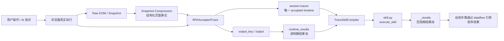
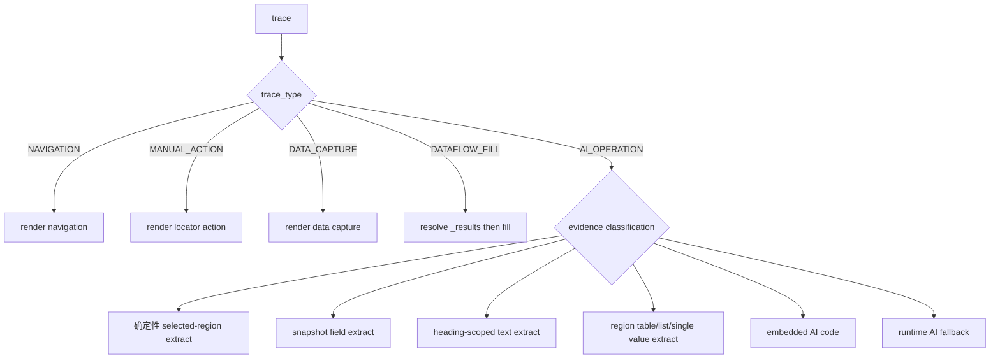

# 录制转 SKILL 当前架构实现与数据流说明

## 1. 先看整体逻辑

当前“录制转 SKILL”的主路径，不是把录制动作原样翻译成脚本，而是分成两个阶段：

```text
录制阶段：真实执行操作，沉淀 accepted trace
编译阶段：消费 trace evidence，生成可回放 Skill
```

录制阶段的核心产物不是最终脚本，而是一条可信的事实时间线。它需要表达：

- 用户或 AI 实际做了什么；
- 在哪个 page / tab / iframe 上下文中执行；
- 使用了什么 locator 或区域证据；
- 当前步骤产生了什么输出；
- 后续步骤是否依赖前序结果。

编译阶段再由 `TraceSkillCompiler` 消费这条时间线，判断哪些步骤可以确定性编译成 Playwright 代码，哪些步骤必须保留 runtime AI，哪些录制现场值应该替换成动态数据引用。

整体链路可以理解为：



这里有几个关键对象：

- `session.traces`：当前录制的唯一 accepted timeline，承载控制流。
- `raw_snapshot / compact_snapshot`：页面事实的采集与压缩结果，影响 AI 如何理解页面，也影响后续 trace evidence 的质量。
- `runtime_results`：录制阶段产生的结果池，用于推断跨步骤依赖。
- `trace.dataflow`：描述当前步骤是否引用了前序结果。
- `TraceSkillCompiler`：根据 trace type 和 evidence 生成 Skill。
- `_results`：生成后的 Skill 在回放时重新构建的结果池。

## 2. 两条主线：控制流与数据流

这套架构可以先分成两条线理解。

第一条是控制流：

```text
用户做了什么
  -> 归一化成 trace
  -> traces 按录制时间排序
  -> compiler 逐条渲染
  -> 生成 execute_skill 的执行顺序
```

控制流关注的是步骤顺序、trace 类型、页面上下文恢复，以及失败时如何定位到具体 trace。当前方向是使用 `trace_id` 和 `failed_trace_index`，避免重新依赖 legacy step index。

第二条是数据流：

```text
某一步产生 output
  -> 写入 runtime_results
  -> 后续步骤发现自己使用了这个值
  -> trace.dataflow 记录 selected_source_ref
  -> compiler 生成 _resolve_result_ref(_results, ref)
```

数据流关注的是：哪些值应该来自用户参数，哪些值来自前序步骤，哪些录制现场值不能被硬编码进最终脚本。

## 3. DOM / Snapshot 压缩层

在自然语言驱动路径里，AI 不是直接读取完整 DOM，也不应该把整页 HTML 原样塞给模型。中间有一层非常关键的页面事实压缩：

```text
浏览器真实页面
  -> raw snapshot
  -> snapshot compression
  -> compact snapshot / structured page facts
  -> RecordingRuntimeAgent / planner
  -> accepted trace evidence
```

这层解决的是：页面上信息很多，但模型上下文有限；如果压缩时把关键区域丢掉，后续 planner 再聪明也看不见目标信息。典型问题是：目标字段明明在 DOM 里，但 compact snapshot 没有表达该字段所在的业务区域，AI 就可能去错误区域提取，最终 trace 和 compiler 都会沿着错误证据继续走。

当前压缩层的核心思路不是“让规则替代 AI 做语义判断”，而是把原始 DOM 提炼成更适合推理的页面事实：

- `actionable_nodes`：按钮、链接、输入框等可操作元素；
- `content_nodes`：可见文本和字段内容；
- `containers` / `structured_regions`：页面业务区域；
- `region_catalogue`：页面有哪些区域的目录；
- `expanded_regions` / `sampled_regions`：按预算展开的区域证据；
- `table_views`：表格、行、列、单元格和行内动作；
- `detail_views`：详情区、字段 label/value、可编辑控件。

这里的边界很重要：

```text
压缩层负责决定“哪些页面事实以什么粒度呈现给 AI”；
不负责替代 AI 判断用户最终意图；
也不负责替代 compiler 发明 replay 逻辑。
```

所以它和 trace / compiler 的关系是：

- 如果 compact snapshot 缺失目标信息，AI 可能生成错误操作或错误抽取 trace。
- 如果 structured facts 足够强，例如明确的 table/detail/region 证据，trace 可以携带更可靠的 evidence。
- compiler 后续能否确定性回放，取决于 trace 里是否留下了可回放的 locator、snapshot、region、table/detail 等强证据。

换句话说：

```text
DOM 压缩层决定 AI 能看见什么；
trace 记录 AI/用户基于这些页面事实做了什么；
compiler 决定这些事实是否足以生成可回放代码。
```

这也是为什么遇到“AI 选错区域、提取错数据、操作错元素”时，不能第一时间只改 prompt 或 compiler。应先检查：

```text
raw snapshot 里有没有目标信息？
compact snapshot 里有没有保留目标信息？
trace 里有没有沉淀对应 evidence？
```

如果 raw snapshot 有，而 compact snapshot 没有，优先问题通常在压缩策略，而不是 planner 或 compiler。

## 4. Trace 是中心模型

`RPAAcceptedTrace` 承载一条被接受的录制事实。它不是单纯的“动作日志”，而是 compiler 后续决策的事实输入。

可以按几类理解它的字段：

```text
身份与类型：
trace_id, trace_type, source, action, description

页面上下文：
before_page, after_page, frame_path, signals.tab, signals.popup

目标元素：
locator_candidates, validation

业务与抽取证据：
signals, region_context, region_scope

数据输出：
output_key, output

跨步骤依赖：
dataflow
```

其中 `trace_type` 描述“这一步是什么动作”，通常在 trace 生成或归一化阶段确定。常见类型包括：

- `NAVIGATION`：页面导航，通常来自 `navigate` / `goto` 或明确导航 trace。
- `MANUAL_ACTION`：手动点击、填写、选择、按键等操作。
- `AI_OPERATION`：自然语言驱动的一步操作，由 `RecordingRuntimeAgent` 执行后产生。
- `DATA_CAPTURE`：普通数据采集，例如 `extract_text`。
- `DATAFLOW_FILL`：原本是 fill，但填入值被识别为来自前序结果，因此改写成数据流填充。

`evidence` 描述“compiler 凭什么生成某种代码”。它不是一个单独字段，而是分布在 trace 的多个字段里：

- `locator_candidates`：目标元素定位证据。
- `validation`：locator 验证结果，例如是否唯一匹配。
- `signals.navigation` / `signals.post_navigation`：导航或跳转证据。
- `signals.popup`：新窗口或新 tab 证据。
- `signals.download`：下载证据。
- `signals.extract_snapshot`：结构化 snapshot 抽取证据。
- `signals.selected_region_text_extract`：选区文本抽取证据。
- `signals.region_text_extract`：heading-scoped 等区域文本抽取证据。
- `region_context` / `region_scope`：区域结构证据，例如 single value、table region、list region。
- `frame_path` / `signals.tab`：执行上下文证据，用于恢复 iframe / tab。
- `output` / `ai_execution.output`：执行结果证据。
- `dataflow`：跨步骤依赖证据。

简单说：

```text
trace type 决定 compiler 的大分支；
evidence 决定该分支内部走确定性 Playwright、embedded AI code，还是 runtime AI fallback。
```

## 5. 录制如何进入 trace

从用户视角看，录制进入 trace 只有两条主路径：

```text
1. 手动操作路径
2. 自然语言驱动路径
```

手动操作路径在代码内部仍兼容两类输入形态：

```text
手动操作路径
  ├─ RPAStep / manual step
  │   -> manual_step_to_trace()
  │
  └─ ManualRecordedAction / browser recorder action
      -> recorded_action_to_trace()
```

这两个函数不代表产品上有两条手动录制主路径。它们只是 trace-first 收敛过程中保留下来的两个适配入口：一个处理已经进入 session step 模型的手动操作，一个处理浏览器 recorder 捕获到的底层 action。二者最终都应该归一成 `RPAAcceptedTrace`。

自然语言驱动路径则是：

```text
自然语言指令
  -> RecordingRuntimeAgent 执行当前指令
  -> result.trace
  -> session.traces
```

长期看，手动操作路径可以继续收敛为：

```text
各种手动输入来源
  -> 统一 manual action DTO
  -> 单一 trace builder
  -> RPAAcceptedTrace
```

但当前不建议为了“架构更干净”立刻重构这两个入口。它们涉及 credential、locator、diagnostic、runtime_results、timeline 展示等多个行为面；除非已经造成明确 bug 或阻塞验收，否则应作为后续收敛项处理。

## 6. 数据流推断逻辑

数据流的核心问题是：后续步骤使用的值，究竟是录制现场的固定值，还是前面步骤产生的动态结果。

例如：

```text
Step 1：提取项目名
output_key = "project"
output = {"name": "ScienceClaw"}

Step 2：在搜索框填入 "ScienceClaw"
```

如果系统发现 Step 2 填入的值等于 Step 1 的输出，就不应该在最终脚本里写死 `"ScienceClaw"`，而应该生成：

```python
_value = _resolve_result_ref(_results, "project.name")
await locator.fill(str(_value))
```

当前 dataflow 推断短期主要采用确定性值匹配，不依赖 AI：

```text
trace.output_key / trace.output
  -> runtime_results
  -> find_value_refs()
  -> trace.dataflow.selected_source_ref
  -> DATAFLOW_FILL
  -> _results 引用
```

这个策略的优点是可解释、可复现；风险是当多个前序输出包含相同值时，存在依赖来源误判。例如多个步骤都输出 `"ScienceClaw"`，后续 fill 只靠值相等就可能选错真实语义来源。

因此这里应被视为短期可接受的确定性推断，而不是最终完备的数据流理解能力。

## 7. Compiler 的核心决策

`TraceSkillCompiler` 不是简单模板拼接，而是按 trace type 和 evidence 做分类。



大体原则是：

- 有强结构化证据时，尽量编译成确定性 Playwright。
- 只有语义判断、弱证据或自由文本抽取时，回退 runtime AI。
- download、popup、navigation、action-targeting 这类行为语义，不能被抽取逻辑覆盖。
- output-only evidence 不能单独发明确定性 DOM 提取逻辑。

## 8. 行为语义不能被抽取逻辑覆盖

download、popup、navigation、action-targeting 这类步骤，本质上不是“读取页面数据”，而是会改变浏览器状态或外部状态：

```text
download：触发文件下载
popup：打开新窗口 / 新 tab
navigation：页面跳转
action-targeting：AI 是为了找到并操作某个按钮或输入框
```

如果原始 trace 表达的是“点击导出按钮并下载文件”，compiler 不能因为附近存在可抽取文本或 region evidence，就把它误编译成：

```python
_result = await locator.inner_text()
```

这会把“做动作，触发状态变化”错误改写成“读取文本，返回结果”，从根上改变了这一步的语义。

所以这条边界可以简化为：

```text
动作步骤不能被误编译成读文本。
```

## 9. Output-only evidence 的边界

`output` 说明的是“当时得到了什么结果”，不等于“以后应该从哪个 DOM 节点稳定获取这个结果”。

例如 AI 执行了一步：

```text
提取当前页面的项目简介
```

返回：

```json
{
  "description": "这是一个用于 RPA 录制的项目"
}
```

如果 trace 里只有这个输出结果，但没有可靠 locator、snapshot field、region context 等证据，compiler 就不能根据字段名 `description` 或输出文本，硬生成类似：

```python
_result = await page.locator(".description").inner_text()
```

这就是凭 output-only evidence 发明确定性 DOM 提取逻辑。它的问题是：

- 输出字段名不一定对应 DOM 结构；
- 输出文本只是录制现场观察值；
- 页面换一条数据后，文本本来就会变化；
- 看起来是确定性代码，实际是假确定性。

因此原则是：

```text
output 是结果证据，不是定位证据；
只有 output + locator/snapshot/region 等强证据，才可以编译成确定性 DOM 抽取。
```

## 10. 上下文恢复：tab / frame / popup

tab、frame、popup 主要解决的是执行上下文问题：

```text
回放时应该在哪个 page / tab / iframe 中执行？
```

它们不应该和业务数据流混在一起。

- `signals.tab`：用于恢复或切换 recorded tab。
- `frame_path` / `signals.reported_frame_path`：用于进入正确 iframe。
- `signals.popup`：用于记录由动作打开的新页面或新 tab。

这些证据可以帮助 compiler 选择正确执行位置，但不应该单独决定“这一步应该确定性抽取还是 runtime AI”。

## 11. 生成后的 Skill 运行模型

最终生成的 Skill 大致是：

```python
async def execute_skill(page, **kwargs):
    _results = {}
    current_page = page

    # trace 0
    ...

    # trace 1
    _results["some_key"] = result

    # trace 2
    value = _resolve_result_ref(_results, "some_key.field")
    ...

    return _results
```

这里要注意：

- 录制期的 `runtime_results` 不会直接带到回放期；
- 回放期会重新执行每一步，并重新构建 `_results`；
- 后续步骤通过 `_results` 引用前序步骤结果；
- 这保证 Skill 不是复刻一次录制现场，而是在新环境中重新执行同一套逻辑。

## 12. 当前最值得评审的边界

这次讨论建议重点看这些问题：

1. `trace` 是否已经足够表达录制事实？
2. `raw snapshot -> compact snapshot -> trace evidence` 这条页面事实链路是否完整？
3. `runtime_results -> dataflow -> _results` 这条数据流是否清晰？
4. 当前基于值相等的 dataflow 推断，在哪些场景下会误判？
5. 哪些 evidence 可以支持确定性编译，哪些必须保留 runtime AI？
6. `tab / frame / popup` 是否只作为执行上下文，而没有误伤 compiler 分类？
7. 是否还有录制现场值被硬编码进最终脚本？
8. 空输出、弱 locator、自由文本抽取这些情况应该进入诊断、runtime AI，还是直接失败？
9. compiler 当前策略是否已经开始复杂化，是否需要更明确的分类测试来锁住边界？

## 13. 一句话总结

当前架构可以压缩成一句话：

```text
录制阶段沉淀 trace 事实，编译阶段消费 trace evidence；
页面事实由 raw_snapshot / compact_snapshot 进入 trace evidence；
控制流由 session.traces 承载，数据流由 runtime_results / dataflow / _results 串起来；
compiler 的职责是在确定性回放和 runtime AI 之间做有证据边界的选择。
```

因此评审重点不是“生成脚本是否像录制动作”，而是：

- trace 是否可信；
- 数据依赖是否正确；
- compiler 分类是否守住证据边界；
- 短期实现里的历史适配层和风险点是否被看见。
