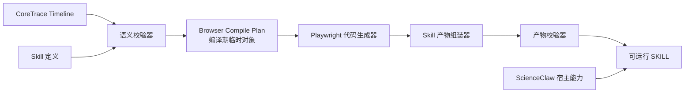

# RPA Agent CoreTrace 到 SKILL 编译链路设计基线

> **生命周期说明（2026-07-20）：** [F028 实施设计](2026-07-20-rpa-agent-intent-first-dual-mode-implementation-design.md) 已更新本文中“CoreTraceTimeline 是 Compiler 唯一输入”和“证据不足阻止编译”的范围。CoreTrace 的 Action/Scope/Binding/Effect、确定性 Action 编译、RunContext 与四文件原子发布部分仍然有效；新 Compiler 以 `RecordingTimeline` 为输入，并允许证据不足的 AI 步骤编译为 `AgentSegment`。

> 文档状态：v0.1 设计与验收基线，已确认。
> 适用范围：CoreTrace Timeline 到宿主型 RPA Agent SKILL 的编译、运行和产物契约。
> 目标读者：后续负责实现 `backend/rpa_agent` 的 Agent、研发人员和评审人员。
> 非目标：本文不提供实施计划、团队任务拆分或 Harness 工程设计，也不兼容 ScienceClaw 旧 Trace、旧 Compiler 和旧 Skill。

## 1. 文档目的

RPA Agent 已经确定以 CoreTrace 作为浏览器动作的唯一中间表示。本文继续回答：

> 一条经过结算的 CoreTrace Timeline，如何在不重新猜测、不读取录制证据、不依赖录制值的前提下，被确定性编译为可回放的 Playwright SKILL？

本文将已确认的讨论沉淀为后续开发 Goal 可直接引用的规格，覆盖：

- Compiler 总体架构；
- Skill Input、Secret、RunContext 与 VariableStore；
- Page Registry、Frame Scope、Locator 与 Effect；
- 所有 `action.kind` 的编译矩阵；
- 编译准入、失败规则和运行错误边界；
- SKILL 产物结构；
- 首个阶段一 E2E 的验收标准。

## 2. 已确认的总原则

### 2.1 CoreTrace 是 Compiler 的唯一动作事实源

Compiler 只消费：

```text
trace_id
sequence
scope
action
data_bindings
effects
wait_until
```

Compiler 不读取：

- TraceCandidate；
- BrowserFact；
- SettlementResult 的原始事实；
- Evidence、DOM Snapshot 或 Screenshot；
- Browser-use History；
- ScienceClaw 旧 `signals`、`output`、`ai_execution` 或 `runtime_results`。

创建态事实的职责止步于 Settlement。进入 CoreTrace 的动作已经完成语义结算，Compiler 不得再次判断“这是不是下载”“这个 tab 是否代表新 Page”“这段输出是否应该转为确定性代码”。

### 2.2 新链路不兼容旧链路

新编译链路不提供：

- CoreTrace 到 `RPAAcceptedTrace` 的转换器；
- 新旧 Trace 双写；
- 新旧 Compiler 抽象父类；
- 旧 `TraceSkillCompiler` 调用；
- 旧 `execute_skill(page, **kwargs)` 兼容入口；
- 旧 `params.json`、`skill.meta.json` 或输出协议兼容；
- 旧 Skill 迁移和重新编译。

ScienceClaw 旧链路可以在切换期间独立存在，但不得进入 `backend/rpa_agent` 新链路内部。

### 2.3 编译器不调用 LLM

Compiler 本身是确定性的。只有 CoreTrace 明确包含 `action.kind=agent` 时，生成的 Skill 才在运行时调用受控 Agent。

```text
规范 Action → Playwright 代码
agent Action → 受控 Runtime Agent Call
```

Locator 失败、Page 丢失或 Binding 缺失不能自动升级为 Agent，也不能通过 LLM 修复后继续。

### 2.4 运行值不进入 CoreTrace 和生成代码

录制时值属于 `SessionVariableStore`，本次运行值属于 `RunContext`。CoreTrace 只保存 Binding 引用，生成代码只按引用读取本次运行值。

变量缺失时禁止回退到：

- 录制值；
- CoreTrace 中的观察输出；
- Skill 默认硬编码值；
- 其他命名空间中恰好同名或同值的数据。

### 2.5 `wait_until` 仍然可选

默认执行链路为：

```text
Action → Effect → 下一条 Trace
```

只有 CoreTrace 显式存在 `wait_until` 时才生成局部同步等待：

```text
Action → Effect → wait_until → 下一条 Trace
```

它不是业务断言，不承担整个 Segment 的成功判断，也不能被 Compiler 自动补充到每个步骤。

## 3. 与 ScienceClaw 技术穿刺的关系

ScienceClaw 已经验证了许多执行机制，但没有形成适合长期演进的编译边界。

| 能力 | ScienceClaw 已验证内容 | 新链路处理方式 |
| --- | --- | --- |
| Playwright 动作生成 | click、fill、press、select、upload、extract 等 | 迁移执行经验，重新基于 CoreTrace 建模和测试 |
| 多 Page | Popup、新标签页、切换、关闭、恢复 | 改为 `scope.page_ref + new_page Effect + PageRegistry` |
| iframe | 嵌套 Frame、动态 iframe URL、错误 Page 等多轮问题 | 改为稳定 `frame_path` 与独立 FrameResolver |
| 下载 | 必须在点击前注册 `expect_download` | 由 `download Effect` 显式驱动 |
| 导航 | 点击导航、重定向和动态 URL | 由 Action/Effect 与可选 `wait_until` 驱动，不固化随机 URL |
| 步骤传值 | `_results` 证明运行期传值可行 | 改为业务语义 `VariableStore`，删除万能结果池 |
| Skill Input/Secret | 默认值、凭据注入、本地与沙箱执行 | 重建新 Manifest 和 RunContext 契约 |
| Runtime Agent | Browser-use、模型配置和 CDP 复用 | 迁移为 `AgentExecutor`，只服务 `agent` Action |
| Skill 存储与执行 | `SKILL.md`、Python 脚本、Skill Storage | 复用宿主能力，采用新产物和加载协议 |

允许复用的是小而独立的底层实现与踩坑经验，不允许新生产代码 import 旧领域模型、旧 Compiler 或旧 Runtime Results。

## 4. Compiler 总体架构



### 4.1 编译输入

编译器接收两类输入：

1. 按顺序排列的 CoreTrace Timeline；
2. Skill 级定义，包括名称、说明、Skill Input、Secret、声明输出和可选阶段二自然语言规则。

Skill 名称、外部输入声明、凭据声明和阶段二规则不进入单条 CoreTrace。

### 4.2 Browser Compile Plan

Compiler 可以建立内部 `BrowserCompilePlan`，用于提前解析：

- Runtime 能力要求；
- Page 生命周期；
- 每条 Trace 的 Scope、Action、Binding、Effect 与 Wait 计划；
- 产物模块和入口；
- Skill 输入和输出契约。

它不是持久化数据模型，也不是第二事实源：

- 不进入 Timeline；
- 不开放给前端编辑；
- 不作为运行时解释输入；
- 每次都可以从 CoreTrace 和 Skill Definition 重新产生。

### 4.3 推荐新领域目录

```text
RpaClaw/backend/rpa_agent/
├─ compiler/   CoreTrace 校验、CompilePlan 和代码生成
├─ runtime/    RunContext、Page/Frame、Effect、变量和 Agent 服务
└─ skill/      Skill Definition、Manifest、产物组装和宿主适配
```

## 5. Skill Input 与 RunContext

### 5.1 新运行入口

生成 Skill 的公共运行契约为：

```python
async def execute_skill(ctx: RunContext) -> SkillRunResult:
    ...
```

不兼容旧：

```python
async def execute_skill(page, **kwargs):
    ...
```

ScienceClaw 宿主负责创建浏览器、准备 Input 与 Secret、创建 RunContext、调用 Skill，并接收结构化结果。

### 5.2 RunContext 最小组成

```text
RunContext
├─ inputs       InputStore
├─ secrets      SecretResolver
├─ variables    VariableStore
├─ pages        PageRegistry
├─ assets       DataAssetRegistry 接口
├─ locators     LocatorResolver
├─ frames       FrameResolver
├─ effects      EffectCoordinator
├─ waits        WaitExecutor
├─ agent        AgentExecutor
├─ steps        StepRunner
└─ results      SkillResultBuilder
```

这些对象均属于一次 Skill Run，不能跨运行隐式共享。

### 5.3 Skill Input

V1 最小声明：

```yaml
- ref: query_keyword
  title: 查询关键字
  value_type: string
  required: true

- ref: order_status
  title: 订单状态
  value_type: string
  required: false
  default: 待验收
```

V1 支持 `string | number | boolean`。日期、月份和下拉值暂时使用稳定格式字符串，不建立通用类型系统。

默认值必须由用户明确配置，不能自动使用录制值。必填 Input 缺失时在启动浏览器流程前失败。

### 5.4 Secret

Secret 与普通 Input 分离。CoreTrace 和 Manifest 只保存 Secret Ref，不保存 Secret 值和凭据库 ID。

```python
password = await ctx.secrets.require("system_a_password")
```

Secret 禁止进入：

- Skill 文件；
- CoreTrace；
- VariableStore；
- 运行日志；
- SkillRunResult；
- 普通 CLI 参数。

### 5.5 VariableStore

最小接口：

```text
write(ref, value)
require(ref)
contains(ref)
export_declared_outputs()
```

示例：

```python
ctx.variables.write("采购订单", {
    "订单号": "PO-2026-05017",
    "供应商": "华东精密设备有限公司",
    "金额": 128600.5,
})

order_no = ctx.variables.require("采购订单.订单号")
```

V1 变量生产规则：

1. 同一完整 Ref 只能有一个生产者；
2. 根对象输出可以满足后续子字段消费者；
3. 多个兄弟叶子可以分别生产并组成对象；
4. 根对象与其子字段不能分别由不同 Trace 生产；
5. 不支持数组位置作为稳定业务引用；
6. 不支持隐式覆盖、跨运行持久化和录制值回退。

### 5.6 Binding 到运行时命名空间

| Binding Kind | 解析方式 |
| --- | --- |
| `literal` | 使用 Binding 自身 `value` |
| `skill_input` | `ctx.inputs.require(ref)` |
| `secret` | `ctx.secrets.require(ref)` |
| `variable` 输入 | `ctx.variables.require(ref)` |
| `variable` 输出 | `ctx.variables.write(ref, result)` |
| `data_asset` 输入 | `ctx.assets.require(ref)` |
| `data_asset` 输出 | `ctx.assets.register(ref, result)` |

不存在万能 `_results` 字典。Binding Kind 决定命名空间，Compiler 不按 key 或值猜测来源。

### 5.7 Agent 上下文边界

`agent` Action 只能获得当前 Trace 显式声明的 Input Binding、当前 Page/Frame Scope、可选 Target 和单一 instruction。默认看不到完整 VariableStore、全部 Secret、其他 Page、前后 CoreTrace或录制输出。

## 6. Page、Frame、Locator 与 Effect

### 6.1 每条 Trace 独立解析 Scope

每条 CoreTrace 都执行：

```text
PageRegistry.require(scope.page_ref)
→ FrameResolver.resolve(scope.frame_path)
→ LocatorResolver.resolve(action.target)
```

不能依赖上一条 Trace 遗留的 `current_page`、当前焦点或当前 Frame。

### 6.2 PageRegistry

宿主启动时注册：

```python
ctx.pages.register("main", initial_page)
```

`new_page Effect` 在动作前监听新 Page，完成后登记逻辑 PageRef。`switch_page` 只激活已登记 Page，`close_page` 关闭并移除当前 Scope Page。

禁止：

- 未知 PageRef 自动创建 `about:blank`；
- 根据 URL、Page 数组序号、`tab_id` 或 `target_id` 猜测 Page；
- 把 iframe 运行时 ID 当成新 Page；
- 关闭后隐式退回上一个 Page。

### 6.3 FrameResolver

FramePath 从外到内逐层解析，每个 FrameStep 按 CoreTrace 声明的 Locator 候选顺序尝试。Compiler 不重新排序、不读取录制期 `frame_id`、不把动态完整 iframe `src` 改写为运行时猜测策略。

任意一层无法解析时当前步骤失败，不能回退 Agent。

### 6.4 LocatorResolver

LocatorResolver 只消费：

```text
target.path
target.locators
target.index
filter_text
filter_binding
```

不根据 description、录制值或 DOM 历史生成新 Locator，不因定位失败自动改为模糊匹配。

### 6.5 Effect 执行顺序

```text
准备 Effect
→ 执行一次 Action
→ 等待并接收 Effect
→ 更新 RunContext
→ 执行可选 wait_until
```

Effect 必须在动作前监听，不能点击后再补抓。

| Effect | 运行语义 |
| --- | --- |
| `navigation` | 观察当前 Page 导航，不断言录制时固定 URL |
| `new_page` | 预监听新 Page，并登记 `page_ref` |
| `download` | 预监听 Download，并写入指定 DataAsset 输出 Binding |
| `dialog` | 临时注册 alert/confirm/prompt 处理器，完成后移除 |

V1 每条 Trace 最多一个主要异步 Effect：`navigation | new_page | download`。`dialog` 可以与其中一个组合。暂不支持 `navigation + new_page`、`new_page + download` 或 `navigation + download`。

复杂业务优先拆成多个真实动作，不能把一串副作用压进一条 Action。

### 6.6 wait_until Scope

- 普通 Action：使用当前 Trace Page/Frame Scope；
- navigation：使用导航后的同一 Scope；
- new_page：使用新 Page 主文档；
- download/dialog：使用当前 Trace Scope。

没有 `wait_until` 时不生成固定 sleep、URL 等待或 Toast 等待。

## 7. Action 编译矩阵

| `action.kind` | Target | 固定 Binding | 执行方式 | 输出 |
| --- | --- | --- | --- | --- |
| `navigate` | 无 | `url`，仅 mode=url | `goto/back/forward/reload` | 无 |
| `click` | 必需 | 无 | `locator.click()` | 无 |
| `fill` | 必需 | `value` 输入 | `locator.fill()` | 无 |
| `press` | 可选 | `keys` 输入 | `locator.press()` 或 `page.keyboard.press()` | 无 |
| `select` | 必需 | `option` 输入 | `locator.select_option()` | 无 |
| `set_checked` | 必需 | 无 | `check()` / `uncheck()` | 无 |
| `hover` | 必需 | 无 | `locator.hover()` | 无 |
| `upload` | 必需 | `file` DataAsset 输入 | `set_input_files()` | 无 |
| `scroll` | 可选 | 无 | 页面或元素滚动 | 无 |
| `extract` | 必需 | `result` 输出 | 文本、属性或表格提取 | Variable/DataAsset |
| `switch_page` | 无 | 无 | 激活已登记 Page | 无 |
| `close_page` | 无 | 无 | 关闭当前 Scope Page | 无 |
| `agent` | 可选 | 显式声明 | 受控 Agent Runtime Call | 显式声明 |

### 7.1 navigate

- `mode=url` 必须有 `url` 输入 Binding；
- URL 只能来自 literal、skill_input 或 variable；
- navigate 自身处理导航，不能重复声明 navigation Effect；
- 不等待录制时完整 URL；
- 页面就绪条件使用可选 wait_until。

### 7.2 click

- 使用 `button` 和 `count`；
- `count=2` 使用 Playwright 双击语义，不生成两条 Trace；
- 可组合 navigation/new_page/download/dialog；
- 完成后不生成固定 500ms 等待。

### 7.3 fill

- 固定槽位为 `value`；
- 允许 literal、skill_input、secret、variable；
- string 保持原值，number/boolean 转为稳定文本；
- 空字符串表示清空，null/object/array 拒绝；
- 变量缺失时不使用录制值。

### 7.4 press

- 固定槽位为 `keys`；
- 有 Target 时使用 `target.press()`；
- 无 Target 时使用 `page.keyboard.press()`，依赖已经结算的浏览器焦点事实；
- Compiler 不自行删除或补造 Target。

### 7.5 select

- V1 只表示原生 HTML select；
- 固定槽位为 `option`；
- 先按 value 精确选择，再按 label 精确选择；
- 自定义下拉、树选择和级联控件保留为实际 click/fill 序列或 agent Action；
- V1 不支持多选数组。

### 7.6 set_checked

根据 `checked` 使用幂等 `check()` 或 `uncheck()`，不通过 click 猜测当前状态。

### 7.7 hover

只执行真实 hover。悬停后菜单出现等异步边界使用显式 wait_until。

### 7.8 upload

- 固定槽位为 `file`；
- 必须是 DataAsset 输入；
- Runtime 将 DataAsset 解析为当前环境可访问的本地路径；
- 禁止把录制机器绝对路径写入 CoreTrace、Variable 或 literal。

### 7.9 scroll

- Target 可选；
- 支持 up/down/left/right 与 pixel/page；
- page 单位根据当前 viewport 计算；
- 不固化录制机器屏幕高度；
- 懒加载同步依赖 Playwright 自动等待或显式 wait_until。

### 7.10 extract

`mode=text` 使用确定 Target 的可见文本，写入 `result` 输出。
`mode=attribute` 读取固定 attribute，不存在时返回 null。
`mode=table` 按稳定 header 或显式零基 index 生成结构化行对象，只处理当前页面当前表格。

表格分页、循环与终止条件不进入单条 extract Action，留给 Browser Segment Plan 或受控 agent。

空文本或空列表可以是合法运行结果。Compiler 不根据空值自动改用 Agent，业务成功条件由后续 Outcome Contract 负责。

### 7.11 switch_page 与 close_page

switch_page 只激活已登记 Page。close_page 关闭当前 Scope Page。关闭后的下一条 Trace 必须显式声明其他 PageRef。

### 7.12 agent

AgentExecutor 接收：

```text
当前 Page/Frame Scope
可选 Target
单一 instruction
显式 Input Bindings
显式 Output Contract
```

Agent 必须返回结构化 `outputs`。所有声明输出必须存在，未声明输出不得写入 RunContext。Agent 失败时当前 Trace 失败，不得使用模型文本自动生成变量名。

Agent Action 可以被 EffectCoordinator 包裹，但新 Page、下载或导航仍须由 CoreTrace effects 显式声明。

### 7.13 全部 Action 的硬约束

1. 不读取旧 Trace 或 signals；
2. 不根据 description 推断执行方式；
3. 不使用录制输出替代运行结果；
4. 不生成通用固定等待；
5. 不静默跳过不支持动作；
6. 不在定位失败后自动调用 Agent；
7. 不改变 Locator 候选顺序；
8. 不把业务动词扩展为 action.kind；
9. 只有 agent 允许 Runtime LLM；
10. 所有输入输出经过 DataBinding。

## 8. 编译准入规则

Compiler 依次进行：

```text
Schema/版本
→ Timeline 顺序
→ Page/Frame 生命周期
→ Action/Target
→ Binding/数据流
→ Effect/wait_until
→ Runtime 能力
→ 代码与产物静态校验
```

存在任意错误时：

```text
status = rejected
artifacts = null
```

不存在“带警告生成”“部分生成”或“跳过错误步骤生成”。

### 8.1 Timeline

- trace_id 唯一；
- sequence 唯一；
- 输入数组顺序与 sequence 一致；
- 允许序号间隔；
- Compiler 不静默重新排序。

### 8.2 Page 生命周期

拒绝：

- 使用尚未创建的 PageRef；
- 重复创建 PageRef；
- 使用已关闭 PageRef；
- switch_page 指向不存在 Page；
- close_page 后继续使用该 Page；
- new_page 引入已有或与来源相同的 PageRef。

### 8.3 Action/Target

严格执行各 Action 的 Target 必需/可选/禁止规则。拒绝缺少 Target、没有 Locator、未知 Locator、非法结构参数、缺少表格列定义和无效 filter_binding。

### 8.4 Binding

Compiler 按固定槽位名查找 Binding，拒绝：

- 缺少必需槽位；
- 同名 Binding；
- direction 错误；
- kind 与 Action 不匹配；
- Skill Input/Secret 未在 Skill Definition 声明；
- Secret sensitive=false 或作为输出；
- 通过 Binding 数组位置猜测槽位。

### 8.5 Variable 数据流

按 Timeline 顺序验证生产者。拒绝未来生产、无生产者、完整 Ref 重复写、根对象与子字段冲突、数组位置业务引用和录制值回退。

### 8.6 DataAsset

当前只冻结 Compiler 所需最小接口：upload 必须消费 DataAsset，download 必须生产 DataAsset，文件路径不能冒充 Variable/literal。完整 DataAsset Schema 推迟到下载/分页验收场景。

### 8.7 Effect

拒绝无效组合、缺少 PageRef、重复 PageRef、download 指向非 DataAsset 输出、prompt 缺少输入和 Effect 引用其他 Trace Binding。

### 8.8 wait_until

检查 Condition Kind、Target、operator、regex 和 expected_binding。wait_until 不得表达 Excel 对账、审批通过或整个 Browser Segment 的业务结果。

### 8.9 Runtime 能力

CompilePlan 汇总：

```text
playwright
agent
data_asset
download
upload
```

当前宿主不满足必需能力时拒绝生成，而不是生成运行到一半才失败的 Skill。

## 9. 失败规则

### 9.1 CompileIssue

V1 使用浅层错误对象：

```yaml
code: variable.unresolved
message: 变量“采购订单.订单号”在使用前没有生产者
trace_id: trace_008
sequence: 80
path: data_bindings[value]
```

错误码命名空间：

```text
schema.*
timeline.*
page.*
frame.*
action.*
target.*
binding.*
variable.*
asset.*
effect.*
wait.*
runtime.*
artifact.*
```

Compiler 尽量聚合全部可静态确定错误，并按 sequence/path 稳定排序。CompileIssue 不携带截图、DOM、Browser-use History、调试堆栈或自动修复 Schema。

### 9.2 StepExecutionError

运行错误最小结构：

```yaml
run_id: run_001
trace_id: trace_008
sequence: 80
phase: target
code: target.not_found
message: 未找到“验收登记”按钮
```

phase 仅允许：

```text
scope
input
target
effect_prepare
action
effect_commit
output
wait
```

这只是最小步骤定位，不是 Debug 工作台。

### 9.3 Runtime 失败原则

任意步骤失败时：

1. 当前 Skill 立即停止；
2. 不跳过步骤；
3. 不自动切换 Agent；
4. 不读取录制值；
5. 不自动重跑整条 Skill；
6. 不自动补偿已经发生的浏览器副作用；
7. 不返回未声明的中间变量；
8. Secret 必须脱敏；
9. Effect 监听器必须清理；
10. 浏览器和 RunContext 最终清理由宿主负责。

## 10. SKILL 产物结构

V1 保留浏览器段文件，使阶段一编译产物与稳定入口分离：

```text
<skill>/
├─ SKILL.md
├─ skill.manifest.json
├─ skill.py
└─ browser_segment.py
```

`browser_segment.py` 不是运行能力上的必需文件；把代码合并进 skill.py 也能运行。V1 保留它的原因是阶段一浏览器能力本身就是明确 Segment，拆分成本可控，并能让稳定入口、生成业务步骤和阶段二自然语言职责保持清楚。它不得演变为 CoreTrace 运行时解释器。

### 10.1 SKILL.md

面向 Agent 和业务人员，包含：

- 适用场景；
- 输入说明；
- 阶段一浏览器流程；
- 可选阶段二自然语言数据处理规则；
- 可选阶段三通知说明；
- 声明输出；
- 失败边界。

阶段二 V1 仍以自然语言固化在 SKILL.md，不强制编译成 Python。

### 10.2 skill.manifest.json

Manifest 是机器契约唯一事实源，至少包含：

```text
schema_version
skill.id/name/version/description
entrypoint
runtime.api_version
runtime.requirements
inputs
secrets
outputs
source.core_trace_schema_version
source.trace_count
source.timeline_hash
source.compiler_version
```

Manifest 不保存 Secret 值、凭据库 ID、本次调用参数、录制值、完整 CoreTrace、BrowserFact、Evidence、DOM 或 Browser-use History。

### 10.3 skill.py

稳定入口，负责：

- 接入宿主 Runtime；
- 接收 RunContext；
- 调用 `run_browser_segment(ctx)`；
- 返回 SkillRunResult。

不承载 Locator、Page、Frame、Effect、VariableStore 或 AgentExecutor 的通用实现。

### 10.4 browser_segment.py

保存 CoreTrace 编译后的可读 Playwright 业务步骤：

- 一条 CoreTrace 对应一个步骤函数；
- 函数名包含 sequence 与 action kind；
- 中文业务名保留在注释或常量；
- Timeline 按顺序调用步骤；
- 变量使用业务 Ref；
- 不使用 exec；
- 不嵌入完整 CoreTrace；
- 不嵌入 Runtime 通用实现；
- 不包含录制值回退。

### 10.5 SkillRunResult

只返回声明输出和 DataAsset：

```yaml
status: succeeded
outputs:
  acceptance_result:
    task_id: TASK-9081
    saved: true
data_assets: []
```

失败时返回最小 StepExecutionError。禁止返回 Secret、完整 VariableStore、Page/Frame、DOM、Browser-use History、堆栈和未声明中间值。

### 10.6 版本与宿主

Manifest 显式声明 `rpa-agent-runtime/0.1`。ScienceClaw 宿主执行前校验 Runtime API 和能力，不兼容时拒绝运行。

进程内加载、沙箱加载和进程间传输属于 ScienceClaw Runtime Adapter；公共 Skill 契约始终是：

```python
async def execute_skill(ctx: RunContext) -> SkillRunResult
```

### 10.7 原子发布

只有 Python 语法、入口、Manifest、Runtime 版本、Secret 扫描、录制值扫描和旧依赖扫描全部通过后才发布。生成失败不得覆盖当前已发布 Skill。

## 11. 首个 E2E 的编译闭环

首个验收场景仍是：

```text
系统 A 复杂条件查询
→ 定位目标订单
→ 提取采购订单业务对象
→ 点击同名行操作按钮
→ 打开随机 URL 新 Page
→ 进入系统 B iframe
→ 使用采购订单.* 填写并保存
```

关键数据流：

```text
Skill Input 查询条件
→ 系统 A 查询 Action
→ agent/extract 输出 variable: 采购订单
→ new_page Effect 注册 acceptance_detail
→ FrameResolver 进入系统 B 表单
→ fill 消费采购订单.订单号/供应商/合同号/金额/币种/日期
→ 保存 Action
→ 声明 acceptance_result
```

同一个已生成 Skill 必须使用两组不同数据运行，不重新录制、不重新编译，以暴露：

- 固化目标行序号；
- 固化录制时订单字段值；
- 固化随机任务 URL；
- 固化 Page 数组位置；
- 固化 iframe 序号或动态 src；
- Variable 缺失时回退录制值。

## 12. 后续开发 Goal 的验收标准

后续实现至少满足以下结果，具体 Harness 形态由实现会话自行设计：

### 12.1 架构边界

- 新生产代码位于 `backend/rpa_agent`；
- 新代码不 import 旧 Trace、旧 Compiler 或旧 Runtime Results；
- CoreTrace 是 Compiler 唯一动作输入；
- Compiler 不调用 LLM；
- 只有 agent Action 产生 Runtime Agent Call。

### 12.2 Compiler

- 所有 v0.1 action.kind 有明确 Renderer；
- Binding 固定槽位和命名空间解析符合本文；
- Page/Frame/Effect/wait_until 顺序符合本文；
- 无效 Timeline 在代码生成前拒绝；
- Compiler 不生成固定通用等待、录制值回退或自动 Agent 修复；
- CompileIssue 能定位 trace_id、sequence 和 path。

### 12.3 Runtime

- 每次运行拥有隔离 RunContext；
- main Page 由宿主注册；
- new_page 只能由 Effect 引入；
- iframe 使用稳定 FramePath；
- 变量按业务 Ref 生产和消费；
- Secret 不进入日志和结果；
- StepExecutionError 能定位失败 phase；
- 失败后停止执行并清理 Effect。

### 12.4 Skill 产物

- 生成 SKILL.md、skill.manifest.json、skill.py、browser_segment.py；
- Manifest、入口、Runtime 版本和生成步骤一致；
- 一条 CoreTrace 对应明确步骤函数；
- 产物不包含旧模型 import、Secret、完整 CoreTrace 解释器或录制值；
- 产物校验成功后才原子发布。

### 12.5 首个业务 E2E

- 覆盖输入框、日期、下拉、图标按钮和同名行按钮；
- 覆盖 Browser-use 产生多个独立实际 Action；
- 覆盖 new_page Effect 与随机 URL；
- 覆盖 iframe Scope；
- 覆盖 `采购订单` 根对象输出和多个叶子消费；
- 同一 Skill 在 Replay A 和 Replay B 中成功；
- 后端 Oracle 证明系统 B 保存的是本次系统 A 数据；
- 两次运行之间 VariableStore 不串值；
- 运行过程中没有真实录制值回退。

## 13. 明确推迟的内容

本文不提前设计：

- 完整 DataAsset v0.1；
- 分页与循环的 Browser Segment Plan；
- Browser Segment Outcome Contract；
- 阶段二确定性脚本编译；
- 阶段三通知配置模型；
- Debug 工作台；
- 长期 Evidence Store；
- 失败恢复、补偿和断点续跑；
- Skill 脱离宿主运行；
- 旧 Skill/Trace/Compiler 兼容；
- 实施计划、团队任务拆分和 Harness 工程形态。

## 14. 后续 Agent 的使用方式

后续开发 Goal 应至少引用：

1. 本文；
2. CoreTrace v0.1 数据模型与 JSON Schema；
3. TraceCandidate、BrowserFact、SettlementResult 规格；
4. 业务变量绑定与录制态上下文设计基线；
5. 首个阶段一 E2E 验收场景设计基线；
6. ScienceClaw 宿主重构 ADR 与设计基线。

后续 Agent 可以自行拆解实现步骤和验证方式，但不得为复用旧代码改变本文确定的事实源、运行值隔离、Page/Effect 生命周期或非兼容边界。如实现证明本文契约无法满足真实场景，应先回到设计评审，不得先增加旧链路兼容层。

## 15. 最终结论

CoreTrace 到 SKILL 的正确链路不是“把旧 Trace 字段换成 CoreTrace 字段”，而是：

```text
已结算 CoreTrace
→ 全 Timeline 语义校验
→ 临时 CompilePlan
→ 确定性 Playwright 代码
→ 版本化宿主 Runtime
→ 可读、可回放、无录制值污染的 SKILL
```

ScienceClaw 提供已经验证的浏览器与宿主机制，新 `backend/rpa_agent` 重新建立清晰的数据、编译和运行边界。只有这一边界成立，业务人员录制得到的 SOP 才能稳定沉淀为低 Token、可检查和可重复运行的 Skill。
