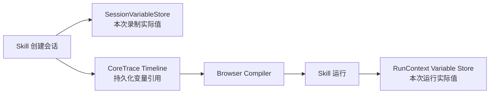

# RPA Agent 业务变量绑定与录制态上下文设计基线

> 文档状态：v0.1 设计基线，已确认。
>
> 适用范围：浏览器 Skill 创建态中的业务变量命名、暂存、双通道生产与消费、CoreTrace `data_bindings`、创建态 UI 投影，以及编译后的运行态解析边界。
>
> 非目标：本文不定义 DataAsset、阶段二数据处理、Skill Manifest、通用表达式语言、强类型系统、调试工作台或完整 Browser Compiler。

## 1. 为什么现在必须单独定义

阶段一不是一组彼此孤立的浏览器动作。真实 SOP 经常要求：

1. 在步骤一从页面提取业务数据；
2. 在步骤三、另一个标签页或 iframe 中继续使用；
3. 录制结束后把这个依赖关系编译进 Skill；
4. Skill 每次运行都重新提取和消费本次数据，而不是复用录制时的值。

如果只记录“本次向输入框填写了 `张三`”，编译器无法判断它是固定文本，还是前序步骤提取的“收件人”。生成的脚本就会硬编码录制值，换一组业务数据便失败。

因此本设计解决的核心问题是：

> 如何让业务人员用自己熟悉的业务名称保存和引用数据，同时让人工录制、自然语言执行、CoreTrace、UI 与编译器共享同一个明确的数据来源契约。

## 2. 第一性原理结论

### 2.1 变量首先是业务概念，不是技术输出编号

用户说“提取收件人信息”，变量首先应命名为 `收件人`；如果它包含多个字段，则使用 `收件人.姓名`、`收件人.手机号` 等路径引用。

`result_1`、`output_key_3`、`ai_result` 等技术名称不能成为默认业务变量名。它们无法帮助用户在后续指令中说清“把哪个数据填到哪里”，也无法帮助用户检查生成的 Skill 是否符合预期。

### 2.2 创建态共享上下文是会话级，不是应用级全局变量

本文所说的“全局变量”只表示：在一次 Skill 创建会话中，人工录制和自然语言两条通道都可以访问。

工程上统一称为 `SessionVariableStore`，归属于当前 `SkillCreationSession`。它不能跨用户、跨录制会话或跨 Skill 隐式共享。

### 2.3 录制值用于创建与检查，变量引用用于回放

录制期间，`SessionVariableStore` 保存当前页面实际提取到的值，供后续步骤继续执行和用户预览。

CoreTrace 不持久化这些业务值，只通过 `data_bindings[].ref` 保存数据依赖。编译后的 Skill 每次运行都在本次 `RunContext` 中重新生产、解析和消费变量。

禁止在运行时变量缺失时回退到录制值。否则录制样例会变成生产数据，掩盖真正的数据流错误。

### 2.4 变量来源必须显式保留，不能只靠值相等猜测

“填写值恰好等于某个已提取值”只能说明它可能来自该变量，不能证明来源。两个变量可能值相同，用户也可能有意填写固定文本。

因此变量来源的优先级是：

1. 用户或 Agent 明确按变量引用执行；
2. 用户从变量面板选择、复制或插入变量；
3. 精确值匹配只形成待确认候选；
4. 没有明确来源时按 literal 处理。

## 3. 三类上下文必须分开



| 模型 | 生命周期 | 保存什么 | 不保存什么 |
| --- | --- | --- | --- |
| `SessionVariableStore` | 一次 Skill 创建会话 | 本次创建过程中已产生的 JSON 值、变量路径及临时来源索引 | 不作为 Skill 生产数据，不跨会话共享 |
| CoreTrace `data_bindings` | Skill 设计与产物编译期 | 输入来源、输出去向和稳定变量引用 | 不保存录制时变量值，不保存 UI 状态 |
| `RunContext` Variable Store | 一次 Skill 运行 | 本次回放重新产生的变量值 | 不读取另一次运行或录制会话的值 |

三者共享相同的业务变量引用语义，但不是同一个持久对象。

## 4. SessionVariableStore v0.1 逻辑模型

v0.1 采用浅层逻辑模型，不提前引入版本、表达式、默认值或类型声明：

```yaml
session_id: session_001
values:
  采购订单:
    订单号: PO-2026-05017
    供应商: 华东精密设备有限公司
    合同号: CT-2026-0088
    含税金额: 128600.5
    币种: CNY
    订单日期: 2026-05-18
```

### 4.1 最小职责

`SessionVariableStore` 只负责：

- 按业务变量引用写入和读取 JSON 值；
- 向人工录制和自然语言通道提供同一份变量目录；
- 为创建态 UI 提供当前值预览；
- 在步骤删除、重命名或重新结算后重建当前可用变量；
- 在编译前协助检查变量引用是否存在明确的前序生产者。

生产者、消费者和步骤关系可以从 CoreTrace Timeline 与当前结算结果派生，不需要在 CoreTrace 中重复增加 `shared_variables`、`producer_id` 或 `consumer_ids` 字段。

### 4.2 值域

Store 允许保存 JSON 原生值：

```text
string | number | boolean | null | object | array
```

这只是运行值的自然形状，不是强类型系统。v0.1 不增加 `type`、`schema`、`version`、`default`、`expression` 或自动类型转换字段。

生产步骤应输出后续消费者可以稳定使用的值。例如金额可以是 JSON number，日期可以是稳定格式字符串；具体转换属于生产动作或后续数据处理能力，不在 Variable Store 内建设通用规则引擎。

### 4.3 嵌套对象与点路径

一次提取可以把一个业务对象写入根变量：

```text
采购订单
```

后续步骤通过点路径读取它的字段：

```text
采购订单.订单号
采购订单.供应商
采购订单.含税金额
```

点路径只表达 JSON 对象的业务字段。v0.1 不把 `0`、`1` 等数组位置当作稳定业务变量路径；列表和批量表格的长期契约由后续 DataAsset 或 Browser Segment 设计解决。

## 5. 业务变量引用规范

### 5.1 `binding.name` 与 `binding.ref` 职责不同

```yaml
data_bindings:
  - name: value
    direction: input
    kind: variable
    ref: 采购订单.订单号
    sensitive: false
```

| 字段 | 面向对象 | 规则 |
| --- | --- | --- |
| `name` | Action/Effect 与 Compiler | 机器槽位名，例如 `value`、`result`、`option`，继续使用稳定 ASCII identifier |
| `ref` | 业务人员、变量上下文与运行时 | 业务变量引用，可以使用中文，并通过点路径表达嵌套字段 |

编译器根据 `action.kind + binding.name` 判断该绑定用于什么，再根据 `binding.ref` 从运行上下文取值或写值。不能把业务引用直接当作 Python/JavaScript 变量名生成代码。

### 5.2 命名规则

业务变量引用遵守以下规则：

1. 使用用户在业务中真实使用的名词，例如 `收件人`、`采购订单.订单号`；
2. 根节点优先是业务实体或业务概念，子路径是其字段；
3. 路径段不能为空，不允许前后空白或连续 `.`；
4. 不使用数组位置作为业务路径段；
5. 不用本次值、页面序号、模型轮次或 Trace 顺序生成名称；
6. 系统可以根据用户指令建议名称，但用户可以在编译前重命名。

机器 Schema 使用独立的 `business_variable_ref` 约束变量引用，而不是放宽所有 `identifier`。因此 `trace_id`、`page_ref`、Binding 槽位名和 DataAsset 引用仍保持原有机器标识符约束。

## 6. CoreTrace 如何表达生产与消费

### 6.1 生产业务对象

用户输入：

> 提取当前目标行的采购订单信息。

结算后的 CoreTrace 只保存输出去向：

```yaml
action:
  kind: agent
  instruction: 提取当前目标行的采购订单信息
data_bindings:
  - name: result
    direction: output
    kind: variable
    ref: 采购订单
    sensitive: false
```

本次实际提取值进入创建态 `SessionVariableStore.values.采购订单`。它不复制进 CoreTrace。

### 6.2 消费业务字段

后续填写订单号：

```yaml
action:
  kind: fill
  target:
    name: 来源订单号
    locators:
      - strategy: label
        value: 来源订单号
data_bindings:
  - name: value
    direction: input
    kind: variable
    ref: 采购订单.订单号
    sensitive: false
```

### 6.3 不新增 CoreTrace 顶层变量字段

CoreTrace 已有 `data_bindings`，它能够表达每个动作的数据输入和输出。再增加 `shared_variables`、`context` 或 `outputs` 会制造第二份数据流事实源，因此不采用。

变量值属于创建态 Store 或运行态 RunContext；变量依赖属于 CoreTrace DataBinding。两者边界不能混合。

## 7. 人工录制通道

### 7.1 普通人工输入

浏览器事件监听器可以可靠捕获“用户填写了什么”，但无法仅凭 DOM 事件可靠知道“这个值来自哪个业务变量”。

因此：

- 用户直接键入内容时，默认形成 literal BindingHint；
- 如果用户从变量面板选择、复制或插入变量，录制工作台保留显式变量来源；
- 如果填写值与 Store 中某个值完全相同，只形成弱候选，不直接结算为 variable；
- 存在多个相同值时必须让用户选择变量或保留 literal，不能默认取第一个匹配。

### 7.2 变量面板操作

变量面板应支持“使用此变量”而不只是复制纯文本。该操作需要把变量引用随本次输入动作传递给 Manual Adapter，使 Candidate 同时携带实际值和来源线索；最终 CoreTrace 只保留变量 `ref`。

如果平台只能观察到系统剪贴板中的纯文本，不能据此宣称变量来源已被证明。

## 8. 自然语言通道

### 8.1 Agent 看到变量目录，不接管变量真相

自然语言通道可以获得当前变量目录和必要预览，以理解用户所说的“刚才的收件人”“采购订单金额”等业务概念。

不应把整个 Store 序列化成一段无约束 Prompt，再让模型通过值相等猜测来源。这样会增加 Token、泄露敏感值，并丢失稳定的数据流引用。

### 8.2 变量感知动作

RPA Agent 提供变量感知的 Browser-use Adapter 动作，例如：

```text
input_variable(index, variable_ref)
```

其职责是：

1. 根据 `variable_ref` 从当前 `SessionVariableStore` 解析本次实际值；
2. 调用 Browser-use/浏览器工具完成真实输入；
3. 在该实际 Action 的 TraceCandidate 中保留 `kind_hint=variable` 与 `ref_hint`；
4. 结算后生成 `kind=variable` 的 CoreTrace DataBinding。

这不是要求修改 Browser-use 的内部规划模型，而是 RPA Agent 在 Tools Adapter 层提供的受控能力。Browser-use 仍可以一轮执行多个 Action，每个实际动作分别形成 Candidate 和 CoreTrace。

### 8.3 提取结果命名

自然语言要求提取数据时，输出引用来自用户意图中的业务对象，而不是由 Browser-use 自动生成无意义 key。

例如：

```text
用户指令：提取收件人信息
输出 ref：收件人
后续消费：收件人.姓名、收件人.手机号
```

Tools Adapter 可以通过 `BindingHint.ref_hint` 把该业务引用交给 Context & Asset Manager 和 Settlement Engine。只有动作成功、输出可用且引用合法时，数据才写入 Store 并结算为 CoreTrace。

## 9. 结算与生命周期

### 9.1 写入时点

失败、取消、歧义或无法形成合法 Binding 的 Candidate 不能污染变量表。变量写入与 accepted CoreTrace 提交属于同一结算边界：

```text
Candidate 执行成功
  → 输出值可用
  → 业务变量引用合法
  → Settlement accepted
  → CoreTrace 原子追加
  → SessionVariableStore 更新
```

若 CoreTrace 追加或 Store 更新任一失败，本次结算不得呈现为部分成功。

### 9.2 重命名

业务人员可以在录制结束前重命名变量。重命名必须作为一次原子操作：

- 修改生产者 output Binding 的 `ref`；
- 修改所有消费者 input Binding 的同名或后代路径；
- 移动 Store 中对应值；
- 重新执行引用、冲突和编译前校验。

如果目标名称已存在且会造成冲突，应拒绝重命名并要求用户选择其他名称，不能静默覆盖。

### 9.3 删除与重排

删除生产步骤后，系统从剩余已结算步骤重建当前变量视图。任何仍引用已删除变量的消费者都进入“引用未解析”状态，并阻止 Skill 编译。

重排步骤后，如果消费者出现在生产者之前，也必须由 Timeline Semantic Validator 拒绝或要求用户修正。UI 可以给出业务可读提示，但不能用录制值补洞。

v0.1 不引入变量版本号。对同一 `ref` 的重复生产是否允许、如何判断明确前序生产者，留给下一步 Browser Compiler 与 Timeline Semantic Validator 契约决定；在该规则明确前不得静默采用“最后一次写入”。

## 10. 创建态 UI 投影

录制工作台至少提供两个互相联动的视图：

### 10.1 步骤视图

- 展示 CoreTrace 的业务可读动作名称；
- 在生产步骤上显示“输出：采购订单”；
- 在消费步骤上显示“使用：采购订单.订单号”；
- 下载等 Effect 可以投影为独立辅助步骤，但不伪造成第二条 CoreTrace；
- 点击变量标签可以定位对应变量和生产/消费步骤。

### 10.2 变量视图

- 展示业务变量引用；
- 展示本次创建值的截断预览；
- 展示生产步骤和消费步骤；
- 支持重命名、复制引用和“使用此变量”；
- 不允许直接编辑变量值。

不允许直接改值的原因是：变量值来自浏览器事实或 Agent 的实际提取结果。手工改值会让录制验证通过，但生成的 Skill 运行时无法复现，破坏“所见即所得”的验收基础。

截图不属于当前业务需求，不进入变量模型、CoreTrace 或 UI 必选项。

## 11. 编译器必须遵守的输入契约

下一步 Browser Compiler 设计必须建立在以下规则上：

1. 编译器只读取 CoreTrace DataBinding 引用，不读取录制值、Browser-use History 或 Candidate 私有字段；
2. output variable 生成对运行态变量上下文的写入，例如 `variables.set("采购订单", result)`；
3. input variable 生成运行态解析，例如 `variables.require("采购订单.订单号")`；
4. 编译产物不能把 `PO-2026-05017`、`128600.5` 等录制值写死为变量替代品；
5. 业务引用是字符串 key，不直接变成语言级变量名；
6. 未解析引用、消费者早于生产者或引用冲突必须在编译前失败；
7. 每次 Skill 运行创建独立 RunContext，并从空的运行态变量表开始；
8. 只有 literal Binding 才允许把固定值直接编译进脚本。

## 12. ScienceClaw 技术穿刺的可复用经验与舍弃项

ScienceClaw 旧链路中已有以下有效实践：

- `RPARuntimeResults.resolve_ref()` 证明嵌套 JSON 与点路径读取可行；
- 删除步骤后重建 runtime results 的方向正确；
- 编译器已经验证了“前序提取结果可供后续动作使用”这一基本需求。

但它也暴露了新设计必须避免的问题：

| ScienceClaw 实践 | 问题 | 新设计 |
| --- | --- | --- |
| `output_key` 使用模型生成的 ASCII key | 业务人员难以理解和复用 | 业务语义 `variable ref`，例如 `收件人` |
| Trace 同时保存 `output_key`、`output`、`dataflow` | 动作事实、运行值和数据流职责混合 | CoreTrace 只保存 Binding；值进入会话/运行上下文 |
| `find_value_refs()` 通过值相等反推来源 | 相同值会歧义，固定文本可能被误判 | 只作为弱候选，需显式来源或用户确认 |
| Browser-use Prompt 直接附带完整 `runtime_results` | Token 高、敏感值暴露、引用关系丢失 | 变量目录 + 变量感知 Adapter Action |
| 编译期把结果写入 `_results[output_key]` | 已证明运行上下文有价值，但 key 缺乏业务语义 | 复用“运行期重新写入”原则，不复用旧字段模型 |

ScienceClaw 仍是技术穿刺和踩坑来源，不是新 Variable Store、CoreTrace 或 Compiler 的兼容目标。

## 13. v0.1 非目标

本轮明确不增加：

- 变量版本、历史快照或跨 Skill 共享；
- 表达式、公式、默认值或通用类型转换；
- 用户直接编辑录制变量值；
- 通过截图识别或保存变量；
- DataAsset、下载文件和大表格的完整模型；
- 阶段二自然语言数据处理规则；
- 调试器、断点和变量回放工作台；
- 仅为兼容旧 `RPAAcceptedTrace` 增加的字段。

## 14. 首个 E2E 的变量契约

系统 A 的逻辑提取产生一个业务对象：

```yaml
采购订单:
  订单号: PO-2026-05017
  供应商: 华东精密设备有限公司
  合同号: CT-2026-0088
  含税金额: 128600.5
  币种: CNY
  订单日期: 2026-05-18
```

系统 B iframe 内的六个填写动作分别消费：

```text
采购订单.订单号
采购订单.供应商
采购订单.合同号
采购订单.含税金额
采购订单.币种
采购订单.订单日期
```

同一个生成 Skill 必须使用两组不同 fixture 回放成功。该双用例用于证明脚本解析运行态变量，而不是硬编码录制样例。

## 15. 下一步设计输入

本文冻结的是“变量如何命名、暂存、生产、消费和进入 CoreTrace”的边界。下一步《RPA Agent CoreTrace 到 SKILL 编译链路设计基线》需要继续确认：

1. `SessionVariableStore` 与运行态 Variable Store 的最小接口；
2. Timeline 中重复 output ref 的准入规则；
3. Page Registry、Frame Scope、Effect 与变量读写如何共同生成 Playwright；
4. Skill 参数、Secret、Variable 和未来 DataAsset 的运行时命名空间；
5. 变量感知 Browser-use Adapter Action 的具体集成方式；
6. 编译前语义校验与首个 E2E Oracle。

上述问题应在编译器设计中解决，不反向扩张 CoreTrace 或 SessionVariableStore。
