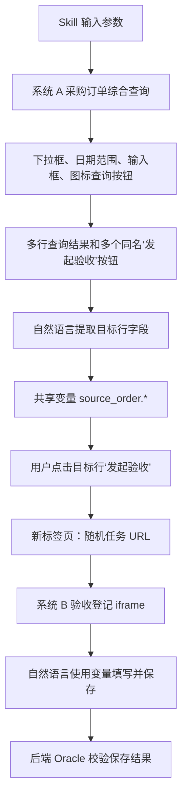

# RPA Agent 首个阶段一 E2E 验收场景设计基线

> 文档状态：已确认设计基线（2026-07-17）。
>
> 场景名称：跨系统采购订单验收登记。
>
> 文档用途：作为 RPA Agent 第一条生产级纵向闭环的产品验收锚点，用业务场景反推共享变量、CoreTrace、编译器、Skill 产物、eval-app 测评集和开发拆分。
>
> 权威边界：本文定义“首个场景必须证明什么”，不直接定义 CoreTrace 字段 Schema，不提前定义 DataAsset，也不替代后续编译链路规格和实施计划。

## 1. 决策结论

首个 E2E 不同时引入 Excel、DataAsset 和阶段二自然语言数据处理，而是先证明完整的阶段一闭环：

```text
系统 A 复杂条件查询
  -> 从目标表格行提取业务字段
  -> 写入共享变量上下文
  -> 点击目标行的同名操作按钮
  -> 捕获新标签页
  -> 进入系统 B 页面中的 iframe
  -> 使用共享变量填写表单
  -> 保存并由后端 Oracle 验证
```

该场景必须同时覆盖人工录制通道和自然语言通道，并最终编译为可重复回放的 Skill。

## 2. 为什么选择这个场景

这个场景是当前最小但完整的业务能力证明：

- 它包含企业页面常见的多种原子组件，而不是只验证单个按钮；
- 它包含表格行上下文，能够检验多个同名按钮是否被正确定位；
- 它包含浏览器副作用、新标签页、随机 URL 和 iframe；
- 它包含从系统 A 取值并在系统 B 使用的跨页面变量绑定；
- 它同时使用“直接操作”和“自然语言逻辑操作”两条通道；
- 它仍然完全属于浏览器阶段，失败归因不会被阶段二数据处理能力干扰；
- 同一个 Skill 使用两组不同数据回放，可以识别行号、URL和字段值硬编码。

复杂度遵循以下原则：

> 只增加能够证明一种独立执行机制、上下文边界或数据契约的复杂度，不为展示组件数量堆叠无验收价值的交互。

## 3. 非目标

首个 E2E 明确不覆盖：

- 下载、上传、Excel 或 CSV 解析；
- DataAsset 的创建、血缘和生命周期；
- 阶段二“自然语言规则 -> Agent 数据处理 -> 人工确认”；
- 数据比较、结果模板填写和源文件写回；
- 跨域 iframe、浏览器原生弹窗和文件选择器；
- 旧 `RPAAcceptedTrace`、旧 Session 或旧 Skill 的兼容；
- 调试工作台和全量可观测平台。

这些能力应在首个阶段一闭环通过后，以独立验收场景逐步加入。

## 4. 端到端业务流程



## 5. eval-app 承载方式

正式验收环境采用现有 `rpa-eval-app` 扩展，不采用公开网页作为基线。

原因是现有 eval-app 已具备 FastAPI、SQLite、固定 fixtures、启动重置、真实业务页面、下载审计和评测 Runner，可以提供：

- 稳定、可重复的页面和数据；
- 可人为构造的同名按钮、行位置变化、随机 URL 和 iframe；
- 不暴露给 Agent 的数据库真值；
- 离线回归和失败复现；
- 后续下载、分页和 DataAsset 场景的连续扩展空间。

逻辑页面划分如下：

```text
/system-a/orders
    系统 A：采购订单综合查询

/system-b/acceptance/:task_id?token=:random_token
    系统 B：验收登记宿主页

/system-b/acceptance-frame/:task_id
    系统 B：iframe 内的验收表单
```

首个场景允许系统 A、系统 B 由同一个 eval-app 服务模拟。它们在产品语义上是两个系统，但不在第一轮额外引入跨域和部署复杂度。

## 6. 系统 A：采购订单综合查询

### 6.1 查询条件

系统 A 查询区域必须同时包含：

| 业务字段 | UI 组件 | 验收目的 |
| --- | --- | --- |
| 业务类型 | 自定义下拉框 | 验证展开、选项定位和选择，不依赖原生 `select` |
| 订单日期 | 日期范围控件 | 验证复合控件和起止日期输入 |
| 供应商名称 | 文本输入框 | 验证普通文本填入和参数绑定 |
| 订单编号 | 文本输入框 | 验证精确业务主键输入 |
| 查询 | 仅图标按钮 | 按钮无可见文字，通过 `aria-label=查询` 或 tooltip 表达语义 |
| 重置 | 仅图标按钮 | 与查询按钮相邻，证明不能按位置或“第一个图标”定位 |

查询值来自 Skill 输入参数：

```text
query.business_type
query.date_from
query.date_to
query.supplier_name
query.order_no
```

除了经配置明确固化的默认值，编译结果不得把录制期查询值写死到脚本中。

### 6.2 查询结果

查询后展示至少三条结果，列包括：

- 订单编号；
- 供应商名称；
- 合同编号；
- 含税金额；
- 币种；
- 订单日期；
- 操作。

每一行的操作列都包含名称完全一致的“发起验收”按钮。

目标按钮必须由目标行的业务字段约束，例如：

```text
订单编号 == query.order_no
```

禁止使用以下定位方式作为最终回放语义：

- 第一行；
- 第三个按钮；
- 页面中第一个“发起验收”；
- 录制期临时生成且不可复现的 DOM 序号。

### 6.3 逻辑提取

用户在对话通道输入：

> 提取订单编号与当前查询条件匹配的那一行中的订单号、供应商、合同号、含税金额、币种和订单日期。

自然语言执行成功后，结果进入共享变量上下文：

```text
source_order.order_no
source_order.supplier_name
source_order.contract_no
source_order.amount
source_order.currency
source_order.order_date
```

变量必须保留业务类型语义。金额不能只保存页面格式化文本；至少需要能够被系统 B 的数字输入框稳定消费。字段级结构将在后续共享变量最小契约中定义。

## 7. 两条采集通道的职责

### 7.1 人工录制通道

人工直接完成：

- 展开并选择业务类型；
- 选择日期范围；
- 输入供应商名称；
- 输入订单编号；
- 点击图标查询按钮；
- 点击目标行的“发起验收”按钮。

这些操作由事件监听器、浏览器事实监听器和结算链路形成 CoreTrace。

### 7.2 自然语言通道

自然语言完成：

- 根据业务条件识别目标行并提取指定字段；
- 在系统 B iframe 中使用 `source_order.*` 填写表单并保存。

对话执行期间关闭人工事件录制，Browser-use 的每个实际浏览器动作分别形成 TraceCandidate；不得把整轮 History 压成一条 CoreTrace。

### 7.3 共享上下文

两条通道必须共享：

- BrowserContext；
- Page Registry；
- 当前活动 Page；
- Frame Scope；
- Skill 输入参数；
- `source_order.*` 变量。

对话完成后恢复人工录制时，不得丢失当前新标签页、iframe 或变量上下文。

## 8. 同名操作按钮与新标签页

用户点击目标行“发起验收”后，浏览器打开新标签页。该点击动作必须与新页面副作用关联：

```text
click CoreTrace
  action: 点击目标订单行中的“发起验收”
  effect: 新 Page 被创建
```

新标签页 URL 包含运行时生成的任务编号和 token，例如：

```text
/system-b/acceptance/task-7f28d3?token=ae91...
```

回放不能把完整 URL 作为前置条件或 completion 断言。页面识别应优先使用：

- 点击动作与新 Page 的因果关系；
- 页面标题或稳定业务标识“验收登记”；
- iframe 的稳定 title/name；
- 页面中必要业务控件是否存在。

`wait_until` 或 completion 仍是可选信息，不得因随机 URL 不匹配阻塞主体流程。

## 9. 系统 B：iframe 内验收登记

### 9.1 宿主页

新标签页的宿主页包含：

- “采购订单验收登记”业务标题；
- 当前任务的非稳定编号；
- 延迟加载的 iframe；
- iframe 外部的其他按钮或说明，防止全页模糊定位。

iframe 使用稳定业务身份，例如：

```text
title="验收登记表单"
name="acceptance-form"
```

iframe 可以延迟加载，但测试不得依赖固定 sleep 作为成功条件。

### 9.2 iframe 表单

iframe 内包含：

| 目标字段 | UI 组件 | 数据来源 |
| --- | --- | --- |
| 来源订单号 | 输入框 | `source_order.order_no` |
| 供应商 | 可搜索自定义下拉框 | `source_order.supplier_name` |
| 合同号 | 输入框 | `source_order.contract_no` |
| 验收金额 | 数字输入框 | `source_order.amount` |
| 币种 | 自定义下拉框 | `source_order.currency` |
| 订单日期 | 日期控件 | `source_order.order_date` |
| 验收说明 | 多行文本框 | 固定业务文本“自动创建” |
| 信息确认 | 复选框 | 固定为选中 |
| 保存 | 普通按钮 | 提交动作 |

保存后打开 DOM 模态确认框，用户或 Browser-use 点击“确认提交”，页面展示成功结果。

### 9.3 自然语言填写指令

用户输入：

> 将刚才从系统 A 提取的订单字段填入当前验收表单，验收说明填写“自动创建”，勾选确认并保存。

Browser-use 可能执行多个 fill、click、select 或日期控件操作。每个实际动作分别进入创建态结算链路，并在 CoreTrace 中保留 iframe Scope。

填入动作最终必须引用变量，不得只保留本次执行时的字面值。即使 Browser-use 实际向页面输入了 `128600.50`，结算和编译结果也应知道其来源是：

```text
source_order.amount
```

## 10. CoreTrace 与浏览器事实预期

本文不重新定义 CoreTrace Schema，但首个场景要求现有模型能够表达以下事实：

| 场景事实 | 预期表示 |
| --- | --- |
| 下拉、日期、输入、点击 | 归一化为有限的 CoreTrace 规范动作，不为业务组件名称新增 `action.kind` |
| 多个同名按钮 | Target 同时包含按钮语义和所在表格行上下文 |
| 逻辑提取 | 提取动作及其输出变量绑定 |
| 点击打开新页 | 点击动作携带 Page 创建 Effect；UI 可把新页事实投影为辅助说明 |
| 随机 URL | 运行时事实可记录实际 URL，但编译器不得把完整随机 URL 当作唯一定位依据 |
| iframe 内动作 | Scope 包含目标 Page 和 Frame 路径/身份 |
| 多步 Browser-use | 每个实际浏览器动作独立结算为 CoreTrace |
| 表单填入 | DataBinding 指向 `source_order.*`，而不是只保存字面值 |
| 保存确认 | 保存和确认是可解释、可回放的独立动作 |

页面加载、等待和观察本身不必机械生成动作 Trace；只有实际可回放动作进入 CoreTrace Timeline。必要完成条件保持可选，不能阻塞主流程。

## 11. 固定测试数据

eval-app 至少提供两个可重置 fixture profile。

### 11.1 用例 A

| 字段 | 值 |
| --- | --- |
| 业务类型 | 设备采购 |
| 查询日期 | 2026-05-01 至 2026-05-31 |
| 供应商 | 华东精密设备有限公司 |
| 订单编号 | PO-2026-05017 |
| 合同编号 | CT-2026-0088 |
| 含税金额 | 128600.50 |
| 币种 | CNY |
| 订单日期 | 2026-05-16 |
| 目标结果位置 | 第一行 |

### 11.2 用例 B

| 字段 | 值 |
| --- | --- |
| 业务类型 | 服务采购 |
| 查询日期 | 2026-06-01 至 2026-06-30 |
| 供应商 | 北辰数字技术有限公司 |
| 订单编号 | PO-2026-06042 |
| 合同编号 | CT-2026-0116 |
| 含税金额 | 10150.75 |
| 币种 | USD |
| 订单日期 | 2026-06-08 |
| 目标结果位置 | 第三行 |

每个 profile 都应包含干扰行，并确保每行都有同名“发起验收”按钮。两个用例的新页面 task id、token、行位置和字段值均不同。

## 12. Skill 产物必须满足的行为

生成的 Skill 至少由以下能力组成：

```text
Skill 输入参数
  -> 系统 A 浏览器脚本
  -> source_order 变量产生
  -> 新 Page 捕获与切换
  -> 系统 B iframe 浏览器脚本
  -> 提交结果
```

首个 E2E 要求：

- 浏览器确定性动作优先编译为 Playwright；
- 只有无法确定性表达的逻辑动作才保留必要的 Agent Call；
- Browser-use 录制期 History 不进入 Skill 作为第二事实源；
- Skill 使用输入参数完成查询；
- Skill 使用变量引用填表；
- Playwright 通过点击触发的新 Page 获取目标页面，而不是导航到录制期随机 URL；
- iframe 使用稳定 Frame 身份，不使用固定 frame 序号；
- 表格按钮使用行上下文，不使用固定 nth；
- “自动创建”是明确业务常量，允许固化；订单字段不是常量，禁止固化。

## 13. E2E 执行阶段

### 13.1 Skill 创建态验收

1. 重置 eval-app 为用例 A；
2. 启动录制；
3. 用户直接完成系统 A 查询条件输入和查询；
4. 用户通过自然语言提取目标行字段；
5. 用户直接点击目标行“发起验收”；
6. 用户通过自然语言填写 iframe 表单并保存；
7. 结束录制并生成 Skill；
8. 检查 TraceCandidate、BrowserFact、SettlementResult、CoreTrace、变量表和 UI 步骤投影；
9. 检查编译产物不存在被禁止的硬编码。

### 13.2 Skill 回放验收

同一个 Skill 分别执行：

| 回放 | fixture | 输入参数 | 预期 |
| --- | --- | --- | --- |
| Replay A | 用例 A | 用例 A 查询条件 | 系统 B 保存 PO-2026-05017 对应字段 |
| Replay B | 用例 B | 用例 B 查询条件 | 系统 B 保存 PO-2026-06042 对应字段 |

每次回放前重置对应 fixture，避免用例间数据污染。

## 14. 验收 Oracle

页面显示“保存成功”只是辅助证据，不能单独判定 E2E 通过。

正式结果由 eval-app 后端读取系统 B 数据库并校验：

- 本次 run 只创建一条验收记录；
- 来源订单号与系统 A 目标行一致；
- 供应商、合同号、金额、币种、订单日期逐字段一致；
- 验收说明等于“自动创建”；
- 信息确认等于 true；
- 记录与本次随机 task id 关联；
- 用例 B 不得残留用例 A 的字段值。

Oracle 接口只供 Harness 使用，不应暴露在被录制页面或 Agent 提示词中。

## 15. 硬编码防护

两个回放用例用于检查以下错误：

| 错误 | 用例如何暴露 |
| --- | --- |
| 固化第一行 | 用例 B 的目标在第三行，回放会选错订单 |
| 固化按钮序号 | 两个 fixture 的目标按钮位置不同 |
| 固化录制值 | 用例 B 的供应商、金额、币种和日期全部不同 |
| 固化完整 URL | 每次 task id 和 token 都不同 |
| 固化 frame 序号 | 宿主页允许存在非业务 frame 或加载顺序变化，业务 frame 身份稳定 |
| 丢失变量来源 | 系统 B 会收到用例 A 字面值或空值 |
| Browser-use 整轮压缩 | UI/Timeline 无法解释或单独编译 iframe 内的实际动作 |

编译产物检查与最终数据库 Oracle 必须同时通过。

## 16. 原子能力覆盖矩阵

| 能力 | 场景位置 | 核心验收 |
| --- | --- | --- |
| 自定义下拉框 | 系统 A 业务类型、系统 B 币种/供应商 | 选择正确选项并可回放 |
| 日期范围 | 系统 A 查询 | 起止日期参数正确传入 |
| 普通输入框 | 系统 A 查询、系统 B 表单 | 不串字段、不固化录制值 |
| 图标按钮 | 系统 A 查询/重置 | 通过语义区分相邻图标 |
| 动态表格 | 系统 A 结果 | 根据业务主键识别目标行 |
| 多个同名按钮 | 系统 A 操作列 | 通过行上下文点击正确按钮 |
| 逻辑提取 | 系统 A 目标行 | 产生结构化 `source_order.*` |
| 新标签页 | 系统 A -> 系统 B | 捕获点击产生的新 Page |
| 随机 URL | 系统 B 宿主页 | 不依赖录制期完整 URL |
| iframe | 系统 B 表单 | 每个动作拥有正确 Frame Scope |
| 数字输入 | 系统 B 金额 | 变量值格式可被控件接受 |
| 多行文本 | 系统 B 说明 | 允许明确业务常量 |
| 复选框 | 系统 B 确认 | 状态可回放且不重复切换 |
| DOM 模态框 | 系统 B 提交 | 保存与确认动作顺序正确 |
| 后端结果验证 | eval Harness | 不以页面提示代替业务真值 |

## 17. 失败归因

E2E 失败必须至少归入以下阶段之一：

```text
eval_fixture_failure
recording_capture_failure
browser_use_execution_failure
candidate_or_fact_mapping_failure
settlement_failure
core_trace_projection_failure
compiler_failure
skill_replay_failure
business_oracle_failure
```

一个阶段失败时，不得用下游补丁伪造通过。例如 Browser-use 页面操作成功但没有形成可编译 CoreTrace，应判为映射或结算失败，而不是 E2E 成功。

## 18. 通过标准

首个 E2E 只有同时满足以下条件才通过：

- 用例 A 的创建态录制完成；
- 两条采集通道共享同一浏览器和变量上下文；
- 每个实际浏览器动作形成可解释的 CoreTrace；
- 点击与新标签页副作用正确关联；
- iframe 动作 Scope 正确；
- UI 能按顺序展示业务可读步骤；
- CoreTrace 能生成 Skill；
- 编译产物通过硬编码检查；
- Replay A 后端 Oracle 通过；
- Replay B 后端 Oracle 通过；
- 两次回放均不依赖录制期 LLM 历史或完整随机 URL；
- 失败报告能够指出发生阶段。

任何“页面上看起来操作成功”都不能替代上述完整链路。

## 19. 本场景对后续设计的输入

在开始开发前，还需要由本场景反推并确认：

1. Skill 输入参数与共享变量的最小契约；
2. CoreTrace `data_binding` 如何表达参数引用和提取变量引用；
3. Browser-use 实际输入值如何在结算时恢复为变量来源；
4. Page Registry、Frame Scope 和点击 Page Effect 的编译契约；
5. CoreTrace -> Playwright 浏览器段 -> Skill 的产物结构；
6. eval-app fixture、随机任务 URL 和 Oracle 接口的测评设计；
7. 第一条 E2E 的分层开发与验收计划。

DataAsset v0.1 在第二个“下载文件/分页提取 -> DataAsset”验收场景前设计，不作为首个阶段一 E2E 的前置模型。

## 20. 推荐开发顺序

```text
验收场景与 eval fixture
  -> 共享参数/变量最小契约
  -> Page/Frame/Effect 编译契约
  -> CoreTrace 到 Skill 的链路规格
  -> 首个 E2E 分层实施计划
  -> 开发与双用例回放
  -> DataAsset 场景设计
  -> 阶段二数据处理场景设计
```

不得恢复为“先建空目录、搬运契约、再决定验收场景”的工程顺序。工程底座任务应嵌入真实纵向切片，并由本场景的验收需要触发。
