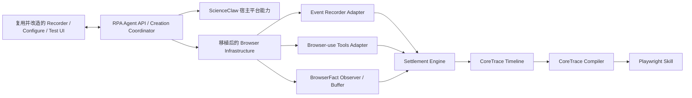
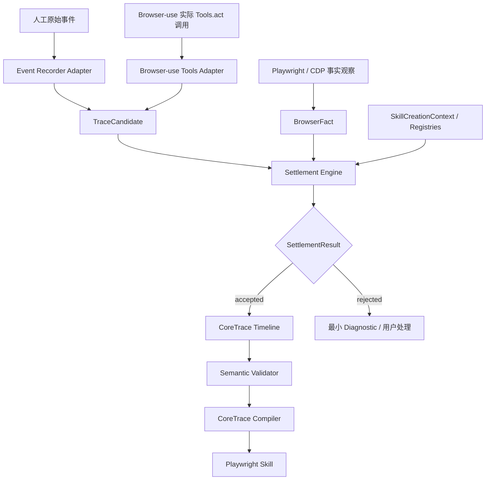

# RPA Agent 基于 ScienceClaw 宿主重构设计基线

> **生命周期说明（2026-07-20）：** [F028 实施设计](2026-07-20-rpa-agent-intent-first-dual-mode-implementation-design.md) 已更新本文中 Browser-use Tools Adapter、Candidate 驱动用户时间线、Settlement 介入录制热路径等内容。宿主隔离、旧 UI 选择性复用和新领域核心不依赖旧 `backend.rpa` 的部分仍然有效；发生冲突时以 ADR-007 和 F028 实施设计为准。

> 文档状态：已确认设计基线。
>
> 文档用途：固定 RPA Agent 在 ScienceClaw 仓库内重新实现时的宿主复用边界、领域隔离规则、分支策略、旧链路退出条件和首批实施约束。
>
> 权威前提：RPA Agent 的产品目标、双通道方案和数据模型继续以本目录中的项目总纲、浏览器双通道设计基线、CoreTrace 规格及创建态上游模型规格为准。ScienceClaw 是技术穿刺和宿主代码基础，不是新 RPA Agent 领域模型的权威来源。
>
> 非目标：本文不定义 DataAsset 完整 Schema、不拆分具体开发任务、不创建 Git 分支、不修改 ScienceClaw 代码，也不承诺兼容 ScienceClaw 的旧录制数据和旧 Skill。

## 1. 决策结论

RPA Agent 不创建完全独立的新项目，而是在 ScienceClaw 仓库内建立新的、边界清晰的领域模块：

```text
RpaClaw/backend/rpa_agent/
```

这项工作不是对 ScienceClaw 旧 RPA 录制链路的数据迁移或增量兼容，而是：

> 复用 ScienceClaw 的宿主平台、浏览器基础设施和产品交互外壳，重新实现 RPA Agent 的录制、结算、CoreTrace、编译和数据资产领域核心。

ScienceClaw 旧 `backend/rpa` 在新链路建设期间只作为只读参考。新 RPA Agent 生产代码不得依赖旧 `RPAAcceptedTrace`、旧 Timeline、旧 `runtime_results` 或旧 `TraceSkillCompiler`。

## 2. 第一性原理判断

项目真正需要复用的是建设成本高、与旧 Trace 语义无关的平台能力：

- 浏览器启动、CDP、Playwright Context 和页面预览；
- 用户、模型、文件、会话、Skill 存储和 API 基础设施；
- Recorder、Configure、Test 页面的主要交互框架；
- 可控测试页面、浏览器回放和 Harness 工程经验。

项目不应因为旧代码已经存在，就继承以下错误成本：

- 扁平且职责混合的 `RPAAcceptedTrace`；
- Browser-use 一整轮 History 压成一条 Trace；
- Compiler 再从万能 `signals` 中猜测动作和副作用；
- 录制事实、运行输出、调试证据和编译提示混在同一对象；
- 为旧数据、旧 Session 和旧 Skill 长期维护兼容分支。

因此采用“同仓库内绿地重建领域核心”，而不是“旧核心原地重构”或“完全新建项目”。

## 3. 已评估的三种路线

| 路线 | 判断 | 原因 |
| --- | --- | --- |
| 原地改造 `RPAAcceptedTrace` | 否决 | 旧模型在后端约 25 个文件中存在近 400 处引用，并与 Manager、Compiler、Route、Harness 混合，兼容成本会反向塑造新架构 |
| ScienceClaw 内新建 `backend/rpa_agent` | 采用 | 保留宿主能力和 Git 历史，同时让新领域模型、接口和 Harness 从零建立清晰边界 |
| 完全独立新项目 | 暂不采用 | 需要重建浏览器、UI、认证、模型配置、Skill 管理和运行基础设施，投入与当前目标不匹配 |

## 4. 目标架构边界



核心依赖方向：

```text
UI / API
   ↓
RPA Agent 应用协调层
   ↓
创建态领域模型与结算
   ↓
浏览器、文件、模型等基础设施适配器
```

领域层不能反向依赖 Vue 页面、FastAPI Route、Browser-use 私有 History、ScienceClaw 旧 Trace 或 Harness 资产。

## 5. 推荐目录结构

```text
RpaClaw/backend/rpa_agent/
├── creation/
│   ├── session.py
│   ├── context.py
│   └── coordinator.py
├── capture/
│   ├── event_recorder_adapter.py
│   ├── browser_use_tools_adapter.py
│   ├── browser_fact_observer.py
│   └── browser_fact_buffer.py
├── models/
│   ├── trace_candidate.py
│   ├── browser_fact.py
│   ├── settlement_result.py
│   ├── core_trace.py
│   └── data_asset.py
├── settlement/
│   ├── engine.py
│   └── semantic_validator.py
├── timeline/
│   ├── store.py
│   └── projection.py
├── compiler/
│   ├── browser_compiler.py
│   └── playwright_renderer.py
├── infrastructure/
│   ├── browser/
│   ├── browser_use/
│   ├── assets/
│   └── storage/
└── api/
    ├── models.py
    └── service.py
```

这是职责草图，不是要求第一批提交一次性创建全部空目录。实现应按纵向能力增量只创建当前需要的模块。

## 6. ScienceClaw 能力处置矩阵

### 6.1 高价值复用

| 能力 | 当前参考位置 | 新系统处置 |
| --- | --- | --- |
| Recorder、Configure、Test 的布局与交互 | `frontend/src/pages/rpa/` | 复用页面与组件，替换 API、状态和 Timeline ViewModel |
| 浏览器预览与 Screencast | `backend/rpa/screencast.py` 及前端预览组件 | 将底层机制移植到新基础设施，保持产品体验 |
| Local CDP 与 Playwright 浏览器启动 | `backend/rpa/cdp_connector.py` | 选择性移植并建立独立测试，不长期从新领域反向 import 旧模块 |
| Recorder 注入脚本 | `backend/rpa/vendor/playwright_recorder_*.js` | 复用原始事件捕获能力，输出改接 Event Recorder Adapter |
| Browser-use 复用当前浏览器 | `backend/rpa/browser_use_recording_operator.py` | 复用 CDP/目标页面绑定经验，重写动作采集出口 |
| 用户、模型、存储和 Skill 基础设施 | ScienceClaw Backend 公共模块 | 通过 Infrastructure Adapter 使用，不复制宿主能力 |
| 受控浏览器测试页 | `rpa-eval-app` | 继续作为代表性页面 Harness，重写期望信号以适配新链路 |

### 6.2 仅作为参考，不进入新生产依赖

| 旧能力 | 原因 | 新替代物 |
| --- | --- | --- |
| `RPAAcceptedTrace` / `RPATraceType` | 混合动作、页面快照、调试证据、结果和编译提示 | CoreTrace + 三个创建态上游模型 |
| `trace_recorder.py` | 直接把录制 DTO 转成 accepted Trace | Event Recorder Adapter → TraceCandidate |
| Browser-use History 整轮 Trace | 一轮指令多个实际动作被压成一条对象 | 每次实际 Action 独立 Candidate |
| `runtime_results` | 值池、数据流和运行上下文职责混合 | SkillCreationContext + Variable/DataAsset Registry |
| `pending_download_events` 合并 | 依赖最近动作和暂停状态，关联边界不稳定 | BrowserFact Buffer + Candidate 事实窗口 |
| `TraceSkillCompiler` 主体 | 读取旧 Trace 的大量私有 evidence 和万能 signals | 只消费 CoreTrace 的新 Compiler |
| 旧 Timeline / Diagnostic | 与旧 Trace 类型和 UI 投影耦合 | CoreTrace Timeline + SettlementResult 投影 |

### 6.3 不能直接按目录删除的能力

当前 `backend/rpa` 还包含 API Monitor、MCP、Harness 和其他非录制能力。因此未来退出对象是“旧录制核心”，不是机械删除整个目录。

最终应逐项分类：

- 删除：旧 Trace、Recorder、Compiler、Timeline 和旧自然语言录制核心；
- 移植：仍有价值的 CDP、Screencast、Recorder Runtime 和浏览器基础设施；
- 改造后保留：Harness，但只验证新事实链路；
- 保留或迁往独立领域：API Monitor、MCP 等非录制能力。

## 7. 新旧依赖隔离规则

### 7.1 生产代码禁止项

`backend/rpa_agent` 生产代码禁止：

- import `RPAAcceptedTrace`、`RPATraceType`、`RPARuntimeResults`；
- 调用旧 `TraceSkillCompiler`；
- 写入旧 `session.traces`、`recorded_actions`、`steps`；
- 把 CoreTrace 转换为旧 Trace 后再编译；
- 从 Browser-use final result 或 History 直接生成 Skill；
- 从 Harness expected signals 补写产品事实。

### 7.2 允许的参考方式

- 阅读旧实现以了解 Playwright、CDP、iframe、Popup 和下载处理经验；
- 把小而独立的底层实现移植到新目录，并同步建立针对新边界的测试；
- 用旧测试案例提炼新 Harness 场景，但不把旧对象格式当作验收目标；
- 在设计材料中记录来源和重新验证结果。

### 7.3 不建立永久双轨

新分支不实现：

- CoreTrace 与 `RPAAcceptedTrace` 双写；
- 新旧 Timeline 同时作为事实源；
- 长期 `rpa_v1/rpa_v2` 产品模式；
- 旧录制 Session 转换脚本；
- 旧 Skill 重新编辑兼容层。

Git 分支和提交历史承担旧能力保留与回滚职责。

## 8. UI 复用边界

UI 是 ScienceClaw 中复用价值最高的部分之一，但复用的是产品体验和组件，不是旧 Trace 字段。

新后端应提供稳定的 Timeline ViewModel，例如：

```text
step_id
sequence
title
description
status
source_display
action_display
effect_displays[]
technical_summary
user_actions[]
```

该 ViewModel 只服务展示和用户交互，不进入 CoreTrace，也不能成为编译事实源。

点击触发下载仍可在 UI 中显示为：

```text
点击“导出”
└── 下载 report.xlsx
```

底层事实仍是一条 click CoreTrace，包含 download Effect 和 DataAsset 输出绑定。UI 可以拆成主动作和副作用显示项，但不能制造第二条 CoreTrace。

产品接口地址可以继续使用 `/api/v1/rpa`，避免向用户暴露内部重构版本；新分支内由 Route 切换到新的 `rpa_agent` 应用服务。

## 9. 新核心数据主链路



两条采集线路共享：

- 同一 SkillCreationSession；
- 同一 BrowserContext 和 Page Registry；
- 同一 BrowserFact Observer；
- 同一变量和 DataAsset 上下文；
- 同一 Settlement Engine；
- 同一 CoreTrace Timeline 和 Compiler。

## 10. 旧架构决策的继承与更新

ScienceClaw 现有 ADR 不能整体照搬，也不能整体废弃。

| 旧决策 | 处置 |
| --- | --- |
| ADR-001：单一 accepted Timeline | 原则继承；唯一 accepted Timeline 从 `RPAAcceptedTrace` 更新为 CoreTrace Timeline，Candidate/Fact/Result 是瞬时结算对象，不是第二事实源 |
| ADR-002：Trace Evidence 驱动 Compiler | 职责更新；Evidence 由 Settlement Engine 消费，Compiler 只读取已经结算、可回放的 CoreTrace |
| ADR-004：RPA Core 拥有事实，Harness 只适配 | 完整继承；Harness 不得补写 Candidate、BrowserFact 或 CoreTrace |
| ADR-005：Browser-use 录制接入边界 | 由新 ADR 取代其旧 Trace 映射方式；保留复用当前浏览器、保留 Agent loop、禁止 final result 成为第二事实源等原则 |

新分支创建后，必须先建立正式 ADR，记录上述继承、更新和取代关系，避免未来开发继续受旧实现约束。

## 11. 分支与工作区策略

根据 2026-07-17 本地已获取的 Git 引用：

```text
upstream/master: e5b717f0
当前 Browser-use 分支: codex/rpa-browser-use-recording-runtime @ 3aa97568
当前分支相对本地 upstream/master: 2 commits ahead / 0 behind
当前 HEAD 与本地 origin 同名分支一致
```

这些信息不是远端最新状态证明。实际创建分支前必须刷新远端引用并再次检查基线。

建议新分支：

```text
codex/rpa-agent-v1-coretrace
```

建议使用独立 Git worktree，以隔离现有 ScienceClaw 目录中的本地数据和未跟踪文件。不得删除或移动当前工作区中的 `.agentmentor`、`data/*` 或用户 Skill 数据来获得“干净目录”。

分支基线默认选择包含 Browser-use CDP 复用穿刺的 `3aa97568`，但只有在刷新远端并确认没有必须吸收的新基线变更后才正式创建。

## 12. 开工前基线门槛

创建新分支后，不立即铺开业务代码。工程底座必须由已确认的首个 E2E 场景反推，而不是先创建空目录或搬运全部契约。开始开发前完成：

1. 创建宿主重构 ADR 和 Feature 验收入口；
2. 固定首个阶段一 E2E 场景、两组 fixtures、硬编码防护和后端 Oracle；
3. 根据场景确认 Skill 输入参数、共享变量和 CoreTrace `data_binding` 的最小契约；
4. 根据新标签页和 iframe 场景确认 Page Registry、Frame Scope 与 Page Effect 的编译契约；
5. 设计 CoreTrace -> Playwright 浏览器段 -> Skill 的产物链路；
6. 将场景实际需要的 CoreTrace 和上游模型契约纳入 ScienceClaw 分支测试；
7. 在第一条纵向实现中同时建立离线测试隔离、旧领域依赖扫描和新目录边界。

现有回归事实：

```text
Browser-use Operator + Runtime Context + Compiler 专项：125 passed
加入 RPA Route 专项：168 passed, 1 failed
```

唯一失败来自测试依赖注入不完整导致真实 Browser-use/LLM 调用，并收到额度 403。该问题必须在新链路实现前隔离，否则离线回归结果不稳定。

## 13. 推荐能力增量

不以“完成多少文件”评估进度，而以可执行、可断言、可复现的业务闭环评估。

### 增量 1：首个阶段一 E2E

```text
系统 A 复杂查询与目标行取值
→ 共享变量
→ 同名行按钮与新标签页
→ 系统 B iframe 填写
→ CoreTrace 编译
→ 同一个 Skill 使用两组数据回放
→ 后端 Oracle
```

该增量内按失败可归因原则分层实现人工通道、Browser-use 通道、结算、编译和回放，不再把“单一 click/fill”当作独立的产品验收终点。

### 增量 2：下载副作用与 DataAsset 闭环

```text
人工点击导出
→ click Candidate + DownloadFact
→ click CoreTrace + download Effect
→ DataAsset
→ expect_download 回放
```

### 增量 3：V1 浏览器取数闭环

- 多页面条件搜索；
- 有下载按钮时下载 Excel/CSV；
- 无下载按钮时分页提取指定列；
- 输出可被阶段二消费的 DataAsset。

### 增量 4：阶段二最小闭环

- 自然语言数据处理指令；
- 输入 DataAsset、源文件或结果模板；
- 用户 Check；
- 数据规则以自然语言沉淀到 Skill。

## 14. 旧录制核心退出门槛

同时满足以下条件后，才能删除或归档旧录制核心：

1. HUMAN 和 AGENT 两条线路只生成新上游模型与 CoreTrace；
2. Recorder、Configure、Test 页面全部使用新 API 和 Timeline ViewModel；
3. 条件查询、下载、分页提取、多 Page、iframe 等代表场景通过；
4. CoreTrace Compiler 生成的 Playwright Skill 可以独立回放；
5. 下载和提取结果可以登记为 DataAsset；
6. 新 Harness 可以从原始采集验证到 Skill 回放；
7. 生产代码扫描确认不再依赖旧录制模型和 Compiler；
8. 新分支保留明确的验证证据和回滚提交点；
9. 团队完成一次以业务场景为输入的人工审查。

退出门槛按能力判断，不按日期或代码行数判断。

## 15. 明确非目标

新分支不承担：

- 兼容旧 `RPAAcceptedTrace`；
- 迁移旧录制 Session、Timeline 或 Diagnostic；
- 兼容旧 Skill 元数据和旧生成脚本；
- 为旧 API 数据形状维护永久转换器；
- 同时运行新旧两套 accepted Timeline；
- 修复 ScienceClaw 与新 RPA Agent 无关的全部历史问题；
- V1 建设通用 DAG、规则引擎、长期 Evidence Store 或完整调试产品。

## 16. 主要风险与约束

| 风险 | 约束 |
| --- | --- |
| 新模块偷偷 import 旧 Trace，形成隐性兼容 | 增加生产依赖扫描和模块边界测试 |
| 为了复用旧 Compiler 而改变 CoreTrace | Compiler 必须以已确认 CoreTrace Schema 为输入，模型变更先回到设计评审 |
| Browser-use History 再次成为事实源 | 只围绕实际工具调用形成 Candidate，History 只作临时诊断 |
| UI 反向要求 CoreTrace 增加展示字段 | 使用独立 Timeline ViewModel，展示字段不进入领域模型 |
| Harness 为了通过而补写事实 | 继承 ADR-004，Harness 只能观察和验证 |
| 旧目录删除误伤 MCP/API Monitor | 退出时逐模块分类，不以整个 `backend/rpa` 为删除单位 |
| 新目录一次性铺空模块 | 只随纵向能力增量创建实际需要的代码和测试 |

## 17. 当前确认与待设计事项

### 已确认

- 采用 ScienceClaw 同仓库独立分支；
- 建立 `backend/rpa_agent` 独立领域目录；
- ScienceClaw 作为宿主平台，旧录制核心只读参考；
- 不兼容、不迁移旧 Trace、旧 Session、旧 Timeline 和旧 Skill；
- 不建立新旧双写或长期双轨；
- 旧录制核心达到能力退出门槛后再删除或归档；
- 整个 `backend/rpa` 不能机械删除，必须按能力分类处置。
- 首个 E2E 是“系统 A 复杂查询与取值 -> 新标签页 -> 系统 B iframe 填写”；
- 首个 E2E 使用一个业务对象及其标量叶子路径，不前置设计 DataAsset；
- 会话级 `SessionVariableStore`、业务语义变量引用、双通道来源保留和运行态隔离已经形成 v0.1 基线；
- 同一个 Skill 必须通过两组不同数据和后端 Oracle，以暴露行号、URL、frame 和字段值硬编码。

### 后续设计

- Skill 外部输入参数与运行时命名空间最小契约；
- Page Registry、Frame Scope、Page Effect 和变量绑定的编译契约；
- CoreTrace -> Playwright 浏览器段 -> Skill 的产物链路；
- 首个 E2E 的 eval-app 测评设计和分层实施计划；
- DataAsset v0.1，推迟到第二个下载/分页提取场景前；
- 团队模块拆分、依赖顺序和验收责任。

## 18. 下一步

当前分支、worktree、ADR 和 Feature 已建立。下一步按首个 E2E 场景继续：

1. 基于已确认的业务变量基线设计 Skill Input/RunContext、Page/Frame/Effect 与变量读写的编译契约；
2. 设计 CoreTrace 到最终 Skill 的产物链路；
3. 设计 eval-app fixture、随机任务 URL 和后端 Oracle；
4. 制定首个 E2E 的分层实施计划；
5. 完成双用例回放后，再进入 DataAsset 场景。

## 19. 相关材料

- [首个阶段一 E2E 验收场景设计基线](./2026-07-17-RPA-Agent首个阶段一E2E验收场景设计基线.md)
- [业务变量绑定与录制态上下文设计基线](./2026-07-17-RPA-Agent业务变量绑定与录制态上下文设计基线.md)
- [F026：RPA Agent ScienceClaw 宿主重构](<../../features/F026-rpa-agent-scienceclaw-host-rebuild.md>)
- [ADR-006：RPA Agent 在 ScienceClaw 内绿地重建领域核心](<../../decisions/ADR-006-rpa-agent-scienceclaw-host-greenfield-core.md>)
- [ScienceClaw RPA 架构接手导航](<../../project/agent-architecture-onboarding.md>)
- [ScienceClaw RPA Harness 入口](<../../rpa/harness/README.md>)

CoreTrace、TraceCandidate、BrowserFact、SettlementResult 及其 JSON Schema 应在首个 E2E 分层实现前按实际消费范围纳入本仓库。不得在验收场景和编译契约尚未确定时先铺开领域模型代码。

## 20. 维护规则

- 本文只维护宿主复用与领域重构上位边界，不复制各数据模型的字段级 Schema；
- 新分支正式 ADR 建立后，本文应链接 ADR 并标明二者权威范围；
- 如果真实实现证明必须依赖旧领域对象，应先说明无法替代的具体能力和消费者，再回到设计评审，不能先加兼容层；
- ScienceClaw 后续新提交如果影响分支基线，应做变更影响分析，不自动合并所有历史 RPA 分支；
- 旧代码退出必须满足第 14 节能力门槛，不得以“看起来已经不用”为依据直接删除。
