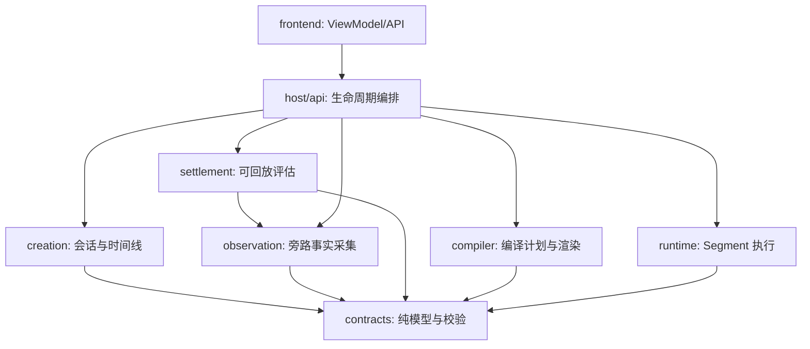
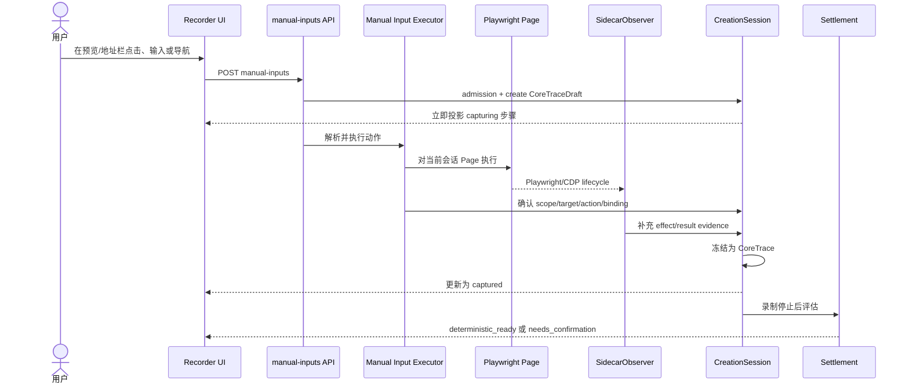
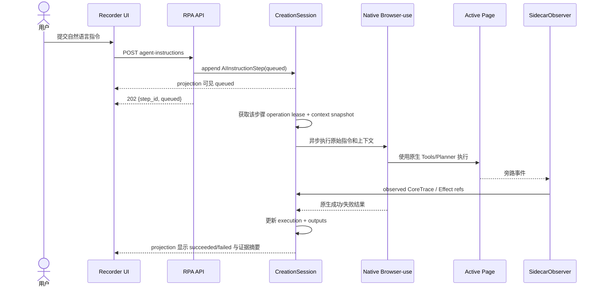
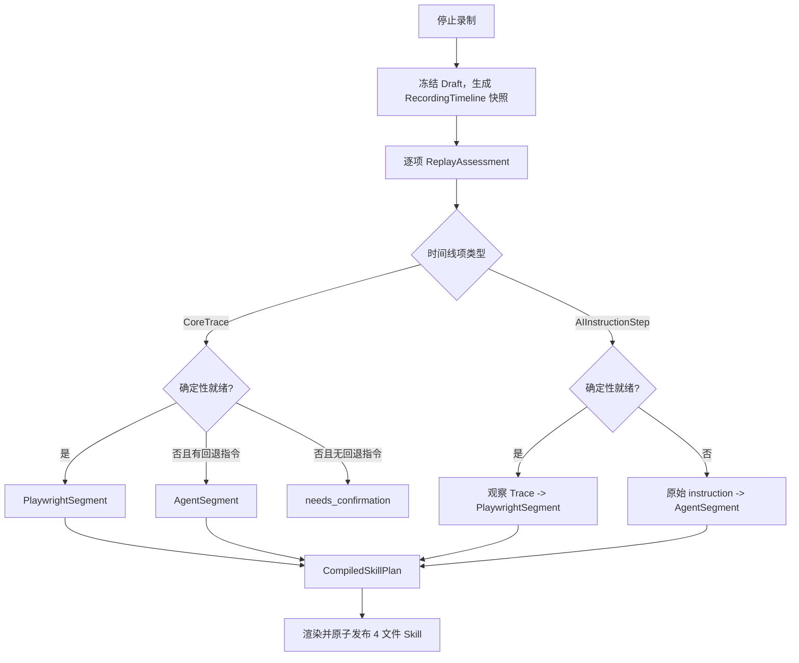
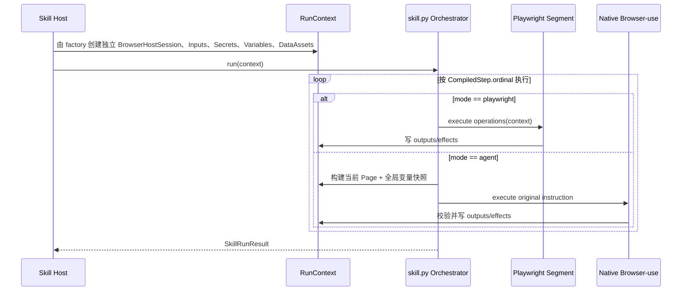

# RPA Agent 意图优先录制与双模式编译实施设计

> 文档状态：实施基线（Implementation Baseline）
>
> 适用 Feature：[F028](../../features/F028-rpa-recording-intent-first-dual-mode-compilation.md)
>
> 决策来源：[ADR-007](../../decisions/ADR-007-rpa-recording-intent-first-dual-mode-compilation.md)
>
> 面向读者：不了解历史讨论、需要直接完成开发的工程师或 Coding Agent
>
> 目标分支：`codex/rpa-agent-intent-first-dual-mode`
>
> 最后更新：2026-07-20

## 0. 如何使用本文档

本文档是 F028 的**权威实施规格**。它负责回答：要改成什么、各模块边界是什么、数据如何流转、应修改哪些代码、如何证明实现正确。

开始开发前，按以下顺序阅读：

1. 本文档；
2. [ADR-007](../../decisions/ADR-007-rpa-recording-intent-first-dual-mode-compilation.md)，理解不可违反的架构决策；
3. [CoreTrace 到 SKILL 编译链路设计基线](2026-07-17-RPA-Agent-CoreTrace到SKILL编译链路设计基线.md)，只继承本文明确保留的 CoreTrace、Binding、Scope、Effect、RunContext 和确定性 Action 编译细节；
4. [ScienceClaw 宿主重构设计基线](2026-07-17-rpa-agent-scienceclaw-host-rebuild-design.md)，只继承本文明确保留的宿主隔离与 UI 复用部分；
5. 当前代码与测试，确认路径和接口没有在后续提交中漂移。

出现冲突时，权威顺序为：

1. ADR-007 的架构决策；
2. 本实施设计；
3. F028 的验收标准；
4. 旧设计基线中未被本文更新的部分；
5. 当前实现。

当前实现不是设计真相。它包含本 Feature 正要移除的行为，例如录制专用 Browser-use Tools、`max_actions_per_step=1`、以 Candidate Settlement 决定左侧步骤是否出现，以及只接受 `CoreTraceTimeline` 的确定性 Compiler。不得因为代码已经存在就保留这些行为。

## 1. 一句话目标

在保留 ScienceClaw 录制交互体验和新版 CoreTrace 事实模型的前提下，把 RPA Agent 简化为：

> 用户意图或手工动作立即进入录制时间线；Browser-use 按原生能力执行；RPA Agent 只提供当前页面、变量等上下文并旁路收集事实；Settlement 判断事实能否稳定回放；Compiler 能确定时生成 Playwright，不能确定时保留原始意图为 AI Instruction；Runtime 按编译结果执行 Playwright 或唤醒原生 Browser-use。

## 2. 为什么必须重构当前实现

### 2.1 用户可见问题

当前实现暴露了三个系统性问题，而不是三个互不相关的小 Bug：

1. **手工步骤显示迟缓。** 用户已经点击、输入或导航，但左侧步骤仍为空或长期“待结算”。原因是 UI 是否出现步骤被绑定到了 Candidate 聚合和 Settlement 完成，而不是绑定到用户已经发生的动作。
2. **自然语言能力被削弱。** RPA Agent 用 `RecordingBrowserUseTools` 替换 Browser-use 原生工具，并通过 `max_actions_per_step=1`、动作记账和自定义完成条件反向约束 Agent 循环。结果是 Browser-use 本来一步能完成的任务被拆成多轮，甚至因为录制监听不完整而把成功任务判为失败。
3. **证据不足导致无法编译。** 当前 Compiler 只接受全部已结算的 `CoreTraceTimeline`。一旦旁路观察没有捕获到完整动作，整个 Skill 被阻塞；但原始自然语言意图本来足以在运行期交给 Browser-use 完成。

这些问题的共同根因是：**执行、观察、判定和编译的职责相互侵入。**

### 2.2 旧 ScienceClaw 与当前新版各自值得保留的部分

| 来源 | 应保留 | 不应继续沿用 |
|---|---|---|
| ScienceClaw | 录制、配置、测试的整体 UI 布局；用户动作快速显示；自然语言对话作为录制入口；本地前后端调试体验 | 多份步骤/Trace/Action 状态并存；旧 `RPAAcceptedTrace`；依赖最近动作猜测下载归属；旧编译链路 |
| 当前新版 | CoreTrace 的 Action、Scope、Binding、Effect 职责；事实采集与确定性编译分离；RunContext；页面、Frame、Locator、变量和 DataAsset 的明确边界 | Candidate/Settlement 控制用户步骤出现；录制专用 Browser-use Tools；RPA Agent 控制 Agent 每步动作数和完成状态；证据不足即阻止编译 |

新方案不是回退旧版，也不是在当前链路上继续加状态，而是组合两者中边界清楚的能力。

## 3. 目标、非目标与成功定义

### 3.1 目标

1. 手工操作发生后，左侧在 500ms 内出现对应步骤草稿，不等待 Effect 完成或 Settlement。
2. 自然语言提交成功后，左侧立即出现一条 AI 指令步骤；该步骤是否存在不依赖 Browser-use 执行了多少动作。
3. Browser-use 使用其原生 Agent、Tools、规划、重试和 `done` 语义；RPA Agent 不替换或收紧它们。
4. 旁路观察继续捕获 Action、页面范围、变量绑定和下载/弹窗/新页面等副作用，形成 CoreTrace 证据。
5. Settlement 只给出证据质量与可回放性判断。
6. Compiler 逐个用户时间线项选择 Playwright 或 AI Instruction，不因单项证据不足阻塞整个 Skill。
7. Runtime 在同一个 RunContext、同一个受控 Page 范围和同一个变量命名空间中执行两类 Segment。
8. UI 整体交互、信息结构和视觉层级以旧 ScienceClaw 为主，只增加新版需要的状态和证据展开组件。

### 3.2 非目标

1. 不修改 browser-use 第三方包源码。
2. 不为 browser-use 新增录制专用 Action、Tool、完成协议或 Planner。
3. 不建设通用 DAG、工作流引擎、规则语言或长期 Evidence Store。
4. 不在 V1 自动生成“部分 Playwright 前缀 + 完整原始 AI 指令”的混合单步，避免重复点击、重复下载等副作用。
5. 不恢复旧 `RPAAcceptedTrace`、`TraceSkillCompiler` 或新旧链路双写。
6. 不大规模重写 ScienceClaw UI；只替换数据源、状态投影和必要组件。
7. 不以 Docker 验证作为本 Feature 验收方式；验收使用本地启动的前后端和真实浏览器、真实 LLM。

### 3.3 成功定义

成功不是“生成了很多 CoreTrace”，而是同时满足：

- 用户看到的步骤与自己的操作/指令一致；
- Browser-use 的任务成功不被录制系统反向否决；
- 每个时间线项最终都有明确的 Playwright 或 Agent 执行方式；
- 编译产物可在新浏览器会话中按相同输入重放；
- 变量与副作用不会在确定性/AI 两条执行路径间丢失。

## 4. 核心原则与不可违反的约束

### 4.1 Browser-use 是执行主体

Browser-use 负责理解自然语言、规划、选择原生工具、执行动作、重试和判断完成。RPA Agent 只允许向它提供：

- 当前录制会话唯一的 `BrowserHostSession` 与活动 Page；
- 截止当前步骤可见的非敏感变量；
- 允许的 Input、Secret 名称、DataAsset 摘要和业务术语；
- 页面别名与输出契约；
- 原始自然语言指令。

RPA Agent 不得：

- 用 `RecordingBrowserUseTools` 或同类包装器替换原生 Tools；
- 设置 `max_actions_per_step=1` 来方便录制；
- 要求 Agent 调用 `extract_variable_and_done` 等录制专用工具；
- 因旁路监听未捕获动作而把 Browser-use 的成功结果改判为失败；
- 根据 Candidate、CoreTrace 或 Settlement 状态决定 Agent 是否继续、重试或 `done`；
- 修改 Browser-use Planner、History、失败计数或原生完成协议。

Browser-use 0.13.2 调用参数白名单如下，未列出的能力参数保持上游默认，不为录制单独覆盖：

| 参数/入口 | V1 规则 |
|---|---|
| `tools` / `controller` | 不传，使用上游原生 Tools |
| `browser_session` | 传 `BrowserUseAttachment`，由 `cdp_url + exact_target_id` 聚焦 factory 创建的 Page；不是把 Playwright Page 对象伪装注入 |
| `max_actions_per_step` | 不传，保持上游默认 5 |
| `max_history_items` | 不传，保持上游默认 `None` |
| `Agent.run(max_steps)` | 中央配置默认 500（上游默认）；只能作为全局成本/安全策略调整，录制和 Runtime 使用同一值，Observer/Settlement 不得动态修改 |
| `step_timeout` / `max_failures` | 保持上游默认 180 秒/5 次，或由同一中央策略统一配置；不能为了易录制而收紧 |
| `use_vision`、planner、loop detection、judge | 保持上游默认或用户统一模型配置，不能在录制路径单独关闭 |
| `enable_signal_handler` | 服务端可设 false，避免子组件接管进程 signal；不改变 Agent 语义 |
| `register_should_stop_callback` / Task cancellation | 只反映用户 stop/exit、服务关停或总运行超时；不得读取 Candidate/Trace/Assessment |
| `sensitive_data` | 在执行边界按 `allowed_secret_refs` 解析后使用上游敏感数据通道；值不进入 task JSON、日志、CoreTrace 或产物，所有回调/History 先脱敏 |
| `available_file_paths` | 只由 `allowed_asset_refs` 经 DataAssetRegistry 解析出的受控本地路径构造；不得接受指令文本中的任意路径 |
| allowed domains / BrowserProfile 安全项 | 只有 Skill/宿主明确安全策略可设置，录制与 Runtime 一致，并写入 manifest policy |

固定 browser-use 版本的 contract test 必须捕获 Agent 构造参数和 run 参数，证明没有隐式覆盖上述默认值。

### 4.2 RPA Agent 是上下文提供者和旁路观察者

旁路观察器监听浏览器和 Browser-use 的只读生命周期，忠实产生事实。它可以标准化、关联和补充事实，但不能发出浏览器动作，也不能决定执行方式。

“旁路”不等于只监听页面级事件。不同动作来源采用不同的只读信号：

| 来源 | 主观察信号 | 辅助信号 | 禁止做法 |
|---|---|---|---|
| 用户手工操作 | `/manual-inputs` dispatch request + executor result | DOM/Accessibility 定位证据、Page/CDP lifecycle 和 Effect 事件 | 从页面事件反推 click/fill，或新建第二套 DOM recorder |
| Browser-use 操作 | Browser-use 原生 `on_step_end` / `AgentHistory` 的只读 action + result 快照 | Page/CDP 生命周期、DOM/Accessibility 证据 | 用自定义 Tools 包住 Action、修改 AgentOutput/History、从回调返回控制信号 |

当前锁定的 browser-use 0.13.2 提供 `Agent.run(..., on_step_end=...)`、`register_new_step_callback` 和 `AgentHistoryList`。实现优先在 `on_step_end` 后读取已执行 action/result，再与 Page/CDP Effect 关联；`register_new_step_callback` 只可用于诊断“模型计划”，不能把尚未执行的 action 当成 CoreTrace。升级 browser-use 时必须用 contract test 重新证明回调时序，不能依赖私有字段静默漂移。

#### 手工操作的 V1 权威入口

Recorder 中的手工操作不是“事后猜测页面发生了什么”。V1 明确保留现有 server-authored 输入链路：前端浏览器预览/地址栏把用户意图提交到 `POST .../manual-inputs`，后端 `host/manual_input.py` 解析 Target 并在当前会话 Page 上执行。该请求与执行结果是手工 Action 的权威边界：

1. API admission 成功后、执行动作前创建 `CoreTraceDraft` 和因果窗口；
2. 由现有 manual input executor 解析 Scope/Target/Binding 并执行，不能新建第二套 DOM recorder；
3. 执行成功后确认 Draft 的 Action；Page/CDP 事件只补充 navigation/download/popup/dialog 等 Effect 和结果证据；
4. 执行失败时 Draft 标为 invalid 并向 UI 返回字段化错误，不伪造 CoreTrace；
5. Recorder 预览之外、用户直接操作任意外部 Chrome 窗口并自动捕获，不属于 V1 目标。

因此 SidecarObserver 对手工通道负责“补充证据”，不负责从页面生命周期反推 click/fill。实现必须复用 `host/browser_session.py` 提供的当前会话 Page，并保持 `/manual-inputs` API 是单一动作入口。manual-input admission 与 AI instruction 使用同一会话 operation lease；AI 运行时 UI 禁用手工输入，绕过 UI 的并发请求返回 409。API 只在短 Session 锁内创建 Draft/预占 lease，浏览器动作在锁外执行，使 Projection 能在动作完成前看到 capturing 行。

允许的数据流只有：

```text
RPA Agent context  ───────> Browser-use
Browser-use actions ──────> Browser/Page
Browser/Page events ──────> Sidecar Observer
Sidecar Observer ─────────> CoreTrace evidence
```

禁止形成以下反馈控制环：

```text
Observer / Settlement ──X──> Browser-use planner / retry / done
```

### 4.3 三类状态必须分离

同一步骤有三种互不替代的状态：

1. **执行状态**：指令是否 queued/running/succeeded/failed/cancelled；
2. **证据状态**：旁路观察是否获得可解释、可关联的事实；
3. **编译状态**：最终选择 playwright/agent/needs_confirmation。

Browser-use 执行成功不代表证据足够；证据不足也不代表执行失败；选择 AgentSegment 更不代表录制失败。

### 4.4 确定性必须可证明，不确定性保留给运行期 AI

只有当证据能够证明稳定回放时，Compiler 才生成 Playwright。否则保留原始意图，由 Runtime 唤醒 Browser-use。Compiler 不猜 Locator、不从聊天文案发明 Action，也不调用 LLM 修补事实。

### 4.5 一个用户意图只产生一个顶层用户步骤

- 手工动作：顶层步骤是 CoreTrace；
- 自然语言：顶层步骤是 AIInstructionStep；
- Browser-use 为一条自然语言执行的零到多个动作，只是该 AIInstructionStep 的观察证据，不在左侧重复生成顶层步骤。

不得引入包裹一切的通用 `SOPStep`。创建期可有内部 `CoreTraceDraft`，但它不是持久领域模型，也不是 Compiler 输入。

## 5. 总体架构

### 5.1 系统上下文

```mermaid
flowchart LR
    User["用户"] --> UI["ScienceClaw 风格 Recorder / Configure / Test"]
    UI --> API["RPA Agent API"]
    API --> Creation["Creation Session"]
    Creation --> Context["Agent Context Provider"]
    Context --> BU["原生 Browser-use Agent"]
    BU --> Page["会话独占 BrowserHostSession / Page"]
    User -->|手工操作| Page
    Page --> Observer["Sidecar Observer"]
    Observer --> TraceStore["CoreTrace Evidence Store"]
    Creation --> Timeline["Recording Timeline"]
    TraceStore --> Settlement["Replay Settlement"]
    Timeline --> Settlement
    Settlement --> Compiler["Dual-mode Compiler"]
    Compiler --> Artifact["SKILL Artifact"]
    Artifact --> Runtime["Skill Runtime"]
    Runtime -->|PlaywrightSegment| Page2["新运行会话 Page"]
    Runtime -->|AgentSegment + Context| BU2["原生 Browser-use Agent"]
    BU2 --> Page2
```



### 5.2 组件职责

| 组件 | 唯一职责 | 明确不负责 |
|---|---|---|
| Recorder UI | 呈现用户时间线、执行状态、证据摘要和编译预览 | 不解释 Candidate，不决定可回放性 |
| CreationSession | 管理会话、时间线顺序、活动操作租约和创建态状态 | 不执行 Browser-use 规划，不编译 |
| AgentContextProvider | 生成当前步骤最小、安全、可序列化的上下文快照 | 不写变量，不监听动作 |
| BrowserUseExecutor | 用原生 Browser-use 执行一条 AI 指令 | 不产生顶层步骤，不判定确定性 |
| SidecarObserver | 从 manual executor、Browser-use 原生 step/history 与 Page/CDP lifecycle 产生 CoreTrace/Effect 证据 | 不控制 Browser-use，不选择编译模式 |
| EffectCorrelator | 把 download/popup/dialog/navigation 等副作用关联到因果 Trace | 不丢弃无法关联的 Effect |
| Settlement | 根据硬条件评估证据质量和可回放性 | 不判定 Agent 成败，不阻塞时间线项存在 |
| Compiler | 按时间线项和评估结果选择 Segment，并渲染 Skill | 不调用 LLM，不补造事实 |
| Runtime | 顺序执行 Segment，维护 Page、变量、DataAsset 和结果 | 不重新 Settlement |

### 5.3 依赖方向



约束：

- `observation` 不依赖 `settlement`、`compiler` 或 `runtime`；
- `settlement` 不依赖 Browser-use Executor；
- `compiler` 不导入创建期 Candidate、Browser-use History 或 UI ViewModel；
- `runtime` 不导入创建期 Session；
- `browser_use` 集成层不得导入 Compiler；
- 新生产代码不得依赖旧 `backend.rpa` 录制核心。

## 6. 数据架构

### 6.1 数据分层

系统只维护四类逻辑真相；录制期数据在 V1 中是 Session-scoped 内存状态，第 12.4 节定义其恢复边界：

| 层 | 数据 | 生命周期 | 用途 |
|---|---|---|---|
| 用户时间线 | `RecordingTimeline` | 录制到编译 | 用户到底录了哪些步骤 |
| 浏览器事实 | `CoreTrace` 与 `BrowserEffect` | 录制到编译；可选保留诊断摘要 | 浏览器实际发生了什么 |
| 评估结果 | `ReplayAssessment` | Settlement 到编译 | 事实能否确定性回放及原因 |
| 编译计划 | `CompiledStep` | 编译到运行 | Runtime 应执行 Playwright 还是 Browser-use |

Browser-use History、DOM Snapshot、截图、Candidate 和原始 CDP 事件属于短期诊断/构建材料，不是 Compiler 的长期输入，也不进入 Skill 产物。

### 6.2 CoreTrace：浏览器动作事实

沿用现有 `core-trace/v0.1` 的核心结构，不把 UI 或 Agent 状态塞入其中：

```python
class CoreTrace(BaseModel):
    trace_id: str
    sequence: int                 # 浏览器事实顺序，不等同于 AI 顶层步骤顺序
    scope: BrowserScope           # page_ref + frame_path
    action: ActionSpec            # navigate/click/fill/.../extract
    data_bindings: list[DataBinding]
    effects: list[BrowserEffect]
    wait_until: list[WaitCondition] | None = None
```

继续保留现有 Action、Binding、Scope、Effect 具体模型及校验。CoreTrace 不保存：

- UI 展开状态、文案和颜色；
- Browser-use 运行轮次、Planner、History 或 `done` 文本；
- Settlement 结果；
- Compiler 模式；
- Secret 值、录制时变量值或大块 DataAsset 内容。

### 6.3 创建期 CoreTraceDraft

为了让手工步骤即时显示，创建期允许存在短生命周期草稿：

```python
class CoreTraceDraft(BaseModel):
    draft_id: str                 # 冻结后成为 trace_id，保持 UI key 稳定
    capture_state: Literal["capturing", "enriching", "ready", "invalid"]
    partial_scope: BrowserScope | None
    partial_action: ActionSpec | None
    data_bindings: list[DataBinding] = []
    effects: list[BrowserEffect] = []
    diagnostic_codes: list[str] = []
```

规则：

1. 决定性手工事件到达时立刻创建 Draft 并投影给 UI；不等待 Effect 或 Settlement。
2. `fill` 等高频事件允许在同一 Draft 内去抖、合并最终值，不能为每个键生成顶层步骤。
3. Scope、Locator、Binding、Effect 到达后只补充该 Draft。
4. Scope/Action/Binding/Effect 在语法上满足 CoreTrace 模型校验后即冻结为 CoreTrace；Locator 是否足够稳定由 Settlement 判断，不能让 Draft 为此长期等待；`draft_id == trace_id`。
5. Draft 不能进入 Compiler、Skill Artifact 或 Runtime。
6. 缺少 Action 或 Scope 等事实而无法冻结的 Draft 是捕获错误：停止录制时必须提示用户删除或重新操作，不能进入最终 RecordingTimeline，也不能静默删除。能够冻结但不满足稳定回放条件的 CoreTrace 才进入 `needs_confirmation`。

### 6.4 AIInstructionStep：自然语言用户步骤

```python
class AIInstructionStep(BaseModel):
    step_id: str
    instruction: str                      # 原始指令，必须原样保留
    created_at: datetime
    execution: AIExecutionState
    context_snapshot_ref: str             # 可审计摘要引用，不含 Secret 值
    observation_trace_refs: list[str] = []
    orphan_effect_refs: list[str] = []
    declared_outputs: list[OutputContract] = []
    expected_effects: list[ExpectedEffect] = []

class AIExecutionState(BaseModel):
    status: Literal[
        "queued", "running", "succeeded", "failed", "cancelled"
    ]
    started_at: datetime | None = None
    finished_at: datetime | None = None
    result_summary: str | None = None
    error_code: str | None = None
    error_message: str | None = None
    selected_attempt_id: str | None = None
    attempts: list[AIExecutionAttempt] = []

class AIExecutionAttempt(BaseModel):
    attempt_id: str
    model_ref: str                         # 服务端模型配置 ID，不含 API key
    status: Literal["queued", "running", "succeeded", "failed", "cancelled"]
    started_at: datetime | None = None
    finished_at: datetime | None = None
    error_code: str | None = None
    observation_trace_refs: list[str] = []
```

规则：

1. API 接受指令后，必须先写入 SessionStore 的 `AIInstructionStep(status="queued")`，再启动 Browser-use。
2. Browser-use 没有动作、失败或被取消，步骤仍然存在。
3. `instruction` 是 AgentSegment 的权威回退内容，不能被总结文本替换。
4. Browser-use 的实际动作以 `observation_trace_refs` 关联；它们是证据子项，不是新的顶层用户步骤。
5. 执行结果可写入 `result_summary`；结构化值必须经输出契约写入 SessionVariableStore。
6. 重试同一用户步骤时追加 `AIExecutionAttempt`，不复制顶层时间线项；每个 attempt 关联自己的观察 Trace，`selected_attempt_id` 指向最终采用的成功 attempt，顶层 `observation_trace_refs` 必须与该 attempt 的 refs 完全相等；历史 attempt 仅用于诊断。
7. `declared_outputs/expected_effects` 是提交时已有的录制契约快照；配置页可补充或收窄最终 `AgentStepConfiguration`，Compiler 只读取后者。不得反向改写原始 instruction、attempt 或录制结果。

### 6.5 RecordingTimeline：唯一用户步骤顺序

```python
RecordingTimelineItem = CoreTrace | AIInstructionStep

class RecordingTimeline(BaseModel):
    schema_version: Literal["recording-timeline/v0.1"]
    session_id: str
    items: list[RecordingTimelineItem]
    observed_traces: dict[str, CoreTrace] = {}
    orphan_effects: dict[str, ObservedEffectEnvelope] = {}
```

Union 通过互斥的必填主键解析：CoreTrace 必须有 `trace_id`，AIInstructionStep 必须有 `step_id`，两类模型都使用 `extra="forbid"`。这使现有 CoreTrace 无需为了时间线增加 UI/包装字段；反序列化必须有冲突与未知类型测试，不得用通用 SOPStep 包装器规避校验。

不变量：

- `items` 数组是左侧用户步骤唯一、最终的排序真相；UI 的 `ordinal` 和 CompiledStep 的 `ordinal` 都按最终数组下标派生，不持久化第二套顶层顺序字段；
- 手工 CoreTrace 直接出现在 `items`；
- AI 观察到的 CoreTrace 只出现在 `observed_traces`，由对应步骤引用；
- 同一 `trace_id` 不得同时出现在顶层和观察集合；
- `observation_trace_refs` 必须全部可解析且顺序稳定；
- 所有 CoreTrace 的 `sequence` 只表示浏览器事实顺序；不得用它排序 AI 顶层步骤，也不得拿它与父 AI 步骤的 ordinal 做数值相等判断；
- 创建期删除把对应 entry 标记为 deleted，最终快照排除该 entry；tombstone 只留在会话审计日志中，不成为第三类 RecordingTimelineItem。重新录制必须创建新会话；
- Compiler 只接受已经停止录制、所有 Draft 均已冻结或显式删除的快照。

### 6.6 ReplayAssessment：Settlement 输出

```python
class ReplayAssessment(BaseModel):
    item_id: str
    status: Literal[
        "deterministic_ready",
        "insufficient_evidence",
        "needs_confirmation",
    ]
    trace_refs: list[str]
    effect_refs: list[str] = []
    issue_codes: list[str] = []
    explanation: str
    assessed_at: datetime
    assessor_version: str
```

Settlement 只能读取时间线项、CoreTrace 和短期 Evidence 摘要并输出评估，不得修改原始步骤。

交叉校验要求：最终 timeline 的每个 item 必须有且只有一条 Assessment；`item_id`（CoreTrace.trace_id 或 AIInstructionStep.step_id）唯一；所有 trace/effect ref 可解析；`assessor_version` 与被评估 timeline hash 一起进入编译 source_hash。多条、缺失或针对旧快照的 Assessment 都是编译错误。

硬性判定规则：

| 条件 | 结果 |
|---|---|
| Scope 可解析；Locator 稳定；Binding 完整；Effect 可验证；观察动作语义覆盖原始意图 | `deterministic_ready` |
| AI 步骤执行成功但动作缺失/不完整，或无法证明语义覆盖 | `insufficient_evidence`，Compiler 选择 Agent |
| 手工步骤缺少稳定 Target/Binding，且没有可用原始意图作为安全回退 | `needs_confirmation` |
| 存在未归因的下载/弹窗/新页面等关键副作用 | 默认 `insufficient_evidence` 或 `needs_confirmation`，绝不能忽略 |
| Browser-use 执行失败 | 执行状态保持 failed；评估独立进行，通常 AgentSegment 仍可生成并在配置页提示 |

“语义覆盖”必须是有限、可测试的规则。例如原始指令要求“打开项目”，观察中至少存在可归因的 click/navigation 并到达目标页；要求“获取 star 数”，观察中需要有带输出绑定的 extract。不能让 LLM 在 Settlement 中自由猜测。

### 6.7 编译计划

```python
CompiledStep = Annotated[
    PlaywrightSegment | AgentSegment,
    Field(discriminator="mode"),
]

class RuntimeModelPolicy(BaseModel):
    mode: Literal["runtime_default", "configured_model"]
    model_ref: str | None = None             # configured_model 时必填；不含凭据

class PlaywrightSegment(BaseModel):
    mode: Literal["playwright"]
    step_id: str
    ordinal: int
    trace_refs: list[str]
    operations: list[BrowserOperation]
    expected_outputs: list[OutputContract] = []
    expected_effects: list[ExpectedEffect] = []

class AgentSegment(BaseModel):
    mode: Literal["agent"]
    step_id: str
    ordinal: int
    instruction: str
    scope_hint: BrowserScopeHint
    output_refs: list[str] = []
    expected_effects: list[ExpectedEffect] = []
    allowed_input_refs: list[str] = []
    allowed_secret_refs: list[str] = []
    allowed_asset_refs: list[str] = []
    page_aliases: dict[str, PageSummary] = {}
    business_terms: list[str] = []
    model_policy: RuntimeModelPolicy
    timeout_seconds: int

class CompiledSkillPlan(BaseModel):
    schema_version: Literal["compiled-skill/v0.1"]
    skill_id: str
    source_hash: str
    steps: list[CompiledStep]
```

上述示例中的辅助类型必须复用或收敛到现有契约：

- `OutputContract` 直接使用现有 `OutputDefinition`（name/title/variable_ref/value_type），不要再建第二套输出定义；
- `ExpectedEffect` 是独立的运行断言契约：`kind` 只能是 navigation/new_page/download/dialog/file_chooser/page_closed；按 kind 携带 url pattern、page ref、asset output ref 或 dialog policy，并用 model validator 禁止无关字段。它不能直接复用“已经发生的事实”BrowserEffect；
- `BrowserScopeHint` 只包含允许 Browser-use 聚焦当前 Page 的 `page_ref`、可选 URL/title 摘要和 frame 提示，不能包含 Locator 或替它规划动作；
- `BrowserOperation` 是现有 CoreTrace 确定性编译计划中的 operation，不是新的浏览器事实类型。

手工 CoreTrace 没有原始自然语言意图。需要 Agent 回退时，回退指令属于配置而不是浏览器事实：

```python
class ManualFallbackInstruction(BaseModel):
    trace_id: str
    instruction: str
    scope_hint: BrowserScopeHint

class AgentStepConfiguration(BaseModel):
    step_id: str
    output_refs: list[str] = []              # 引用 SkillDefinition.outputs.name
    expected_effects: list[ExpectedEffect] = []
    allowed_input_refs: list[str] = []
    allowed_secret_refs: list[str] = []
    allowed_asset_refs: list[str] = []
    page_aliases: dict[str, PageSummary] = {}
    business_terms: list[str] = []
    model_policy: RuntimeModelPolicy
    timeout_seconds: int

class CompilationConfiguration(BaseModel):
    skill_definition: SkillDefinition
    manual_fallbacks: dict[str, ManualFallbackInstruction] = {}
    agent_steps: dict[str, AgentStepConfiguration] = {}
```

因此 Compiler 的完整输入是 `RecordingTimeline + list[ReplayAssessment] + CompilationConfiguration`。配置页补充回退指令不会改写 CoreTrace。每个 AI 顶层项、以及每个使用 Agent 回退的手工项都必须有且只有一个 `AgentStepConfiguration`，即使权限列表为空；所有 ref 必须能在 SkillDefinition 中解析。`RuntimeModelPolicy` 默认 `runtime_default`，表示使用运行用户当时的默认模型；选择 `configured_model` 时 manifest 保存非敏感 model config ref，运行用户无权访问时明确失败。录制 attempt 的 `model_ref` 只用于诊断，不自动固定 Runtime 模型。

选择规则：

| 顶层项 | Assessment | 编译结果 |
|---|---|---|
| 手工 CoreTrace | deterministic_ready | 一个 PlaywrightSegment |
| 手工 CoreTrace | insufficient_evidence / needs_confirmation | 配置页要求用户补充回退指令或重新录制；有明确回退指令后生成 AgentSegment |
| AIInstructionStep | deterministic_ready | 由其观察 Trace 生成一个 PlaywrightSegment，可包含多个 operation |
| AIInstructionStep | insufficient_evidence | 由原始 `instruction` 生成一个 AgentSegment |
| AIInstructionStep | needs_confirmation | 阻止发布该项，要求修正输入/输出/副作用契约；不得猜测 |

V1 中一个顶层项只能选择一种模式。不能把同一步的部分观察动作编译为 Playwright 后再执行完整原始指令。

### 6.8 Agent 上下文与全局变量

创建态和运行态必须遵循同一上下文契约：

```python
class AgentExecutionContext(BaseModel):
    instruction: str
    current_page: PageContext
    variables: dict[str, JsonValue]
    inputs: dict[str, JsonValue]
    allowed_secret_names: list[str]
    data_assets: dict[str, DataAssetSummary]
    page_aliases: dict[str, PageSummary]
    business_terms: list[str]
    output_contracts: list[OutputContract]

class PageContext(BaseModel):
    page_ref: str
    target_id: str
    url: str
    title: str
    attached: bool

class PageSummary(BaseModel):
    page_ref: str
    url: str
    title: str

class DataAssetSummary(BaseModel):
    asset_ref: str
    media_type: str
    byte_size: int
    schema_or_columns: JsonValue | None = None
    preview: JsonValue | None = None
    truncated: bool = False
```

规则：

- `variables` 提供当前步骤之前已经产生的**全部非敏感、小体积、JSON 可序列化**变量，而不是要求前端猜 `required_variable_refs`；
- 大对象、表格、文件只提供 DataAsset 引用、类型、字段和摘要，不内联完整内容；
- Secret 只暴露允许的名称和用途，值由运行时 Resolver 在受控动作中解析，不进入 Prompt、日志、CoreTrace 或产物；
- 上下文快照在步骤开始时冻结，避免执行中并发写导致同一步语义漂移；
- Browser-use 返回的结构化输出先按契约校验，再原子写回 VariableStore；
- AgentSegment 运行时读取 RunContext 中截至该步骤的变量，因此前序 Playwright/Agent 输出都能被后续步骤使用；
- inputs/secrets/assets/page aliases 必须先按该步骤 AgentStepConfiguration 的 allow refs 过滤；SecretResolver 只为这一步解析允许值并传入上游 sensitive_data，DataAssetRegistry 只把允许资产解析为 available_file_paths/摘要；
- Prompt 大小必须有上限和可观测指标，不能随机丢变量。

V1 冻结以下默认上限，并集中为可配置常量、加入 boundary tests：

| 项目 | 默认上限 | 超限行为 |
|---|---:|---|
| 单个普通变量 canonical JSON | 16 KiB | `agent_context_variable_oversize`，要求转为 DataAsset |
| 普通变量总量 | 200 个且 128 KiB | `agent_context_variables_too_large`，不随机裁剪 |
| 单个 DataAsset summary | 4 KiB | 保留 ref/type/size/schema，截断 preview 并置 `truncated=true` |
| DataAsset 数量/摘要总量 | 20 个且 64 KiB | `agent_context_assets_too_large` |
| page aliases | 20 个 | `agent_context_page_aliases_too_large` |
| 最终 Agent context | 256 KiB 且估算 32k tokens | `agent_context_too_large`；不得静默删变量 |

摘要生成失败时提供 metadata-only summary（`preview=null, truncated=true`）；如果连 media type/size/ref 都不可得则拒绝该步骤。Token 估算器和 canonical JSON 算法必须固定版本并记录指标。F028 不再把 DataAsset 上限视为开放问题。

### 6.9 Browser-use 结果与输出绑定

自然语言步骤可能只读取页面并在原生 `done` 结果中返回值，而没有可观察的浏览器 Action。这是合法执行结果，不得伪造 `extract` CoreTrace。

- 录制时尚未声明结构化输出：只保留 Browser-use `final_result()` 的脱敏文本为 `result_summary`，**不在录制期写 VariableStore**。配置页允许用户据此新增输出映射；该变量第一次产生于配置后的 Test replay。
- 录制请求已经携带 `declared_outputs`：优先使用 browser-use 原生 `output_model_schema` / `extraction_schema`（以锁定版本公开 API 为准）要求最终结果符合 JSON Schema，并在录制期校验后写 SessionVariableStore，后续录制步骤可读取。
- Skill 运行时以该步骤 `AgentStepConfiguration.output_refs` 解析结构化输出并写 RunContext VariableStore；这属于结果契约，不是自定义浏览器 Tool。
- AgentExecutor 只解析原生最终结果，进行 schema、类型、大小和 Secret 泄漏校验，再一次性写入 VariableStore；解析失败标记 `agent_output_invalid`，不能部分写入。
- `done` 文本或结构化结果可以证明 AI 执行输出，但不能单独证明某个 Locator/Action 可稳定回放；没有完整动作证据时仍编译 AgentSegment。
- 配置页新增/修改输出契约后，测试必须重新执行对应 AgentSegment；不能把旧录制文本未经验证直接固化为运行值。

### 6.10 副作用事实

现有 `BrowserEffect` 继续表示已经归因到 CoreTrace 的 navigation/new_page/download/dialog。尚未归因或只描述页面生命周期的事件使用带因果元数据的 Envelope：

```python
class LifecycleEffect(BaseModel):
    kind: Literal["file_chooser", "page_activated", "page_closed"]
    page_ref: str
    asset_input_ref: str | None = None       # file_chooser 时可用

ObservedEffectPayload = BrowserEffect | LifecycleEffect

class ObservedEffectEnvelope(BaseModel):
    effect_id: str
    session_id: str
    generation: str
    page_ref: str
    occurred_at: datetime
    payload: ObservedEffectPayload
    candidate_item_ids: list[str] = []
    candidate_trace_ids: list[str] = []
```

`ObservedEffectEnvelope` 是观察事实，不是运行期断言。成功关联后，其 BrowserEffect payload 写入对应 CoreTrace.effects；原 envelope 可留短期诊断。不能唯一关联时放入 RecordingTimeline.orphan_effects，Settlement 必须把相关 `effect_id` 写入 Assessment.effect_refs。若连候选 item 都无法确定，则停止录制时把所有时间上相邻候选项标为 insufficient/needs_confirmation，并在配置页显示“存在未归因副作用”，不能只降级任意最后一步。

至少监听：

- navigation；
- popup/new page；
- download；
- dialog；
- file chooser；
- page activated/switched/closed。

副作用由统一 SidecarObserver 从 Playwright/CDP 生命周期捕获。关联策略：优先使用 action window、page/session id、时间、触发目标和导航链；不能可靠关联时进入 `orphan_effects`，并让 Settlement 降级，绝不能丢弃。

下载回放必须通过 `RunContext.effects` 注册 DataAsset，并把逻辑引用写入 VariableStore 或结果；不得只验证“出现了下载事件”。

## 7. 关键运行流程

### 7.1 手工录制：Action-first



性能验收：在本地开发模式和受控静态测试页上预热 3 次后执行 30 次操作。起点为前端发出 `/manual-inputs` 请求前的 `performance.now()`，终点为同一 draft_id 的左侧 DOM 行在 Vue `nextTick` 后可见；P95 小于等于 500ms，并同时报告机器配置、前端 render 与 API/Projection 各段耗时。Effect 可以稍后补充，不得阻塞首次显示。AI 指令行用同样方法从提交点击到 queued 行可见测量 30 次。

### 7.2 自然语言录制：Intent-first



API 不得在持有整个 Session 写锁时等待 Browser-use。推荐实现为 `202 Accepted + 后台 Task`：

1. 在短 Session 锁内原子完成 admission：校验 session state、解析 idempotency、预占“一个会话最多一条 AI 指令”的 operation lease、追加 queued step/context snapshot，并登记 `AgentTaskRecord(state="reserved")`；
2. 无法预占 lease 时，在创建步骤前返回 409；同一 idempotency key 的合法重试按下表返回已有步骤；
3. 释放 Session 锁，由 HostedSession/SessionStore 持有的 `AgentTaskSupervisor` 创建 Task 并绑定到 reserved record；创建失败则短事务标记步骤 failed、释放 lease 并返回 500；不得使用无法查询和取消的 fire-and-forget Task；
4. Task 成功登记后返回 202，在会话大锁之外运行 Browser-use；
5. Observer 通过窄接口追加证据；
6. 短事务内完成状态和变量写回，最终释放 lease。

Admission 状态表：

| 条件 | 结果 | 是否创建步骤 |
|---|---|---|
| 新 idempotency key，session=recording，lease 空闲 | 原子预占并返回 202 | 是 |
| 同 key、同 canonical payload | 返回原 step_id 与当前状态（202/200 均可，但项目内必须固定并测试；V1 固定 202） | 否 |
| 同 key、不同 payload | 409 `idempotency_conflict` | 否 |
| 不同 key、lease 已占用 | 409 `agent_instruction_in_progress` | 否 |
| stop 先获得锁 | 409 `session_not_recording` | 否 |
| admission 先获得锁，随后 stop | step 已存在；stop 请求 supervisor 取消并最终标记 cancelled | 是 |

这样 Projection 和 Screencast 在 Agent 运行期间仍可读取，不会被长请求锁死。

### 7.3 Settlement 与编译



### 7.4 Skill 运行

本文严格区分三种对象，代码命名也必须避免继续都叫 `BrowserSession`：

| 概念名 | 建议代码名 | 所有者 | 生命周期 |
|---|---|---|---|
| RPA 领域会话 | `HostedRecordingSession` / `HostedTestSession` | SessionStore | 从 API 创建到 stop/exit |
| 浏览器宿主会话 | `BrowserHostSession` | `BrowserRunSessionFactory` | 独占 browser process 或至少独占 BrowserContext、Page、CDP target 与 generation |
| Browser-use 附着 | `BrowserUseAttachment` | BrowserUseExecutor | 单次 AIInstructionStep/AgentSegment，附着已有 CDP target，不拥有宿主浏览器 |

新增 `BrowserRunSessionFactory` 作为唯一宿主创建入口：

```python
class BrowserRunSessionFactory(Protocol):
    async def create_recording(self, *, owner_id: str) -> BrowserHostSession: ...
    async def create_test(self, *, owner_id: str, skill_id: str) -> BrowserHostSession: ...
    async def create_run(self, *, owner_id: str, skill_id: str) -> BrowserHostSession: ...
```

每次新录制、重新录制、Test replay 和正式 Run 都调用 factory。允许复用 Playwright driver 进程，但不得复用 BrowserContext、Page、CDP target、cookie/storage 或 observer generation。Browser-use 只通过该 `BrowserHostSession.cdp_url + exact_target_id` 建立临时 attachment，attachment 关闭时不关闭宿主；Hosted session 结束时由 factory/owner 关闭 BrowserHostSession。



`POST .../test-run` 必须先由 factory 创建 `HostedTestSession + BrowserHostSession`，再从测试 Page 构造 RunContext，并把 Screencast 切换到 test session 的 page ref；结束/取消后关闭 test session。严禁从录制 `hosted.browser.main_page` 构造 Test RunContext。重新录制同样先关闭旧 HostedRecordingSession，再返回包含新 `browser_session_ref`、`page_ref` 和 `generation` 的创建响应。

## 8. API 契约

### 8.1 创建与重新录制会话

`POST /api/v1/rpa-agent/sessions` 不再接受可复用的 `browser_session_ref`。请求只允许可选 `start_url`；服务端调用 `BrowserRunSessionFactory.create_recording(owner_id)`，返回：

```json
{
  "session_id": "rca_...",
  "state": "recording",
  "browser_session_ref": "bhs_...",
  "page_ref": "page_...",
  "generation": "gen_..."
}
```

`POST .../sessions/{old_session_id}/rerecord` 先在旧 session operation lease 下停止 admission、取消任务、drain observer 并关闭旧 BrowserHostSession，再通过 factory 创建并返回**新的 session_id 和全部 browser refs**。清理失败不得把旧 ref 注入新会话；返回明确 cleanup error，由用户重试新建会话。前端路由必须替换 URL 中的旧 sessionId。

### 8.2 提交手工输入

`POST /api/v1/rpa-agent/sessions/{session_id}/manual-inputs` 以现有 request 为基础：`input_id` + `kind(click|text|paste|navigate)`；click 使用 coordinates，text/paste 使用 text，navigate 使用规范化后的 `https?` URL。`input_id` 是 owner/session 范围内的幂等键。旧 ScienceClaw `/rpa/session/{id}/navigate` 不恢复，Recorder 地址栏也统一走本端点，从而 navigation 与 click/fill 共享 Draft/Effect/lease 边界。

短锁内预占共享 operation lease、创建 `CoreTraceDraft(draft_id)` 后，在锁外调用 manual input executor；Projection 此时已经可见 Draft。动作完成后返回 `200 {input_id, draft_id, capture_status}`。旧 `candidate_id/candidate_ids` 响应字段删除，前端不得再以 Candidate 建行。

同 input_id 同 payload 返回已有 Draft/状态；同 key 不同 payload 返回 409 `manual_input_idempotency_conflict`；AI 指令或另一手工动作占用 lease 时返回 409 `session_operation_in_progress`。执行失败返回具体 manual error，同时保留 invalid Draft 供 UI 展示和删除/重试。

### 8.3 提交 AI 指令

`POST /api/v1/rpa-agent/sessions/{session_id}/agent-instructions`

请求头：`Idempotency-Key: <opaque 16..128 chars>`，Recorder 每次用户提交生成一次，并在网络重试时复用；服务端以 owner_id + session_id + key 为作用域，同时保存 canonical request hash。

请求：

```json
{
  "instruction": "打开和 skill 最相关的项目",
  "model_id": "server-owned-model-config-id",
  "business_terms": [],
  "allowed_inputs": {},
  "allowed_secret_names": [],
  "allowed_data_assets": {},
  "page_aliases": {},
  "declared_outputs": [],
  "expected_effects": []
}
```

响应：`202 Accepted`

```json
{
  "step_id": "ais_...",
  "ordinal": 2,
  "execution_status": "queued"
}
```

接口语义：

- `instruction`、声明字段或 `model_id` 格式非法返回带字段路径的 422；不存在的模型配置返回 404，越权模型配置返回 403。这些错误发生在创建步骤前；
- `model_id` 可选；省略时解析当前用户默认模型。服务端只接受当前用户有权访问的模型配置 ID，不接受客户端传入任意 `base_url`、`api_key` 或未经登记的模型名；同步解析成功后创建步骤，并把非敏感 `model_ref` 写入 execution attempt；
- 已授权模型在实际调用时不可用、配额不足或 Agent 运行失败属于异步执行失败，不把已经创建的步骤删除；
- 模型名称校验与 Provider 调用错误要映射为可区分的错误码，例如 `model_not_allowed`、`provider_quota_exhausted`、`agent_execution_failed`；
- `required_variable_refs` 从必填调用契约中移除。若为了兼容暂时保留，只能作为缩减上下文的可选 hint，不能导致未声明的已有全局变量不可见；
- 重复提交严格使用第 7.2 节 admission 状态表，避免网络重试生成两个步骤；缺失或格式非法的 key 返回字段化 422。

### 8.4 Creation Projection

`GET /api/v1/rpa-agent/sessions/{session_id}/projection`

返回面向 UI 的 ViewModel，不暴露 Candidate/Settlement 内部对象：

```json
{
  "session_id": "rca_...",
  "recording_state": "recording",
  "items": [
    {
      "id": "tr_...",
      "kind": "manual",
      "ordinal": 1,
      "title": "导航到 github.com/trending",
      "capture_status": "captured",
      "execution_status": "succeeded",
      "replay_status": "pending",
      "compile_mode": null,
      "observations": []
    },
    {
      "id": "ais_...",
      "kind": "ai_instruction",
      "ordinal": 2,
      "title": "打开和 skill 最相关的项目",
      "capture_status": "observing",
      "execution_status": "running",
      "replay_status": "pending",
      "compile_mode": null,
      "observations": [
        {"trace_id": "tr_obs_...", "action": "click", "summary": "点击 ibelick/ui-skills"}
      ]
    }
  ]
}
```

状态域必须独立：

```text
capture_status: capturing | observing | captured | incomplete
execution_status: queued | running | succeeded | failed | cancelled
replay_status: pending | deterministic_ready | insufficient_evidence | needs_confirmation
compile_mode: null | playwright | agent | needs_confirmation
```

手工步骤的 execution_status 可固定为 succeeded/failed（动作是否实际发生）；AI 步骤使用 Agent 状态。前端不得把 replay_status 显示成 Agent 是否完成。

### 8.5 停止、配置与编译

- `POST .../stop`：停止接受新操作；等待/取消活动 Agent Task；Drain Observer；冻结 Draft；生成可评估快照。若仍有无法冻结且未删除的 invalid Draft，返回 409 `recording_drafts_incomplete` 和 draft ids，会话恢复为 recording 供用户删除/重试；不能生成缺项 timeline。
- `PUT .../configuration`：接受名称、说明、Input/Secret/Output/DataAsset 契约，以及手工不确定项的可选回退指令。请求模型必须与前端字段一致，契约错误返回字段级详情。
- `POST .../compile`（或现有保存并编译入口）：执行 Settlement、生成 CompiledSkillPlan、渲染并原子发布产物。AI 证据不足自动选择 Agent，不返回“配置保存失败”。
- `POST .../test-run`：保持现有公开路径，始终通过 BrowserRunSessionFactory 创建新的 HostedTestSession/BrowserHostSession，并按产物执行；响应返回 test session ref，测试结果按步骤返回 mode、输入输出、副作用和错误。旧别名若存在只允许临时 307/308 跳转并在同一 Feature 内移除。

如果沿用现有复合接口，也必须保留上述事务边界和错误语义。

## 9. UI 交互契约

### 9.1 复用原则

Recorder、Configure、Test 的页面骨架、导航步骤条、三栏布局、浏览器预览、左侧实时步骤和右侧 AI 对话以旧 ScienceClaw 为视觉/交互基线。允许新增：

- AI 步骤的执行状态；
- 可展开的“观察到的动作”子列表；
- 编译方式徽标（确定性 Playwright / 运行时 AI）；
- 证据不足原因和手工回退指令输入；
- 输出变量和下载 DataAsset 配置。

不得把录制页重写成与旧版无关的工作台，也不得在左侧直接显示 Candidate、BrowserFact、Settlement ID 等内部术语。

冷启动实施时使用以下可检出的代码基线，不能凭文字重新设计：

- 旧 ScienceClaw 交互 donor：commit `37f87da3` 下 `RpaClaw/frontend/src/pages/rpa/{RecorderPage,ConfigurePage,TestPage}.vue`；
- pre-F028 最近一次 UI 恢复与测试参考：commit `d7a01010` 的同路径页面和测试；
- 只选择性移植布局、组件与交互，不整体 cherry-pick `d7a01010`，因为该提交同时包含被 F028 撤回的 Candidate/Browser-use 控制代码。

UI 回归清单必须逐项截图/断言：顶部“录制→配置→测试保存”步骤条；录制页左侧实时步骤、中央浏览器、右侧 AI 助手三栏；顶部完成录制；配置页逐步参数/输入/Secret/输出；测试页浏览器和逐步结果。新增组件不得改变这些主路径的位置和顺序。

### 9.2 左侧时间线行为

- 用户手工操作：立即出现动作摘要；捕获补全时原地更新，不能新增重复行。
- 用户提交自然语言：立即出现原始指令；右侧聊天与左侧步骤引用同一个 `step_id`。
- AI 观察动作：默认折叠显示数量；展开后作为子项，不计入顶层步骤数。
- 执行失败：步骤保留并显示错误；用户可重试该指令，重试生成 attempt 记录但不复制顶层步骤，除非用户明确“新增一步”。
- 删除/重录：按用户步骤操作；重新录制创建新的 HostedRecordingSession/BrowserHostSession，不复用旧页面。

### 9.3 配置页行为

配置页逐个顶层步骤展示 Compiler 预判：

- `Playwright`：显示稳定动作摘要、输入/输出和副作用；
- `AI`：显示将保留的原始指令、需要的变量/Secret/DataAsset 和期望输出；
- `需确认`：明确缺哪个 Scope、Binding、Effect 或回退指令，不能只显示“配置保存失败”。

“开始测试”前进行纯本地 schema 校验并显示字段级错误；后端 422 也必须映射到具体字段和错误码。

## 10. 当前代码到目标代码的迁移

以下路径以 `RpaClaw/` 为项目根目录。

| 当前模块 | 处置 | 目标 |
|---|---|---|
| `backend/rpa_agent/contracts/models.py` | 保留并扩展 | 保留 CoreTrace/Scope/Action/Binding/Effect；新增 AIInstructionStep、RecordingTimeline、ReplayAssessment、CompiledStep 契约；避免 UI 字段进入领域模型 |
| `backend/rpa_agent/creation/timeline.py` | 重构 | 从“只存 Accepted CoreTrace”改为创建期 Draft + AIInstructionStep，以及停止后的 RecordingTimeline 快照 |
| `backend/rpa_agent/creation/projection.py` | 替换投影逻辑 | 从 Candidate/CoreTrace/Diagnostic 投影改为用户时间线 ViewModel；隐藏内部事实 |
| `backend/rpa_agent/creation/session.py` | 重构 | 管理 timeline、observer sink、Agent operation lease、context snapshot 和独立状态；不持长锁执行 Agent |
| `backend/rpa_agent/creation/settlement.py` | 收窄职责 | 输出 ReplayAssessment；不得控制 Browser-use 或时间线项存在 |
| `backend/rpa_agent/creation/readiness.py` | 替换 | 证据不足的 AI 项可编译为 AgentSegment；只有真正需确认项阻止发布 |
| `backend/rpa_agent/browser_use/adapter.py` | 从热路径移除/重构 | 不再把 Tools 调用映射为执行控制；如保留，仅作为原生事件/History 的只读规范化辅助 |
| `backend/rpa_agent/browser_use/context.py` | 保留并扩展 | 构建全局非敏感变量、DataAsset 摘要、Secret 名称和 Page 的统一上下文 |
| `backend/rpa_agent/host/browser_use_agent.py` | 关键重构 | 删除 `RecordingBrowserUseTools` 注入、动作记账和 `max_actions_per_step=1`；使用原生 Agent/Tools；以 cdp_url + exact_target_id 建立 BrowserUseAttachment 并提供上下文 |
| `backend/rpa_agent/host/manual_input.py` | 保留为手工权威入口并重构编排 | admission 时创建 Draft/因果窗口；复用现有 target 解析与动作执行；执行在 Session 锁外；结果确认 Action，Observer 只补 Effect |
| `backend/rpa_agent/host/browser_session.py` | 拆清职责并重命名概念 | 作为 BrowserHostSession 适配基础；移除 Candidate 自动 Settlement；增加 generation/ownership/observer sink；不得与 browser-use attachment 混名 |
| `backend/rpa_agent/host/scienceclaw_browser.py` | 纳入 factory | 由 BrowserRunSessionFactory 统一创建 recording/test/run 宿主与 exact CDP target，不得复用旧 page |
| `backend/rpa_agent/compiler/compiler.py` | 重构入口 | 输入 RecordingTimeline + Assessment；逐项输出 PlaywrightSegment/AgentSegment；复用已有确定性 operation renderer |
| `backend/rpa_agent/runtime/context.py` | 保留 | 继续作为 Page/Input/Secret/Variable/DataAsset/Effect/Agent 的运行边界，补齐统一 Agent context builder |
| `backend/rpa_agent/runtime/agent.py` | 重构集成 | 调用原生 Browser-use，并按 OutputContract 回写；不要求自定义完成工具 |
| `backend/rpa_agent/host/default_services.py` | 扩展 | 运行双模式 plan；Test RunContext 必须来自 factory 新建的 BrowserHostSession，不再读取录制 `main_page`；仍原子生成/加载 4 文件 Skill |
| `backend/rpa_agent/host/session_store.py` | 保留并加原子 admission/租约 | 会话状态机和 2h TTL 保留；新增短锁 `admit_manual/admit_agent`、operation lease、idempotency、AgentTaskSupervisor 与 BrowserHostSession ownership；禁止 `use()` 跨浏览器/LLM await 持锁 |
| `backend/route/rpa_agent.py` | 重构 manual/Agent/test endpoint | `/manual-inputs` 保持手工单一入口；AI admission 原子预占 lease 后 202；Projection 可并发读取；`/test-run` 新建 test host；停止时 drain/cancel |
| `backend/rpa_agent/api/models.py` | 更新契约 | 新增异步响应、独立状态、输出/副作用声明；修正 configuration 请求/前端一致性 |
| `frontend/src/api/rpaAgent.ts` | 更新类型 | 用用户时间线 ViewModel 替换 Candidate 状态类型 |
| `frontend/src/utils/rpaAgentCreationProjection.ts` | 重写 | 只转换新 Projection；不在前端推断 Settlement |
| `frontend/src/pages/rpa/*` | 以旧 UI 为主局部改造 | 恢复 ScienceClaw 交互骨架，接入新 ViewModel 和新增状态组件 |

### 10.1 必须从运行热路径删除的行为

用静态测试或 `rg` 守卫以下行为：

- `RecordingBrowserUseTools` 被传给 `browser_use.Agent`；
- `max_actions_per_step=1`；
- `extract_variable_and_done` 或任何录制专用 `done` Tool；
- “没有记录完整步骤所以 Agent 请求失败”的成功后置否决；
- Candidate/Settlement 结果驱动 Browser-use retry/stop；
- Compiler 只因 AI 观察 Trace 不完整而拒绝整个 Skill。

如果类名暂时保留以兼容测试，也必须确保没有生产调用路径，并在同一 Feature 内删除。

### 10.2 推荐目标模块边界

只在真正实现时创建文件，不预建空目录：

```text
backend/rpa_agent/
  contracts/
    models.py                  # 稳定领域契约
  creation/
    session.py                 # 创建态与 operation lease
    timeline.py                # Draft/AI 时间线与冻结
    projection.py              # UI ViewModel
  observation/
    observer.py                # 原生 Agent lifecycle + Page/CDP 旁路订阅
    correlator.py              # Action/Effect 关联
  settlement/
    assessor.py                # ReplayAssessment
  browser_use/
    executor.py                # 原生 Browser-use 调用
    context.py                 # 统一上下文
  compiler/
    compiler.py                # 双模式计划
    playwright_renderer.py     # 复用确定性 Action 编译
    skill_renderer.py          # 4 文件产物
  runtime/
    context.py
    agent.py
    executor.py                # CompiledStep 编排
```

目录不是验收目标；职责和依赖方向才是。若现有文件能清晰承载职责，不为“看起来新”而机械搬迁。

## 11. Skill 产物与 Runtime

继续采用现有四文件产物，避免额外格式扩张：

```text
<skill>/
  SKILL.md
  skill.manifest.json
  skill.py
  browser_segment.py
```

- `SKILL.md`：人类可读的用途、输入、Secret、输出和运行说明；
- `skill.manifest.json`：版本、timeline hash、步骤 mode 摘要、输入输出/权限；不保存 Secret、DOM、截图、Browser-use History 或完整 CoreTrace；
- `skill.py`：按 CompiledStep 顺序编排，Playwright 调 `browser_segment.py`，Agent 调 `RunContext.agent.execute(...)`；
- `browser_segment.py`：只包含由稳定 CoreTrace 渲染的确定性操作。

新链路必须把 manifest 升级为 `skill-manifest/v0.2`，不能继续使用只描述 CoreTrace 的 `SourceContract`：

```python
class CompilationSourceContract(BaseModel):
    schema_version: Literal["recording-compilation-source/v0.1"]
    recording_timeline_schema_version: Literal["recording-timeline/v0.1"]
    compiler_version: str
    source_hash: str                  # 64 位小写 sha256
    item_count: int
    playwright_segment_count: int
    agent_segment_count: int

class SkillManifestV02(BaseModel):
    schema_version: Literal["skill-manifest/v0.2"]
    # identity/runtime/input/secret/asset/output 字段继续复用现有契约
    source: CompilationSourceContract
    agent_policies: dict[str, AgentStepConfiguration]
```

`source_hash` 必须对 canonical JSON 的 `{RecordingTimeline, ReplayAssessment[], CompilationConfiguration, compiler_version}` 整体计算。修改 manual fallback、output/resource/model policy 或 assessor 结论都会改变 hash。Manifest 中的 `agent_policies` 只保存非敏感 ref 与策略，不保存 Secret 值、DataAsset 真实路径或录制上下文值。旧 `skill-manifest/v0.1` 仍可由旧宿主读取，但 F028 Compiler 只生成 v0.2，不做双写。

`skill.py` 的生成逻辑必须显式传递 `step_id`、scope hint、原始 instruction、输出契约和期望副作用。AgentSegment 不得调用录制期 API。

发布仍采用临时目录写入、完整校验、原子替换。编译失败不得破坏上一个可运行版本。

## 12. 并发、会话与失败语义

### 12.1 会话隔离

- 每个 recording/test/run 拥有自己的 BrowserHostSession/Page ownership token 和 generation；
- SessionStore 不得缓存并复用已停止 HostedSession 的 BrowserHostSession 或 Page；
- 退出、完成、重新录制时关闭本会话拥有的 Page/Context 和 Screencast 订阅；
- Observer 的事件必须带 session_id、page_id 和 generation，迟到事件不能写入新会话。

### 12.2 Agent 串行与锁

- 一个录制会话同一时刻最多运行一条 AIInstructionStep；
- operation lease 与 Session 数据锁分离；
- Projection、Screencast、状态查询在 Agent 执行期间可用；
- 第二条指令可以返回 409 `agent_instruction_in_progress`，或进入显式队列；V1 推荐返回 409，避免隐式排队改变用户顺序；
- 用户停止录制时，先禁止新指令，再请求取消活动 Agent；在超时后标记 cancelled 并清理 BrowserUseAttachment；HostedSession 退出时再关闭 BrowserHostSession。

### 12.3 错误分类

| 类别 | HTTP/状态 | 用户语义 |
|---|---|---|
| 请求 schema / 配置字段错误 | 422 + 字段级 detail | 修正输入后重试 |
| 模型不在 allowlist | 步骤 failed，`model_not_allowed` | 换允许的模型 |
| Provider 403/配额 | 步骤 failed，`provider_quota_exhausted` | 配置账户/模型，不是录制不完整 |
| LLM/结构化输出无法解析 | 步骤 failed，`agent_output_invalid` | 模型兼容性或输出契约问题，不删除步骤 |
| Browser-use 原生任务失败 | 步骤 failed，`agent_execution_failed` | 可重试或调整指令 |
| 旁路证据不足 | execution 可 succeeded；replay insufficient | 自动编译为 Agent，不显示任务失败 |
| 手工动作无法确定性回放 | needs_confirmation | 补回退意图或重录 |

### 12.4 V1 存储与进程重启语义

V1 明确使用**进程内、owner-scoped 的临时 SessionStore**，沿用当前默认 2 小时 idle TTL，不承诺后端进程重启后恢复录制。本文中的“写入/保存步骤”表示写入该会话 Store，不表示数据库持久化。

- RecordingTimeline 创建态、context snapshot、idempotency record、AgentTaskRecord、tombstone audit 和 Observer buffer 都属于 HostedSession 内存状态；
- 编译并原子发布后的四文件 Skill 才是跨进程持久产物；
- 服务正常关停必须先拒绝 admission、取消/等待 supervisor tasks、关闭 BrowserHostSession，再清空 Store；
- 进程异常重启后旧 session id 返回 404 `session_not_found`，UI 明确提示重新录制，不能假装恢复；
- `context_snapshot_ref` 只在 Session TTL 内可解析，值经过脱敏且不含 Secret；
- 后续若要求断点恢复，必须新增持久仓库、task lease 恢复和浏览器重附着 ADR，不能把本 Feature 悄悄扩成分布式任务系统。

## 13. 分阶段实施与回滚点

必须以“可验证能力增量”实施，不以大规模一次性重写为进度。

### 增量 0：契约与 Harness

实现：

- 新领域模型及序列化/交叉校验；
- Projection、ReplayAssessment、CompiledStep contract tests；
- 静态架构守卫，锁定 Browser-use 不被自定义 Tools/step limit 控制；
- Feature flag 仅用于切换整条 F028 新链路，不做新旧双写。

证据：离线测试通过；Golden JSON 可往返；旧 CoreTrace action compiler 单测不回退。

回滚：只回滚契约提交，无数据迁移。

### 增量 1：原生 Browser-use 与 Intent-first 时间线

实现：

- POST 指令先创建 AIInstructionStep，202 异步运行；
- operation lease 与 Session 锁分离；
- 删除生产路径的 RecordingBrowserUseTools、动作记账和 step limit；
- Context Provider 传全局非敏感变量；
- Observer 只读挂载。

证据：使用 fake Browser-use 证明步骤立即出现、0/1/N 个动作都不影响顶层步骤；Projection 在 Agent 运行中可读取；原生 `done` 决定执行成功。

回滚：Feature flag 整体退回上一可运行版本；不保留双写。

### 增量 2：Action-first 手工时间线与副作用

实现：

- CoreTraceDraft 即时投影、fill 合并、冻结；
- navigation/download/popup/dialog/file chooser/page lifecycle 旁路采集；
- orphan effect 保留与可见。

证据：手工步骤 P95 <= 500ms；下载关联及 orphan 降级测试；重新录制无 Page 串扰。

### 增量 3：Settlement 收窄

实现：

- 逐项 ReplayAssessment；
- 有限语义覆盖规则；
- 执行/证据/编译状态完全分离。

证据：相同 Browser-use 成功结果在完整/不完整证据下分别得到 playwright/agent，但 execution 都为 succeeded。

### 增量 4：双模式 Compiler 与 Runtime

实现：

- RecordingTimeline -> CompiledSkillPlan；
- PlaywrightSegment 复用现有 CoreTrace operation renderer；
- AgentSegment 用原始 instruction 和统一 RunContext；
- 变量、输出、下载在两种 Segment 间贯通；
- 四文件原子发布。

证据：纯 Playwright、纯 Agent、混合多步三类离线/集成测试；证据不足不阻塞 AI 项编译；单项不重复执行。

### 增量 5：ScienceClaw UI 恢复与本地 Live E2E

实现：

- 恢复旧录制/配置/测试 UI 骨架；
- 接入新 Projection 和独立状态；
- 增加观察子项、编译模式、回退指令和字段级错误。

证据：本地启动前后端，使用真实 LLM、真实 browser-use、真实 Playwright 完成第 14 节场景并保存日志/截图/产物/重放结果。

## 14. 验证 Harness 与验收场景

### 14.1 离线测试

至少覆盖：

- RecordingTimeline Union 序列化、顺序和引用完整性；
- Draft 冻结、不完整 Draft 和 fill 去抖；
- AI 步骤在 0/1/N 个观察动作时始终只有一个顶层项；
- 执行状态和 ReplayAssessment 正交；
- 每条编译决策表分支；
- 未关联副作用不会丢失；
- Secret 不进入上下文 JSON、日志、CoreTrace、manifest 或生成代码；
- Agent 输出按契约写入 VariableStore；
- 编译原子发布和失败回滚；
- 新 HostedSession 不复用旧 BrowserHostSession/Page；
- 静态守卫禁止录制专用 Tools、step limit 和成功后置否决。

### 14.2 集成测试

使用可控 fake Browser-use 和真实 Playwright 测试页验证：

1. Agent 原生返回成功但 Observer 捕获零动作：步骤 succeeded，assessment insufficient，编译 AgentSegment。
2. Agent 执行 click + navigation，证据完整：编译 PlaywrightSegment。
3. Agent 第一轮已 `done`：Executor 立即结束，不出现 RPA 自己添加的 Step 2-6。
4. 下载由 click 触发：Effect 关联、重放并注册 DataAsset。
5. Agent 运行中持续 GET projection：不阻塞，状态从 queued -> running -> succeeded。
6. 停止并重新录制：新 Page 初始状态独立，无旧页面、变量或 Observer 迟到事件。

### 14.3 本地真实 Live E2E（强制）

环境：本地启动前端和后端，不使用 Docker；使用 `.env` 已配置的真实 LLM Provider。模型从实际 allowlist 选择可用项，例如 `qwen3.7-plus-2026-05-26`、`qwen3.7-max-preview`、`qwen3.5-plus-2026-04-20`，不得用 Mock 替代最终验收。模型配额/权限错误必须作为环境失败单独记录，不得伪装成功。

主场景：

1. 新建录制会话，确认 factory 产生新的 BrowserHostSession、Page、exact target 与 generation；
2. 手工打开 `https://github.com/trending`；
3. 确认左侧快速出现手工导航步骤；
4. 输入“打开和 skill 最相关的项目”；
5. 确认左侧立即出现 AI 指令步骤，Browser-use 使用原生循环打开项目；
6. 输入“获取 star 数”；
7. 确认左侧立即出现第二条 AI 指令；本主场景提交前没有声明输出，因此录制期只保存 `result_summary`，不声称变量已经写入；
8. 停止录制，查看每步 ReplayAssessment 和 playwright/agent 选择；
9. 配置名称、说明、输入/Secret/输出/DataAsset，把 star 结果声明为该 AI 步骤的 output ref，成功编译；
10. 开始测试，使用全新 HostedTestSession/BrowserHostSession 重放；
11. 断言最终项目页正确，Test replay 首次产生 star 变量，且其标准化值与项目页可独立读取的 star counter 一致，混合 Segment 顺序正确；
12. 退出后重新录制，断言没有复用测试或上次录制页面。

主场景 Oracle（避免“相关/合理/原生”等主观判断）：

- 第 2 步后 URL path 必须为 `/trending`；
- 第 5 步后 URL 必须匹配 `https://github.com/{owner}/{repo}` 且不再是 `/trending`，页面可见 repo name/description/topic/README heading 中至少一处按 Unicode casefold 包含 `skill`；最终记录所选 URL，不硬编码某个动态 Trending 排名；
- star 输出先按 GitHub UI 的 `k/m` 表示规范化为整数，再与测试结束时由独立 Playwright Locator 读取的同一 repo star counter 规范化值比较；允许页面实时变化导致的容差为 `max(1, 0.1%)`；
- Browser-use 原生边界由构造参数 contract test 与运行日志共同证明：`tools` 未传、`max_actions_per_step/max_history_items` 未覆盖，History 一旦 `is_done && is_successful` 即结束，RPA 不追加轮次；
- download 场景不使用“合理降级”：完整 Action+Effect+asset binding 必须得到 playwright；缺任一硬条件的 AI 项必须得到 agent；手工项必须 needs_confirmation；
- UI 一致性以第 9.1 节 donor commit、回归清单和同视口 before/after 截图为 Oracle，不以评审者主观印象代替。

副作用场景：录制一次点击后下载文件的操作，按上述硬分支断言 download Effect 与编译 mode；重放后 DataAssetRegistry 中必须存在 manifest 声明的 asset output ref，文件存在、非空且 media type/文件名满足配置断言。

验收证据必须包含：

- 前后端本地启动命令与版本；
- 所用模型/provider（不记录 key）；
- API 状态变化与关键后端日志；
- Recorder、Configure、Test 截图或视频；
- RecordingTimeline、ReplayAssessment、CompiledSkillPlan 脱敏摘要；
- 生成 Skill 文件清单和测试结果；
- 第二次录制会话隔离证明。

## 15. Definition of Done

只有同时满足以下条件才能声明 F028 完成：

- [ ] 用户时间线领域模型只有顶层 CoreTrace 与 AIInstructionStep，没有通用 SOPStep；
- [ ] 手工动作和 AI 指令都立即显示，满足延迟与不重复要求；
- [ ] Browser-use 使用原生 Tools、Planner、retry、history 和 done，没有录制控制协议；
- [ ] Observer/Settlement 不向 Browser-use 形成反馈控制；
- [ ] Side effect 不丢失，无法归因时明确降级；
- [ ] Settlement 只输出 ReplayAssessment；
- [ ] AI 证据不足可编译为 AgentSegment，不阻塞 Skill；
- [ ] Playwright/Agent Segment 共用 Page、变量、Secret、DataAsset 和输出契约；
- [ ] 重新录制和测试创建新 HostedSession/BrowserHostSession，无会话串扰；
- [ ] UI 通过 donor commit 交互清单、自动化断言和同视口截图回归，配置错误可定位；
- [ ] 离线、集成和本地真实 LLM Live E2E 证据齐全；
- [ ] ADR/F028/旧规格的生命周期链接已更新；
- [ ] 无旧录制核心生产依赖和新旧双写；
- [ ] 代码、测试、文档和实际运行行为一致。

## 16. 给实施 Agent 的执行指令

1. 不要直接开始大规模改代码。先把第 14 节测试骨架和第 10.1 节静态架构守卫落地，建立可失败的 Harness。
2. 开工前用 `rg` 定位当前 `RecordingBrowserUseTools`、`max_actions_per_step`、Candidate Projection、Session 长锁和 CoreTrace-only Compiler 的全部生产调用点，形成迁移清单。
3. 按第 13 节逐个能力增量提交；每个提交必须包含对应自动化证据和回滚点。
4. 不要整体 cherry-pick 旧备份分支。UI 只选择性复用旧 ScienceClaw 页面/组件；领域状态和 API 必须接新 ViewModel。
5. 不要为了通过 E2E 给 GitHub 场景写特殊判断，也不要在 Settlement 中调用 LLM 猜动作。
6. 若发现本文与 ADR-007 冲突，停止实施并提出 ADR 变更；若只是路径/接口与当前代码漂移，在不改变决策的前提下更新本文和 Feature Evidence。
7. 最终汇报必须按 Definition of Done 逐项给出证据，不以“测试大部分通过”或“代码已实现”代替能力验收。

## 17. 已确定事项与暂不扩张项

已确定：

- AI 指令采用 202 异步执行，以保证时间线即时可见和 Projection 不被长锁阻塞；
- 一个会话使用统一 operation lease，同时只运行一条手工动作或 AI 指令；admission 失败在创建步骤前返回 409；
- 编译模式以顶层时间线项为原子；
- AI 证据不足自动降级 Agent；
- 手工证据不足且无原始意图时需要用户确认；
- 全局非敏感变量按冻结上限默认提供给 Browser-use；Secret 在 task JSON 中仅按名称授权，在执行边界通过原生 sensitive_data 通道解析；
- 未预声明输出的 AI 录制只保存 result_summary，变量在配置后的 Test replay 首次产生；
- AgentSegment 的输出、资源权限、页面、模型和副作用策略按 step 配置；录制模型只作诊断，Runtime 模型由显式 policy 决定；
- session 数据 V1 只在进程内保存 2 小时，只有原子发布的 Skill 跨重启持久；
- 四文件 Skill 产物升级 manifest v0.2，并继续复用 RunContext 基础；
- 本地真实 LLM Live E2E 是强制验收。

暂不扩张：

- 单步内的确定性前缀 + AI 后缀切分；
- 多 Agent 指令并发或隐式队列；
- 长期保存完整 DOM、截图和 Browser-use History；
- 通用语义规划器或 LLM Settlement；
- 对任意桌面应用的录制支持。

这些事项只有在真实用例证明当前边界不足，并有新的 ADR 与验收 Harness 后才能进入设计。

## 18. 文档生命周期关系

本文：

- **implements** ADR-007；
- **specifies** F028；
- **updates** `2026-07-17-rpa-agent-scienceclaw-host-rebuild-design.md` 中 Browser-use Tools Adapter、Candidate 驱动左侧时间线和录制热路径部分；
- **updates** `2026-07-17-RPA-Agent-CoreTrace到SKILL编译链路设计基线.md` 中“CoreTraceTimeline 是唯一 Compiler 输入”和证据不足阻止编译的部分；
- **preserves** 两份旧规格中未冲突的宿主隔离、CoreTrace 低层事实模型、Binding/Scope/Effect、确定性 Action 编译、RunContext 和四文件原子发布设计。

实现完成后，应在 F028 Evidence 中登记具体提交、测试和 Live E2E 证据。若后续改变 Browser-use 主体地位、时间线两类顶层项或双模式编译原则，必须新增或更新 ADR，而不是只改代码。
