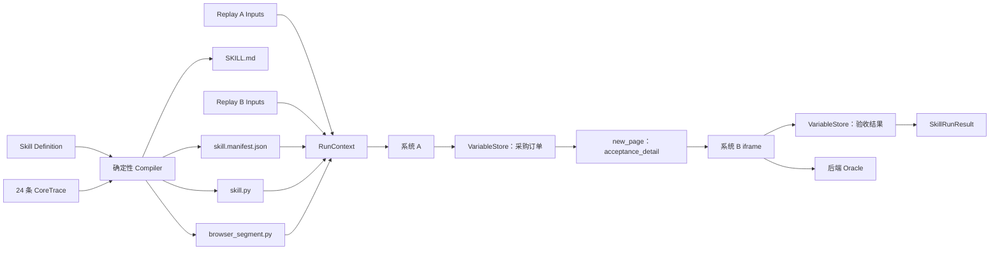

# RPA Agent 首个 E2E：CoreTrace 到 Playwright SKILL 完整示例

> 状态：v0.1 Golden Sample（2026-07-17）
> 用途：把已确认的首个阶段一 E2E、CoreTrace、业务变量契约和 Compiler 设计串成一套可检查的端到端示例。
> 边界：这是后续 Compiler/Runtime 实现的目标样例，不表示当前 ScienceClaw 已经能够运行这些产物。

## 1. 这个示例回答什么问题

该示例回答的是：

> 一次“录制 + 对话”得到的 24 条 CoreTrace，经过确定性 Compiler 后，应该形成什么样的 Playwright SKILL？

它不是新的数据模型，也不是第二套规格。若示例与正式 Schema 或设计基线冲突，以正式规格为准，并应修正示例或发起规格校准，不能让实现自行选择其一。

## 2. 文件结构

```text
RPA Agent首个E2E CoreTrace到Playwright SKILL完整示例/
├─ README.md
├─ skill.definition.json
├─ coretrace.timeline.json
├─ replay-a.inputs.json
├─ replay-b.inputs.json
└─ generated-skill/
   ├─ SKILL.md
   ├─ skill.manifest.json
   ├─ skill.py
   └─ browser_segment.py
```

| 文件 | 所属阶段 | 作用 |
| --- | --- | --- |
| `skill.definition.json` | Compiler 输入 | 声明 Skill 身份、Input、输出和可选阶段二/三配置 |
| `coretrace.timeline.json` | Compiler 输入 | 24 条动作级 CoreTrace，是浏览器动作的唯一事实源 |
| `replay-a.inputs.json` | 回放输入 | 用例 A 的 Skill Input，不参与编译 |
| `replay-b.inputs.json` | 回放输入 | 用例 B 的 Skill Input，不参与编译 |
| `generated-skill/SKILL.md` | Compiler 输出 | 面向业务人员和 Agent 的使用说明 |
| `generated-skill/skill.manifest.json` | Compiler 输出 | 机器运行契约和来源摘要 |
| `generated-skill/skill.py` | Compiler 输出 | ScienceClaw 宿主调用的稳定入口 |
| `generated-skill/browser_segment.py` | Compiler 输出 | 由 CoreTrace 展开的 Playwright 业务步骤 |

## 3. 完整数据流



Compiler 不读取 Replay A/B 的值。两组输入只在运行时进入各自隔离的 `RunContext`。

## 4. 24 条 Trace 如何形成业务闭环

| 序号 | 通道来源 | CoreTrace | 编译结果 |
| --- | --- | --- | --- |
| 10 | 人工录制 | `navigate` | 使用 `system_a_url` 打开系统 A |
| 20-30 | 人工录制 | `click + click` | 展开自定义下拉，并按 `query.business_type` 过滤选项 |
| 40-70 | 人工录制 | 4 个 `fill` | 日期、供应商、订单号分别读取 Skill Input |
| 80 | 人工录制 | `click` | 点击语义明确的图标查询按钮，并执行局部可选等待 |
| 90 | 自然语言 | `agent` | 提取根业务对象 `采购订单`；这是唯一运行时 LLM Call |
| 100 | 人工录制 | `click + new_page` | 按订单号约束表格行，在点击前监听并登记新 Page |
| 110-230 | 自然语言实际动作 | 多个 `fill/click/set_checked` | 每个 Browser-use 实际动作独立结算，并编译为 Playwright |
| 240 | 自然语言实际动作 | `extract` | 读取辅助成功信息并写入声明变量 `验收结果` |

一轮自然语言指令不会被压成一条“万能 Trace”。只有步骤 90 的逻辑提取无法在创建态确定性展开，因此保留 `agent`；系统 B 填表的实际浏览器动作已经结算为规范 Action，回放时不再调用 LLM。

## 5. 关键编译点

### 5.1 运行值与录制值隔离

生成代码只出现：

```python
ctx.inputs.require("query.order_no")
ctx.variables.require("采购订单.订单号")
```

用例 A/B 的订单号、供应商、金额、币种和日期不会写入生成产物。唯一允许固化的表单内容是用户明确声明的业务常量“自动创建”。

### 5.2 自定义下拉框不是原生 select

下拉框被编译为：

```text
点击 combobox
→ 在 listbox 中按 Binding 过滤 role=option
→ 点击匹配选项的稳定子元素
```

其中 `filter_binding` 在生成代码中被解析为本次 Input 或 Variable 的值。示例没有错误地把自定义组件归类为 `action.kind=select`。

### 5.3 同名按钮依赖行上下文

“发起验收”按钮的 Locator 路径为：

```text
采购订单表格
→ 订单号包含 query.order_no 的目标行
→ 该行内 role=button, name=发起验收
```

没有固定第一行、第三个按钮或录制期 DOM 序号。

### 5.4 Page Effect 先监听后点击

`trace_100` 被展开为：

```python
async with ctx.effects.capture_new_page(
    source_page=page,
    page_ref="acceptance_detail",
):
    await target.click()
```

新 Page 由本次点击的因果关系获得，不通过随机 URL、Page 数组位置或 `about:blank` 恢复。

### 5.5 每条 iframe Trace 独立解析 Scope

系统 B 的每个步骤都重新执行：

```text
PageRegistry.require("acceptance_detail")
→ FrameResolver.resolve(title/name 稳定身份)
→ LocatorResolver.resolve(Target)
```

不依赖上一条 Trace 留下的当前 Page、焦点或 Frame。

### 5.6 页面成功提示不是 E2E 真值

`trace_240` 的输出只用于 Skill 返回和辅助观察。正式验收仍由 eval-app 后端 Oracle 校验数据库中的订单号、供应商、合同号、金额、币种、日期、说明、确认状态和随机任务关联。

## 6. 生成代码中的 Runtime 接口含义

`browser_segment.py` 使用以下已设计、尚待实现的宿主接口：

| 接口 | 示例中的职责 |
| --- | --- |
| `ctx.inputs.require` | 读取本次 Skill Input |
| `ctx.variables.write/require` | 生产和消费业务变量 |
| `ctx.pages.require` | 按逻辑 PageRef 获取已登记 Page |
| `ctx.frames.resolve` | 逐层解析 FramePath |
| `ctx.locators.resolve` | 按声明顺序解析 Locator 候选和 Target Path |
| `ctx.effects.capture_new_page` | 在 Action 前监听新 Page，并在成功后登记 PageRef |
| `ctx.agent.execute` | 只执行显式 `agent` Action，并校验声明输出名 |
| `ctx.steps.execute` | 将运行失败归因到 trace_id、sequence 和 action kind |
| `ctx.results.succeeded` | 只导出 Manifest 声明输出 |

这些调用形状是本 Golden Sample 对 Runtime 实现的最小契约输入。后续实现若发现签名需要调整，可以改进 API 形式，但不得改变 Page、Binding、Effect、失败边界和“一条 CoreTrace 对应一个步骤函数”的语义。

## 7. 已完成的静态验证

本示例已经完成：

- `coretrace.timeline.json` 通过 `RPA Agent Core Trace v0.1 JSON Schema.json`，共 24 条 Trace；
- sequence 和 trace_id 唯一且顺序一致；
- Page 生命周期为 `main -> acceptance_detail`，没有使用未创建 Page；
- 所有 Skill Input 引用均已声明；
- `filter_binding` 均能在当前 Trace 内解析；
- `采购订单` 在消费六个叶子字段前已经生产；
- Manifest 的 `trace_count` 和 Timeline SHA-256 一致；
- 两个 Python 文件通过 AST 语法解析；
- 24 条 Trace 对应 24 个步骤函数；
- 生成产物不包含两组 fixture 的订单号、金额、随机任务 URL 或 token。

静态验证不能证明页面可运行。动态通过仍要求：Runtime 接口完成、eval-app 页面契约完成、Replay A/B 实际执行成功以及后端 Oracle 通过。

## 8. 对后续开发 Goal 的意义

后续 Agent 不应先实现一套泛化 Compiler，再尝试让它适配该场景。更稳妥的能力增量是：

```text
让正式 CoreTrace 校验器接受本 Timeline
→ 让 Compiler 生成与 Golden Sample 等价的四文件产物
→ 让 Runtime 执行 Replay A
→ 使用同一产物执行 Replay B
→ 后端 Oracle 同时通过
```

“等价”指行为契约和禁止项等价，不要求生成代码逐字符一致。
